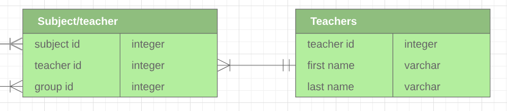
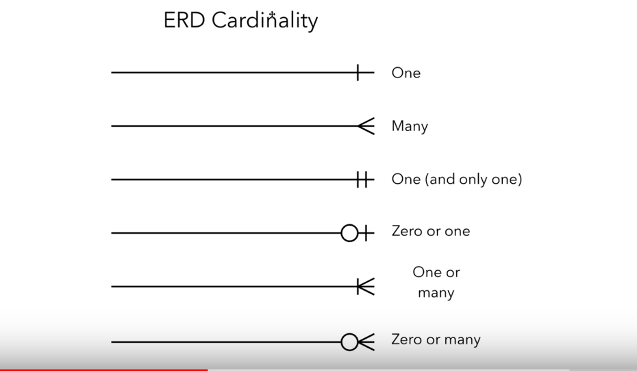

# ND111 - SQL for Data Analysis `Lesson01`

#### Tags
* Author : AH Uyekita
* Title  :  _Basic SQL_
* Date   : 14/12/2018
* Course : Data Science II - Foundations Nanodegree
    * COD    : ND111
    * **Instructor:** [Derek Steer][derek]

[derek]: https://modeanalytics.com

#### Related Courses

* [UD032 - Tratamento de Dados com MongoDB][rel_1]

[rel_1]: https://br.udacity.com/course/data-wrangling-with-mongodb--ud032

#### Exercises

All exercises of this chapter I have stored in the Mode Analytics platform.

[Solutions in Mode Analytics][sol_ma]

[sol_ma]: https://modeanalytics.com/ah_uyekita/reports/03e5141ea602

********************************************************************************


#### Requirements

You do not need any experience before to take this course.

SQL Database: Postgres

#### Data

This course will use the data from Parch & Posey, it is a fictional company, that sells paper.

* Has 50 reps spread across the US in 4 regions;
* Three kinds of paper
    * Regular
    * Poster
    * Glossy

This fictional company is tailored to simulate a real situation.

#### Source of this note

I have written this note watching the videos.

********************************************************************************

## Entity Relationship Diagrams (ERD)

This is a way to see (visualize) the relationship between different spreadsheets, in other words, how is structure a database. In a database, there are several tables, and each table has your own attributes, based on the cardinality they could interact with each other.

#### Entities

This is a simple spreadsheet with information about anything you want, but keep in mind to: store new observations by rows and features/variables by column.


My example is a table called `Marks`, which has `mark id`, `student id`, `subject id`, `date` and `mark` as attributes. The other column is the variable's type.

#### Atributte

An attribute is a feature we want to keep track.

#### Relationship

Is a way to connect two tables.



Remember, this line has some properties, that is named as cardinality.

#### Cardinality

Cardinality represents a notation of how the information between tables will interact with each other.



Additional videos with good content.

[Video 1 - Lucidchart][erd_1]
[Vídeo 2 - Lucidchart][erd_2]

[erd_1]: https://www.youtube.com/watch?v=QpdhBUYk7Kk&vl=en
[erd_2]: https://www.youtube.com/watch?v=-CuY5ADwn24

***
## SQL Introduction

SQL is a Language used to manage this interactions between tables, allowing us to access the stored database. The meaning of SQL is:

> Structured Query Language

It is very popular in Data Analysis because:

* Easy to understand
* Easy to learn
* Used to access very large datasets directly where is stored
* Easy to audit and replicate
* It is possible to run multiple queries at onde
* Almost do not have a limit of rows/observations
* Ensure the data Integrity, it is not possible to register a half child if you have defined this field as an integer
* SQL is very fast
* Database provide the data sharing, everybody could access the data simultaneously, which is good due to a standardization of database

SQL provides also functions such as:

* Summation
* Count
* Max and min
* Mean, etc.

Have in mind, probably we are going to manipulate data, and rarely updating or change values.

SQL is not case sensitive, so the best practices is to write the clauses/staments in upper case.

**Best practices**
```{sql}
SELECT first_column
  FROM my_table
```
**Bad one**
```{sql}
SelecT first_column
from my_table
```
Bear in mind, the indentation is not a requirements but helps a lot to understand your code.

#### SQL vs. NoSQL

Extracted from the class notes.

>You may have heard of NoSQL, which stands for not only SQL. Databases using NoSQL allow for you to write code that interacts with the data a bit differently than what we will do in this course. These NoSQL environments tend to be particularly popular for web based data, but less popular for data that lives in spreadsheets the way we have been analyzing data up to this point. One of the most popular NoSQL languages is called MongoDB. Udacity has a full course on MongoDB that you can take for free here, but these will not be a focus of this program.
>NoSQL is not a focus of analyzing data in this Nanodegree program, but you might see it referenced outside this course!

## Clauses

Tell the database what to do.

#### `DROP TABLE`

Remove a table from the database.

#### `CREATE TABLE`

Create a new table.

#### `SELECT`

Is also know as query, is used to create a new table with the selected variables. You can use `*` if you want to select all columns.
```{sql}
SELECT first_column, second_column, last_column
  FROM first_table;
```

#### `LIMIT`

This is the same of `.head()` but this could only load a few lines to analyses the table.

```{sql}
SELECT first_column
  FROM my_table
LIMIT 1000            /* Will load the firs 1000 lines*/
```

#### `ORDER BY`

It is possible to order by in ascendant and descendent way.

**ascendant**
```{sql}
SELECT first_column, second_column, last_column
  FROM my_table
ORDER BY last_column /*ascendanting*/
LIMIT 1000
```

**descendent**
```{sql}
SELECT first_column, second_column, last_column
  FROM my_table
ORDER BY last_column DESC, second_column /*descending for last_column*/
LIMIT 1000
```
This last query will returns:

* Last_column ordered by the highest to lowest;
* The second_column will be the lowest to highest.

#### `WHERE`

Apply a filter to find a specific customer or anything else.
```{sql}
SELECT first_column, second_column, last_column
  FROM my_table
WHERE first_column = 100
ORDER BY second_column
LIMIT 100
```
All staments possible to use.
* `>` (greater than)
* `<` (less than)
* `>=` (greater than or equal to)
* `<=` (less than or equal to)
* `=` (equal to)
* `!=` (not equal to)

If the argument of the WHERE clause is not a number, you must use single quotes.
```{sql}
SELECT first_column, second_column, last_column
  FROM my_table
WHERE first_column = 'Hello World!'
ORDER BY second_column
LIMIT 100
```

## Derived Columns

Is a new column created from the query. It is similar to the `mutate` function from R.

This is the operator to create a derived column:

* `*` (Multiplication)
* `+` (Addition)
* `-` (Subtraction)
* `/` (Division)

```{sql}
SELECT id, (standard_amt_usd/total_amt_usd)*100
FROM orders
LIMIT 10;
```
Will display without a specific name (?column?).

#### `AS`

If you use the `AS` the derived column will be name as you define (in other words "alias").

```{sql}
SELECT id, (standard_amt_usd/total_amt_usd)*100 AS std_percent, total_amt_usd
FROM orders
LIMIT 10;
```
Best pratices: No capital letters, descriptive names, etc.

## Introduction to "Logical Operators"

In the next concepts, you will be learning about Logical Operators. Logical Operators include:

#### LIKE

Using with WHERE clause could search some patterns.

```{sql}
SELECT first_column, second_column, last_column
  FROM my_table
WHERE last_column LIKE '%ello%'
```
The `%` is called wild-card.

#### IN

It is the same in Python or R. `IN` will be used to filter the dataset based on a list.
```{sql}
SELECT first_column, second_column, last_column
  FROM my_table
WHERE last_column IN (100, 200)
```
This example will filter the rows of last_column with values of 100 or 200.

#### NOT

`NOT` return the reverse/opposite.

```{sql}
SELECT first_column, second_column, last_column
  FROM my_table
WHERE last_column NOT IN (100, 200)
```
This example will remove all observations equals to 100 or 200.

Possible uses:

* NOT IN
* NOT LIKE

#### AND

Logical statment usually to make some filtration.

```sql
SELECT *
FROM orders
WHERE standard_qty > 1000 AND poster_qty = 0 AND gloss_qty = 0;
```
#### BETWEEN

Sometimes AND statment could be replaced by BETWEEN, this is much clearly to understand. BUT the BETWEEN is inclusive, which means the endpoints will be included in the filter.

```sql
SELECT name
FROM accounts
WHERE name NOT LIKE 'C%' AND name LIKE '%s';
```
#### OR

Well, this is a logical operator.

```sql
SELECT id
FROM orders
WHERE gloss_qty > 4000 OR poster_qty > 4000;
```
