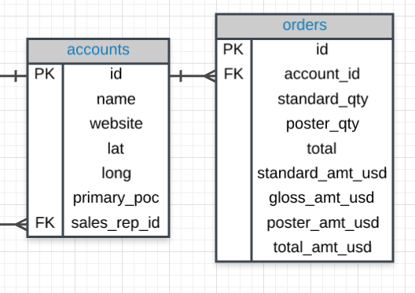

# ND111 - SQL for Data Analysis `Lesson02`

#### Tags
* Author : AH Uyekita
* Title  :  _SQL Joins_
* Date   : 15/12/2018
* Course : Data Science II - Foundations Nanodegree
    * COD    : ND111
    * **Instructor:** [Derek Steer][derek]

[derek]: https://modeanalytics.com

#### Exercises

All exercises of this chapter I have stored in the Mode Analytics platform.

[Solutions in Mode Analytics][sol_ma]

[sol_ma]: https://modeanalytics.com/ah_uyekita/reports/7a7293af2041

********************************************************************************

## Joins

When a table is splited the performance to update or just to make a query is better than a big one. The reason is the quantity of data to read. This is one of the reason to split dataset in several tables, even more, sometimes in convinient to split because the type of data stored.

The reason of JOIN is to "bind" two datasets into one. Here we need to use the period `.` (table.colums) to reference which column/variable we want to select.

```sql
SELECT accounts.name, orders.occurred_at
  FROM orders
JOIN accounts
ON orders.account_id = accounts.id;
```
The result of this query is two columns (`name` and `occured_at`), and to linked by the `account_id` and `id`.

### Primary Key (PK)

Is a columns with unique values used to map a variable.

### Foreign Key (FK)

Is a Primary Key from the other table. We use the PK and FK to link the tables.

Based on the new information about `PK` and `FK`. Let's insert a picture to visualize the database.



I want to Join these tables. My query:

```sql
SELECT orders.*
FROM orders
JOIN accounts
ON orders.account_id = accounts.id;
```

What I need to realize:

* `PK` and `FK` **always** will be allocated in `ON`.
* `FROM` and `JOIN` each one with one table.

### Binding three tables

It is possible to "chaining" three tables.

```sql
SELECT *
FROM web_events
JOIN accounts
ON web_events.account_id = accounts.id
JOIN orders
ON accounts.id = orders.account_id
```
In this case, I will import all columns, but I may want few columns.

```sql
SELECT web_events.channel, accounts.name, orders.total
FROM web_events
JOIN accounts
ON web_events.account_id = accounts.id
JOIN orders
ON accounts.id = orders.account_id
```
### Alias

Alias is a form to "short" the name of columns, the first method is using `AS`, but it could be simplified by only a space.

* Example 1

```sql
Select t1.column1 aliasname, t2.column2 aliasname2
FROM tablename AS t1
JOIN tablename2 AS t2
```
**or**
```sql
Select t1.column1 aliasname, t2.column2 aliasname2
FROM tablename t1
JOIN tablename2 t2
```
* Example 2

```sql
SELECT col1 + col2 AS total, col3
```
**or**
```sql
SELECT col1 + col2 total, col3
```
**or**

### `INNER JOIN`

Returns rows which appears in both tables.

```sql
SELECT table_1.id, table_1.name, table_2.total
  FROM table_2
    JOIN table_1
      ON table_2.account_id = table_1.id
```
These last examples are all `INNER JOINS`, and will return a new dataframe (intersection between two dataframes).

### `OUTER JOIN`

There are two kinds of OUTER JOINs

* Left outer JOIN, and;
* Right outer JOIN.

This two new JOINs has a property to pull rows that only exist in one table, it means some rows might have NULL values. The standard for this course will be to use only the left outer join.
