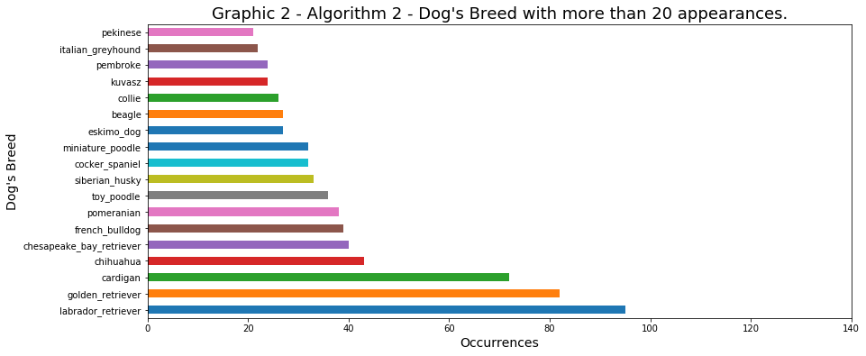
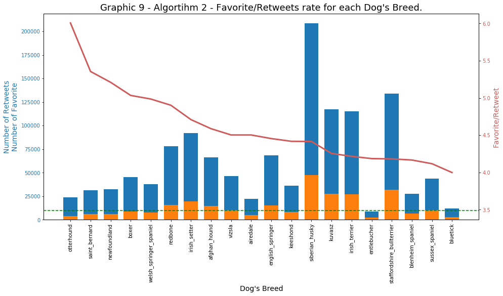

```{r setup, include=FALSE}
knitr::opts_chunk$set(echo = TRUE,message=FALSE)
```

# Act Report


## Synopsis

In respect to the data analysis, I have observed a seasonality in the frequency of tweets, the user @dog_rates tend to tweets more in the begining of the week, monday and tuesday specially, and i have also identified seasonality along the year, there are much more tweets in december and november, going in opposite way these two month have the lowest rating_numerator.

In regard to the algorithms used to predict the dog's breed, I have realized the three algorithms has results very distinct, after a visual investigation plotting a graphic without sucess I have used the Correlation Map to found my insights.


## 1. Introduction

This report is based on _Wrangle and Analyze Data_ Project outcome, and aims to shows the insights observed in the [wrangle_act.ipynb][wrangle_act] file. The project's subject is about the [WeRateDogs™][dog_rates] user, which gives rates for dog's pictures, nowadays this account has more than 7,572,000 followers, more than 9,500 tweets, and more than 141,000 likes.

[wrangle_act]: https://github.com/AndersonUyekita/ND111_data_science_foundations_02/blob/master/03-Chapter03/00-Project_02/wrangle_act.ipynb

[dog_rates]: https://twitter.com/dog_rates

## 2. Data Wrangling

For a better understanding, I have divided this chapter into three parts:

* [Data Gathering](#data_gathering);
* [Data Assessing](#data_assessing), and;
* [Data Cleaning](#data_cleaning).


### 2.1. Data Gathering {#data_gathering}

The bedrock of this project is a combination of the `twitter_archive_enhanced.csv` and `image_predictions.tsv` files, which I have named as `twitter_archive_master.csv`. Later, I have added to the `twitter_archive_master.csv` two new features gathered from the Twitter using the tweepy package.

The `twitter_archive_master.csv` has severeal information about [WeRateDogs™][dog_rates], including the predicted dog's breeds by three differents algorithms. Let's investigate this data frame to identify any kind of pattern or relationship between the recorded data.

### 2.2. Data Assessing {#data_assessing}

Following the good pratices, I have documented each issue found before fixing it, and I have found 17 issues. In [Appendix A1](#appendix_a1) you can see an entire Table with all issues and its description.

Most of the problems is related to:

* Data quality
    * Invalid values: Too high values (e.g. rating of 1776) or non-standard values (e. g. dog's names such a, an, very, etc.);
    * Wrong data type: Date Time variables as string.

* Data tidiness
    * Converting several columns into a one column, and;
    * Merging tables.

### 2.3. Data Cleaning {#data_cleaning}

Along the process of Cleaning, I have fixed problems in rating_numerator and rating_denominator values resulted by a non well calibrated regular expression to extract the rating from the `text` column. Similarly, the dog's name was fixed due to a problem gathering ordinary words instead the dog's name.

In this chapter I have performed the merging of data frames.

For further information about Data Wrangling, please read the complete Project Report in this [link][wrangle_act].

## 3. Exploratory Analysis

Based on a data frame of several tweets from WeRateDogs™ (provided by `twitter_archive_master.csv` file), I would like to investigate how is the output of each algorithm employed to predict the dog's breed.

### 3.1. Predict Dog Breed Algorithm

The Graphics 1, 2, and 3 shows the first 20 breeds with more appearance.





As you can see, P1 algorithm has the lowest quantity of breed with more than 20 appearance, only 14 breeds, and has the breed with more apperance between the three algorithms. In other hand, the algorithm P3 has 21 breeds with more than 20 apperance, which also results the lowest between the top scored breeds.

>The algorithm 1 tend to concentrate the breed classification in few breeds, whereas algorithm P3 do the opposite, spreading the classification in more breeds. The algorithm P2 is a midterm between P1 and P3 algprithms.

### 3.2. Retweets vs Favorite

The graphics 4 and 5, presents a straighforward scatterplot graphic of favorite_count x retweet_count to visualize any pattern.


### 3.3. Tweet's Seasonality


### 3.4. Algorithm Correlation





## 4. Conclusions


### Additional Info

For further information about Project 02 from Data Science II, you can access the following link:

* [ND111 - Project 02 - Repository][url_4] (Github Repository)
* [ND111 - Project 02 - Wrangle Act][wrangle_act] (Jupyter Notebook File)
* [ND111 - Project 02 - Wrangle Report][url_3] (Markdown File)
* [ND111 - Data Science II - Nanodegree Repository][url_1] (Github Repository)

[url_1]: https://github.com/AndersonUyekita/ND111_data_science_foundations_02
[url_3]: http://rpubs.com/AndersonUyekita/nd111_project_02_wrangle_report
[url_4]: https://github.com/AndersonUyekita/ND111_data_science_foundations_02/tree/master/03-Chapter03/00-Project_02


## Appendix

### A1 - Data Assessing Issues {#appendix_a1}

<center><strong>Table 1 - Summary of Issues Identified.</strong></center>

|Issue ID|Table|Issue Type|Dimension|Method|Column|Description|
|:---:|:--:|:---:|:---:|:----:|:----:|:--------------------------------:|
|1|df_ach|Quality|Validity|Visual|name|Invalid names or non-standard names.|
|2|df_ach|Tidiness|-|Visual|source|HTML tags, URL, and content in a single column.|
|3|df_ach|Quality|Validity|Programmatic|rating_numerator|Invalid ratings. Value varies from 1776 to 0.<br>Data Structure must be converted from `int` to `float`.|
|4|df_ach|Quality|Validity|Programmatic|rating_denominator|Invalid denominator, I expected a fixed base.<br>Data Structure must be converted from `int` to `float`.|
|5|df_ach|Tidiness|-|Programmatic|doggo, floofer, pupper, and puppo|This is a categorical variable, and I can combine these columns into one column.|
|6|df_ach|Tidiness|-|Programmatic|text|There is two information in a single column. Split the text from the URL.|
|7|df_ach|Quality|Validity|Programmatic|timestamp|Convert to date.|
|8|df_ach|Quality|Validity|Programmatic|tweet_id|Following the example of zip code, it must be a string.|
|9|df_ach|Quality|Accuracy|Programmatic|retweeted_status_id|The same dog could be recorded twice or more in cases of retweets.|
|10|df_ach|Quality|Accuracy|Programmatic|in_reply_to_status_id|The same dog could be recorded twice or more in cases of reply.|
|11|df_img|Quality|Consistency|Visual|p1, p2, and p3|Dog's breed has no standard. Capital letter or lowercase names.|
|12|df_img|Quality|Validity|Programmatic|tweet_id|Convert to string.|
|13|df_img|Quality|Validity|Programmatic|jpg_url|It has duplicated images and consequently double entry.|
|14|twt_ach_mstr|Tidiness|-|Programmatic|-|Merging these two tables (`df_ach` and `df_img`) into one.|
|15|df_img|Quality|Completeness|Programmatic|"retweet count"|Gather additional info in `tweet_json.txt` file.|
|16|df_img|Quality|Completeness|Programmatic|"favorite count"|Gather additional info in `tweet_json.txt` file.|
|17|twt_ach_mstr|Quality|Validity|Programmatic|"many columns"|Remove `in_reply_to_status_id`, `in_reply_to_user_id`, `retweeted_status_timestamp`, `retweeted_status_id`, and `retweeted_status_user_id`.

Legend:

* `df_ach`: Loaded data frame from `twitter_archive_enhanced.csv`;
* `df_img`: Loaded data frame from  `image_predictions.tsv`, and;
* `twt_ach_mstr`: Loaded data frame from `twitter_archive_master.csv`.
