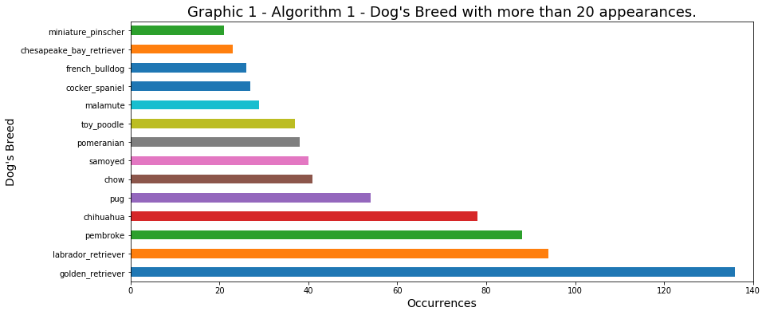

```{r setup, include=FALSE}
knitr::opts_chunk$set(echo = TRUE,message=FALSE)
```

# Act Report


## Synopsis

This project aims to give to the student a real case of how to gather, assess, clean, and analyze the data, in other words its englobes the Data Wrangling and Exploratory Data Analysis. The database used as an example is about the [WeRateDogs™][dog_rates] Twitter user, this account has more than 7,572,000 followers, 9,500 tweets, and 141,000 likes.

The Data Gathering process bundled three different tasks, the first one download file from URL and later loading to the Jupyter Notebook, which requires a manual step, the second downloading a file programmatically, and the third gathering data from the Twitter API. This step has also required to save these data in a local machine.

Based on the data gathered, I have assessed the most evident issues (17 issues in total) and documented it to create a record of modifications. Later, in Data Cleaning process I have fixed all identified issues, and I have also merged (the two downloaded files from the Data Gathering process) into one and added some missing values (from the archive downloaded from the Twitter API). The final data frame was stored as `twitter_archive_master.csv`.

In the Data Analysis and Visualization, which I have interpreted as Exploratory Analysis, I have posed few questions to guide my analysis, which lead me to found strong evidence of:

* Seasonality in the number of tweets along the week and along the year;
* A positive correlation between the number of retweets and the number of favourites, and;
* No correlation between the algorithms output used to predict the dog breed.


## 1. Introduction

This report is based on _Wrangle and Analyze Data_ Project outcome, and aims to shows the insights observed in the [wrangle_act.ipynb][wrangle_act] file.

[wrangle_act]: https://github.com/AndersonUyekita/ND111_data_science_foundations_02/blob/master/03-Chapter03/00-Project_02/wrangle_act.ipynb

[dog_rates]: https://twitter.com/dog_rates

## 2. Data Wrangling

For a better understanding, I have divided this chapter into three parts:

* [Data Gathering](#data_gathering);
* [Data Assessing](#data_assessing), and;
* [Data Cleaning](#data_cleaning).


### 2.1. Data Gathering {#data_gathering}

The bedrock of this project is a combination of the `twitter_archive_enhanced.csv` and `image_predictions.tsv` files, which I have named as `twitter_archive_master.csv`. Later, I have added to the `twitter_archive_master.csv` two new features gathered from the Twitter using the tweepy package.

The `twitter_archive_master.csv` has information about [WeRateDogs™][dog_rate], including the predicted dog's breeds by three differents algorithms. Let's investigate this data frame to identify any kind of pattern or relationship between the recorded data.

### 2.2. Data Assessing {#data_assessing}

Following the good practices, I have documented each issue found before fixing it, and I have found 17 issues. In [Appendix A1](#appendix_a1) you can see an entire Table with all issues and its description.

Most of the problems are related to:

* Data quality
    * Invalid values: Too high values (e.g. rating of 1776) or non-standard values (e. g. dog's names such a, an, very, etc.);
    * Wrong data type: Date Time variables as a string.

* Data tidiness
    * Converting several columns into one column, and;
    * Merging tables.

### 2.3. Data Cleaning {#data_cleaning}

Along the process of Cleaning, I have fixed problems in rating_numerator and rating_denominator values resulted by a non well calibrated regular expression to extract the rating from the `text` column. Similarly, the dog's name was fixed due to a problem gathering ordinary words instead of the dog's name.

In this chapter, I have performed the merging of data frames.

For further information about Data Wrangling, please read the complete Project Report in this [link][wrangle_act].

## 3. Exploratory Analysis

Based on a data frame of several tweets from WeRateDogs™ (provided by `twitter_archive_master.csv` file), I would like to investigate how is the output of each algorithm employed to predict the dog's breed.

### 3.1. Predict Dog Breed Algorithm

The Graphics 1, 2, and 3 show the first 20 breeds with more appearance.




As you can see, P1 algorithm has the lowest quantity of breed with more than 20 appearance, only 14 breeds, and has the breed with more appearance between the three algorithms. On the other hand, the algorithm P3 has 21 breeds with more than 20 appearance, which also results the lowest between the top scored breeds.


>**Conclusion:** The algorithm 1 tends to concentrate the breed classification in few breeds, whereas algorithm P3 do the opposite, spreading the classification in more breeds. The algorithm P2 is a midterm between P1 and P3 algorithms.

### 3.2. Retweets vs Favorite

The graphics 4 and 5, presents a straightforward scatterplot graphic of `favorite_count` vs `retweet_count` to visualize any pattern.


>**Conclusion:** There is a strong and positive correlation between both variables.


### 3.3. Puppo, Pupper, Doggo, or Floofer

> **Question** Are Puppo, Pupper, Doggo or Floofer with better rating than "ordinary" dogs?

Based on Graphic 4, I want to visualize if there is any pattern using the Dogtionary as a classifier.


>**Conclusion:** It is not possible to identify any pattern using the dogtionary classification.


### 3.3. Tweet's Seasonality

>**Question:** Are there seasonality in the tweets behaviour?


The Graphic 6 shows the Tweets' number during the week.


>**Conclusion:** There is a seasonality along the week because the WeRateDogs tend to tweet in average more on Mondays, Tuesday, and Wednesday. Although the number of tweets is different during the week, the rating stays steadily. 


The Graphic 7 shows the Tweets' number along the year.


>**Conclusion:** The tweets have also seasonality during the year, there are much more tweets in December and November. A strange characteristic is the average rating in these two months, which is the lowest values over the year.

### 3.4. Dog's Breed Appeal

> **Question:** What is the dog's breed with more impact?

The graphics 8, 9, and 10 show how is the behaviour of the relation between favourite and retweet. The red line represents the rate of favourite by each retweet, green line average rate, the blue bars (number of Favorites), and orange bars (number of retweets).


>**Conclusion:** Unfortunately, it is impossible to take any conclusion based on these three graphics, but these results open an opportunity to pose a new question. How different are the results of these three algorithm?

### 3.5. Algorithm Correlation

> **Question: ** How different are the results of these three algorithms?

Founded on the 3.4. item, where it is not possible to identify what is the breed with better performance with respect to the rate (the relationship between favourite and retweet). There is no dog's breed which appears in the three algorithms in the top 20. For this reason, I have increased the threshold to 40 (top 40) and later I have used all breeds.

The graphic 11 shows a comparison between the rate of the same breed for all algorithms.


>**Conclusion:** There is no correlation between the results of the three algorithms. An analysis oblique using only the 40 breeds with the highest rate could lead us an erroneous conclusion. The Correlation Map using all breeds gave a good measure of (un)similarities between these algorithms.

## 4. Conclusions

This project aims to perform the Data Wrangling and the Exploratory Data Analysis in the WeRateDogs™ Twitter account.

The Data Gathering process englobed three different tasks, the first one download file from URL and later loading to the Jupyter Notebook, which requires a manual step, the second downloading a file programmatically, and the third gathering data from the Twitter API.

Based on the data gathered, I have assessed the most evident issues (17 issues in total) and documented it to create a record of modifications. Later, in Data Cleaning process I have fixed all identified issues to complete, and I have also merged separated data frame into one and added some missing values. The final data frame was stored as twitter_archive_master.csv.

In the Data Analysis and Visualization, which I have interpreted as Exploratory Analysis, I have posed few questions to guide my analysis. I have found strong evidence of:

Seasonality in the number of tweets along the week and along the year;
A positive correlation between the number of retweets and the number of favourites, and;
No correlation between the algorithms output used to predict the dog breed.

### Additional Info

For further information about Project 02 from Data Science II, you can access the following link:

* [ND111 - Project 02 - Repository][url_4] (Github Repository)
* [ND111 - Project 02 - Wrangle Act][wrangle_act] (Jupyter Notebook File)
* [ND111 - Project 02 - Wrangle Report][url_3] (Markdown File)
* [ND111 - Data Science II - Nanodegree Repository][url_1] (Github Repository)

[url_1]: https://github.com/AndersonUyekita/ND111_data_science_foundations_02
[url_3]: http://rpubs.com/AndersonUyekita/nd111_project_02_wrangle_report
[url_4]: https://github.com/AndersonUyekita/ND111_data_science_foundations_02/tree/master/03-Chapter03/00-Project_02


## Appendix

### A1 - Data Assessing Issues {#appendix_a1}

<center><strong>Table 1 - Summary of Issues Identified.</strong></center>

|Issue ID|Table|Issue Type|Dimension|Method|Column|Description|
|:---:|:--:|:---:|:---:|:----:|:----:|:--------------------------------:|
|1|df_ach|Quality|Validity|Visual|name|Invalid names or non-standard names.|
|2|df_ach|Tidiness|-|Visual|source|HTML tags, URL, and content in a single column.|
|3|df_ach|Quality|Validity|Programmatic|rating_numerator|Invalid ratings. Value varies from 1776 to 0.<br>Data Structure must be converted from `int` to `float`.|
|4|df_ach|Quality|Validity|Programmatic|rating_denominator|Invalid denominator, I expected a fixed base.<br>Data Structure must be converted from `int` to `float`.|
|5|df_ach|Tidiness|-|Programmatic|doggo, floofer, pupper, and puppo|This is a categorical variable, and I can combine these columns into one column.|
|6|df_ach|Tidiness|-|Programmatic|text|There is two information in a single column. Split the text from the URL.|
|7|df_ach|Quality|Validity|Programmatic|timestamp|Convert to date.|
|8|df_ach|Quality|Validity|Programmatic|tweet_id|Following the example of zip code, it must be a string.|
|9|df_ach|Quality|Accuracy|Programmatic|retweeted_status_id|The same dog could be recorded twice or more in cases of retweets.|
|10|df_ach|Quality|Accuracy|Programmatic|in_reply_to_status_id|The same dog could be recorded twice or more in cases of reply.|
|11|df_img|Quality|Consistency|Visual|p1, p2, and p3|Dog's breed has no standard. Capital letter or lowercase names.|
|12|df_img|Quality|Validity|Programmatic|tweet_id|Convert to string.|
|13|df_img|Quality|Validity|Programmatic|jpg_url|It has duplicated images and consequently double entry.|
|14|twt_ach_mstr|Tidiness|-|Programmatic|-|Merging these two tables (`df_ach` and `df_img`) into one.|
|15|df_img|Quality|Completeness|Programmatic|"retweet count"|Gather additional info in `tweet_json.txt` file.|
|16|df_img|Quality|Completeness|Programmatic|"favorite count"|Gather additional info in `tweet_json.txt` file.|
|17|twt_ach_mstr|Quality|Validity|Programmatic|"many columns"|Remove `in_reply_to_status_id`, `in_reply_to_user_id`, `retweeted_status_timestamp`, `retweeted_status_id`, and `retweeted_status_user_id`.

Legend:

* `df_ach`: Loaded data frame from `twitter_archive_enhanced.csv`;
* `df_img`: Loaded data frame from  `image_predictions.tsv`, and;
* `twt_ach_mstr`: Loaded data frame from `twitter_archive_master.csv`.
