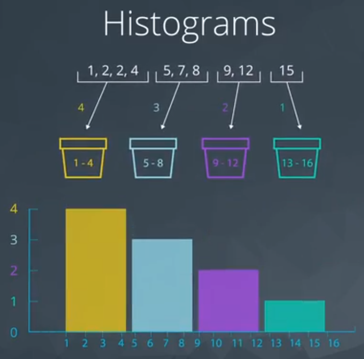
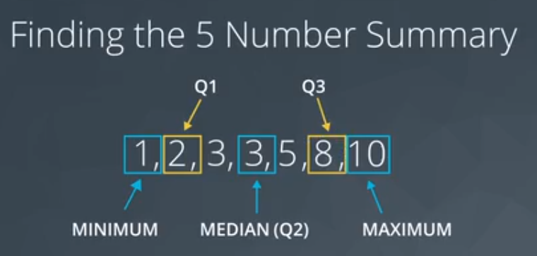
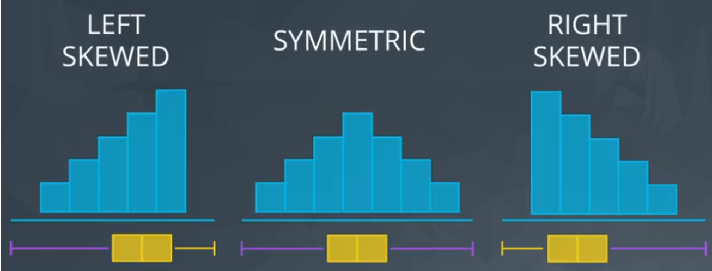
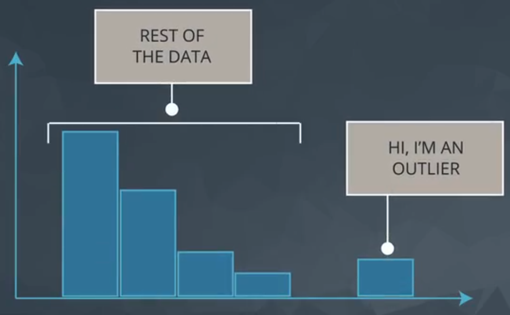

# ND111 - Advanced Statistics `Lesson02`

#### Tags
* Author : AH Uyekita
* Title  :  _Descriptive Statistics - Part II_
* Date   : 03/01/2019
* Course : Data Science II - Foundations Nanodegree
    * COD    : ND111
    * **Instructor:** Sebastian Thrun
    * **Instructor:** Josh Bernhard

********************************************************************************
## Quantitative Data

### Measures of Spread

>How far are points from one another.

Common values of spread:

* Range;
* Interquartile range (IQR);
* Standard Deviation, and;
* Variance.

#### Histogram

Figure 1 shows an example of histogram.

This is a way to visualize the quantitative data.

### Five Number Summary

These are the number:

* Maximum;
* Third quartile or Q3 (75%);
* Second quartile (it is the same of mean) or Q2 (or 50%);
* First quartile or Q1 (25%), and;
* Minimum.

First step to do is order the values, as you can see in Figure 2 (odd set of values).

As you can see, Q1 and Q3 are the median of the data on either sides of Q2.

The range is defined as:

$$ \text{Range} = maximum - minimum \tag{1}$$

The Interquartile is define as:

$$ \text{Interquartile} = Q3 - Q1 \tag{2}$$

For a even set of values I need to calculate the "average" of two values.

#### Boxplot

The boxplot graphic is a way to visualize the spread of the data.

It could be useful for quickly comparing the spread of two data sets.

Based on the Figure 4, the graphic on the right shows that in the weekends the number of dogs varies much more than on weekdays (looking to the range).

### Standard Deviation

>Meaning: On average, how much each point varies from the mean of the points.

First, I need to define the "distance" between mean and each observation. "Distance" could be interpreted as the difference of these two values. The issue observed in this difference are positive and negative values. For this reason, the square is used to turn everything positive (because later I can square root).

* Standard Deviation is frequently used to compare spread of different groups.
* Having higher standard deviation is associated with having higher risk.

$$ \text{Standard Deviation} = \frac{1}{n} \sum_{i = 1}^n (\bar x - x_i)^2 \tag{3}$$

### Shape

The shape is related to the histogram form, Figure 5 shows an example.

* Left Skewed
    * is pulled to the "begining"
    * median stays close to the mode
    * GPA, Age of death, Asset price changes
* Simmetric (example: Normal distribution or bell curve)
    * mean = median = mode;
    * Examples: heights, weights, scores, precipitation, etc.
* Right Skewed
    * mean is pulled to the tail
    * median stays close to the mode
    * Amount of drug left in your bloodstream over time, distribution of wealth, human athletic abilities.

>Side note: If you aren't sure if your data are normally distributed, there are plots called normal quantile plots and statistical methods like the Kolmogorov-Smirnov test that are aimed to help you understand whether or not your data are normally distributed. Implementing this test is beyond the scope of this class, but can be used as a fun fact.

### Outliers

>Data points thah fall very far from the rest of the values in our dataset.

The "very far" is quite generic and could be interpreted in many forms. One way to visualize it is plotting a histogram, as you can see in Figure 6.

1. Note they exist and the impact on summary Statistics
2. If typo, remove or fix it.
3. Understand why they exist, and the impact on questions we are trying to answer
4. Reporting the 5 number summary is better than mean and standard deviation when outliers are present
5. Be careful in reporting know how to ask the right questions

## Descriptive vs Inferential

Descriptive Statistics: Describing Collected Data
Inferential Statistics: Drawing conclusions about a population based on data collected from sample of individuals from that population.
