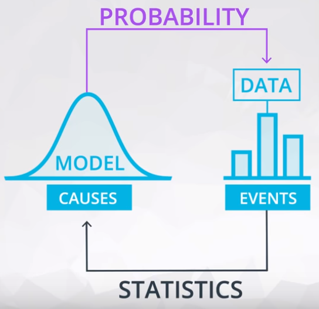

# ND111 - Advanced Statistics `Lesson04`

#### Tags
* Author : AH Uyekita
* Title  : _Probability_
* Date   : 05/01/2019
* Course : Data Science II - Foundations Nanodegree
    * COD    : ND111
    * **Instructor:** Sebastian Thrun
    * **Instructor:** Josh Bernhard

********************************************************************************

## Probability

### Introduction to Probability

Do not confound Statistics and Probability.

* Probability: Make preditcions about the future events based on models, and;
    * Here I want to predict data!
* Statistics: Analyze data from past events to infer what those models or causes could be.
    * Here I use data to preditc!

Figure 1 shows the relation between these two subjects.

#### Fair Coin

The probability notation is based on the 0 to 1 scale, where 0 means zero percentage and 1 means 100 percentage. The example below is a 50%.

$$ P(HEADS) = 0.5 $$

To be a fair coin the tail probability it is the same of heads.

$$ P(TAILS) = 0.5 $$

#### Loaded Coin

Its occurs when the $P(HEADS)$ is different of $P(TAILS)$. Bear in mind, in the equation 1.

$$ P(HEADS) + P(TAILS) = 1 \tag{1}$$

**Example 1:** {HEADS, HEADS} = $P(H, H)$ for a fair coin.

$P(H) = P(T) = 0.5$

To ilustrate this solution, let's draw the Truth Table (Table 1)

<strong>Table 1 - Truth Table for a Fair Coin</strong>

|Flip 1|Flip 2|Probability|
|:-:|:-:|:-:|
|H|H|$ 0.5 * 0.5 = 0.25 $|
|H|T|$ 0.5 * 0.5 = 0.25 $|
|T|H|$ 0.5 * 0.5 = 0.25 $|
|T|T|$ 0.5 * 0.5 = 0.25 $|
|||$ \sum = 1.0 $|

The probability of P(H, H) is 0.25.

**Example 2:** {HEADS, HEADS} = $P(H, H)$ for a loaded coin.

$ P(H) = 0.6 $
$ P(T) = 0.4 $

To ilustrate this solution, let's draw the Truth Table (Table 2)

<strong>Table 2 - Truth Table for a Loaded Coin</strong>

|Flip 1|Flip 2|Probability|
|:-:|:-:|:-:|
|H|H|$ 0.6 * 0.6 = 0.36 $|
|H|T|$ 0.6 * 0.4 = 0.24 $|
|T|H|$ 0.4 * 0.6 = 0.24 $|
|T|T|$ 0.4 * 0.4 = 0.16 $|
|||$ \sum = 1.0 $|

The probability of P(H, H) is 0.36.

**Example 3:** Three coins flipped. What is the probability of only one heads in three coins flipped. Adopting a fair coin ($ P(H) = 0.5 $).

$P_1(Only one H)$

<strong>Table 3 - Truth Table for a Loaded Coin</strong>

|Flip 1|Flip 2|Flip 3|Probability|Has only one heads?|$P_1$|
|:-:|:-:|:-:|:-:|:-:|:-:|
|H|H|H|$ 0.5 * 0.5 * 0.5 = 0.125 $|No|0|
|H|H|T|$ 0.5 * 0.5 * 0.5 = 0.125 $|No|0|
|H|T|H|$ 0.5 * 0.5 * 0.5 = 0.125 $|No|0|
|H|T|T|$ 0.5 * 0.5 * 0.5 = 0.125 $|Yes|0.125|
|T|H|H|$ 0.5 * 0.5 * 0.5 = 0.125 $|No|0|
|T|H|T|$ 0.5 * 0.5 * 0.5 = 0.125 $|Yes|0.125|
|T|T|H|$ 0.5 * 0.5 * 0.5 = 0.125 $|Yes|0.125|
|T|T|T|$ 0.5 * 0.5 * 0.5 = 0.125 $|No|0|
||||$ \sum = 1.0 $|$ \sum = 3 \text{ cases} $|$ \sum = 0.375 $|

The $ P_1 $ is 0.375.

**Example 4:** Three coins flipped. What is the probability of only one heads in three coins flipped. Adopting a loaded coin ($ P(H) = 0.6 $).

$P_2(Only one H)$

<strong>Table 3 - Truth Table for a Loaded Coin</strong>

|Flip 1|Flip 2|Flip 3|Probability|Has only one heads?|$P_2$|
|:-:|:-:|:-:|:-:|:-:|:-:|
|H|H|H|$ 0.6 * 0.6 * 0.6 = 0.216 $|No|0|
|H|H|T|$ 0.6 * 0.6 * 0.4 = 0.144 $|No|0|
|H|T|H|$ 0.6 * 0.4 * 0.6 = 0.144 $|No|0|
|H|T|T|$ 0.6 * 0.4 * 0.4 = 0.096 $|Yes|0.096|
|T|H|H|$ 0.4 * 0.6 * 0.6 = 0.144 $|No|0|
|T|H|T|$ 0.4 * 0.6 * 0.4 = 0.096 $|Yes|0.096|
|T|T|H|$ 0.4 * 0.4 * 0.6 = 0.096 $|Yes|0.096|
|T|T|T|$ 0.4 * 0.4 * 0.4 = 0.064 $|No|0|
||||$ \sum = 1.0 $|$ \sum = 3 \text{ cases} $|$ \sum = 0.288 $|

The $ P_2 $ is 0.288.

### Bernoulli Distribution

Founded on this introduction, let's generalize this concept using the Bernoulli Distribution.

>In probability theory and statistics, the Bernoulli distribution, named after Swiss mathematician Jacob Bernoulli, is the discrete probability distribution of a random variable which takes the value 1 with probability ${\displaystyle p}$  and the value 0 with probability ${\displaystyle q=1-p,}$  that is, the probability distribution of any single experiment that asks a yes–no question; the question results in a boolean-valued outcome, a single bit of information whose value is success/yes/true/one with probability p and failure/no/false/zero with probability q. It can be used to represent a (possibly biased) coin toss where 1 and 0 would represent "heads" and "tails" (or vice versa), respectively, and p would be the probability of the coin landing on heads or tails, respectively. In particular, unfair coins would have ${\displaystyle p\neq 1/2.}$

>The Bernoulli distribution is a special case of the binomial distribution where a single trial is conducted (so n would be 1 for such a binomial distribution). It is also a special case of the two-point distribution, for which the possible outcomes need not be 0 and 1. -- <cite>[Wikipedia][source_bern_1]</cite>

Rede more in [wolfram][source_bern_2].

[source_bern_1]: https://en.wikipedia.org/wiki/Bernoulli_distribution
[source_bern_2]: http://mathworld.wolfram.com/BernoulliDistribution.html

#### Summary

>Here you learned some fundamental rules of probability. Using notation, we could say that the outcome of a coin flip could either be T or H for the event that the coin flips tails or heads, respectively.

>Then the following rules are true:

* Probability of a Event
> $$\bold{P(H)} = 0.5$$

* Probability of opposite event
>$$\bold{1 - P(H) = P(\text{not H})} = 0.5$$

>where $\bold{\text{not H}}$ is the event of anything other than heads. Since, there are only two possible outcomes, we have that $\bold{P(\text{not H}) = P(T)} = 0.5$. In later concepts, you will see this with the following notation: $\bold{\lnot H}$.

* Probability of composite event
$$ P * P * P * \dots * P $$

It is only true because the events are independent of one another, which means the outcome of one does not affect the outcome of another.
>* Across multiple coin flips, we have the probability of seeing n heads as $\bold{P(H)^n}$. This is because these events are independent.

>We can get two generic rules from this:

>1. The probability of any event must be between 0 and 1, inclusive.

>2. The probability of the compliment event is 1 minus the probability of an event. That is the probability of all other possible events is 1 minus the probability an event itself. Therefore, the sum of all possible events is equal to 1.

>3. If our events are independent, then the probability of the string of possible events is the product of those events. That is the probability of one event AND the next AND the next event, is the product of those events.

#### Looking Ahead

>You will be working with the Binomial Distribution, which creates a function for working with coin flip events like the first events in this lesson. These events are independent, and the above rules will hold. <cite>from Text: Recap + Next Steps</cite>
