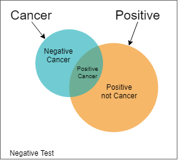

# ND111 - Advanced Statistics `Lesson07`

#### Tags
* Author : AH Uyekita
* Title  : _Bayes Rule_
* Date   : 06/01/2019
* Course : Data Science II - Foundations Nanodegree
    * COD    : ND111
    * **Instructor:** Sebastian Thrun
    * **Instructor:** Josh Bernhard

********************************************************************************

## Bayes Rule

The person who writes down this theorem.

>Thomas Bayes (/beɪz/; c. 1701 – 7 April 1761) was an English statistician, philosopher and Presbyterian minister who is known for formulating a specific case of the theorem that bears his name: Bayes' theorem. Bayes never published what would become his most famous accomplishment; his notes were edited and published after his death by Richard Price. --- <cite>[Wikipedia - Thomas Bayes][wiki_thomas_bayes]</cite>

[wiki_thomas_bayes]: https://en.wikipedia.org/wiki/Thomas_Bayes

### Cancer Example

The probability to a person has cancer is 1% and the probability to the test gives positive is 90%. If a person do not has cancer the probability of the test gives negative is 90%.

_What is the probability of a given positive test the person has cancer?_

|Disease|Test|$P_{disease}$|$P_{test}$|P|Q1: Test positive?|Q1: answer|
|:-:|:-:|:-:|:-:|:-:|:-:|:-:|
|No|Negative|0.99|0.90|0.891|No|0|
|No|Positive|0.99|0.10|0.099|Yes|0.099|
|Yes|Negative|0.01|0.10|0.001|No|0|
|Yes|Positive|0.01|0.90|0.009|Yes|0.009|
|||||||SUM = 0.108|

Bear in mind, the probability of a false positive is 0.099, which is 11 times bigger than the a truth valeu of 0.009.

Figure 1 ilustrate this situation.

Given the test is positive, the probability of this person has cancer is:

$$ P(C\|Positive) = \frac{P(C,Positive)}{P(C,Positive) + P(\neg \ C,Positive)} = \frac{0.009}{0.009 + 0.099} = 0.08333$$

### Bayes Rule

From the example above, I can point out some definitions:

**Prior:**

This is a information before the test.

 $$ P(C) = 0.01 \\ P(\neg C) = 0.99 \tag{1}$$

**Joint:**

Now, I will apply the test for a given positive result.

$$ P(C,Positive) = P(C) * \underbrace{P(Positive\|C)}_{Sensibility} \\
   P(\neg C,Positive) = P(\neg \ C) * \underbrace{P(Positive\| \neg \ C)}_{Sensibility} \tag{2} $$

For a negative result.

   $$ P(C,Negative) = P(C) * \underbrace{P(Negative\|C)}_{Specitivity} \\
      P(\neg \ C,Negative) = P(\neg \ C) * \underbrace{P(Negative\| \neg \ C)}_{Specitivity} \tag{3}$$

**Normalization:**

This is performed for each result (Positive and Negative).

$$ P(Positive) = P(C,Positive) + P(\neg \ C,Positive) \tag{4}$$

**Posterior:**

Divide the $P(C,Positive)$ and $P(\neg  C,Positive)$ by $P(Positive)$.

$$P(C|Positive) = \frac{P(C,Positive)}{P(Positive)} \tag{5}$$

$$P(\neg C|Positive) = \frac{P(\neg C,Positive)}{P(Positive)} \tag{6}$$

Finally, the Bayes equation could be generalized as:

$$P(A|B) = \frac{P(A) * P(B|A)}{P(B)} \tag{7}$$
