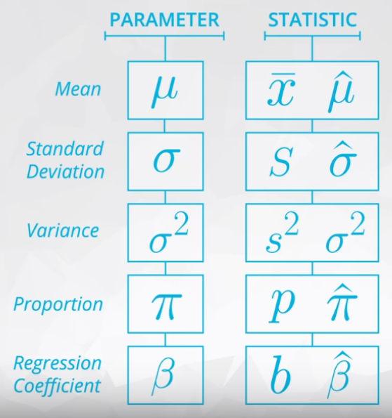
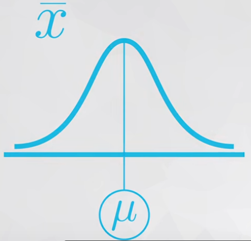
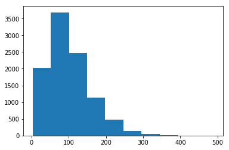
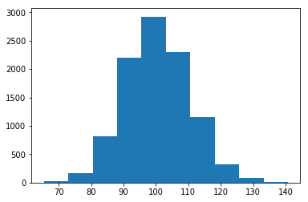

# ND111 - Advanced Statistics `Lesson10`

#### Tags
* Author : AH Uyekita
* Title  : _Sampling distributions and Central Limit Theorem_
* Date   : 06/01/2019
* Course : Data Science II - Foundations Nanodegree
    * COD    : ND111
    * **Instructor:** Sebastian Thrun
    * **Instructor:** Josh Bernhard

********************************************************************************

## Sampling distributions and Central Limit Theorem

Recap of Inferential Statistics.

#### Inferential Statistics

>In order to assure you are comfortable with the ideas surrounding inferential statistics. The next 4 concepts are aimed at the difference between Descriptive and Inferential Statistics. Actually applying inferential statistics techniques to data will be taught in later lessons.

#### Probability to Statistics

>This begins a set of lessons that will be more data oriented in the way that you are applying ideas, and less probability oriented.

>Often we use statistics to verify conclusions of probability through simulation. Therefore, simulation (similar to the python lesson you completed earlier) will be a large part of the way we show mathematical ideas moving forward.

##### Solutions

>It is in your best interest to work through the solution notebooks on your own before looking at the solutions available for this course. However, if you get stuck or would like to double check your solutions, notice all of the solutions and data are available in the resources tab of this course. This is true for all of the following lessons as well. --- <cite>Class notes</cite>

#### Comparison Descriptive and Inferential Statistics

>In this section, we learned about how Inferential Statistics differs from Descriptive Statistics.

>* `Descriptive statistics` is about describing our collected data using the measures discussed throughout this lesson: measures of center, measures of spread, shape of our distribution, and outliers. We can also use plots of our data to gain a better understanding.

>* `Inferential Statistics` is about using our collected data to draw conclusions to a larger population. Performing inferential statistics well requires that we take a sample that accurately represents our population of interest.

>A common way to collect data is via a survey. However, surveys may be extremely biased depending on the types of questions that are asked, and the way the questions are asked. This is a topic you should think about when tackling the the first project.

>We looked at specific examples that allowed us to identify the

>* Population - our entire group of interest.
>* Parameter - numeric summary about a population
>* Sample - subset of the population
>* Statistic numeric summary about a sample

### Sampling distribution

>A sampling distribution is the distribution of a statistic. Here we looked the distribution of the proportion for samples of 5 students. This is key to the ideas covered not only in this lesson, but in future lessons.

### Notation

<strong>Figure 1</strong>

>As you saw in this video, we commonly use Greek symbols as parameters and lowercase letters as the corresponding statistics. Sometimes in the literature, you might also see the same Greek symbols with a "hat" to represent that this is an estimate of the corresponding parameter.

### Other Sampling Distribution

It is possible to use other statistics.

* Standard Deviation
* Variance
* Difference in Means

The difference between parameters and statistics is the last one is varies and the first is fixed.

### Law of Large Number

This theorem preconizes the greater the number of the samples/trials the average of this sample will be close to the population mean. This is the reason we have simulated samples sizes of 10,000.

* Increasing the size of the sample the mean of this sample will be closer to the population mean.

[Read more in Wikipedia][wiki_lln] and [Investopedia][investopedia_lln]

[wiki_lln]: https://en.wikipedia.org/wiki/Law_of_large_numbers
[investopedia_lln]: https://www.investopedia.com/terms/l/lawoflargenumbers.asp

### Central Limit Theorem

Quite similar with the LLN theorem, but this is related to the shape of sample. It is necessary to plot a histogram to see the miracle.

* Increasing the size of the sample the shape of the sample will be closer to a normal distribution.

<strong>Figure 2</strong>

>The Central Limit Theorem states that with a large enough sample size the sampling distribution of the mean will be normally distributed.

>The Central Limit Theorem actually applies for these well known statistics:

>1. Sample means ($\bar x$)
>2. Sample proportions ($p$)
>3. Difference in sample means ($\bar x_1 - \bar x_2$)
>4. Difference in sample propostions ($p_1 - p_2$)

But is not applied to:

1. Variance or Standard Deviation
2. Correlation coeficient
3. Maximum value

>And it applies for additional statistics, **but it doesn't apply for all statistics!**. You will see more on this towards the end of this lesson.

Examples CLT in Figures 3 and 4.

<strong>Figure 3</strong>

<strong>Figure 4</strong>

Varying the value of the sample from 3 to 100, the bell shape could be identified.

### Bootstrapping

>Bootstrapping is a technique where we sample from a group with replacement.

>We can use bootstrapping to simulate the creation of sampling distribution, which you did many times in this lesson.

>By bootstrapping and then calculating repeated values of our statistics, we can gain an understanding of the sampling distribution of our statistics.
