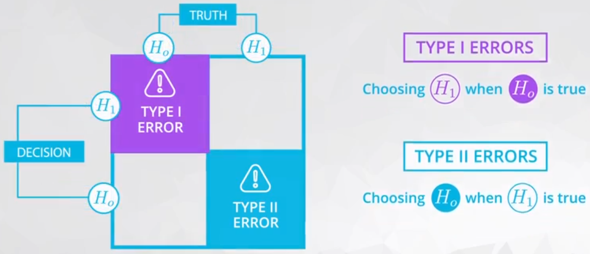

# ND111 - Advanced Statistics `Lesson12`

#### Tags
* Author : AH Uyekita
* Title  : _Hypothesis Testing_
* Date   : 08/01/2019
* Course : Data Science II - Foundations Nanodegree
    * COD    : ND111
    * **Instructor:** Sebastian Thrun
    * **Instructor:** Josh Bernhard

********************************************************************************

## Hypothesis Testing

Is a way to answer a given question. First step is convert/transform this question in hypothesis. Then, gather data to answer/justify which hypothesis are likely to be true.

**Example:** Hypothesis Examples.

My question:

$$ \text{What is the most favorite ice cream flavor?} $$

I have pose two hypothesis about ice cream.

$$H_0: \text{Chocolate is most favorite.} \\
  H_1:\text{Vanilla is most favorite.} $$

After pose hypothesis, I need to collect data to support my hypothesis (if is `True` or `False`).

Have in mind, Confidence Intervals and Hypoteshis Testing allow us to draw conclusions about the **population** only using **sample data**.

#### $H_0$ - Null hypotheses {-}

The $H_0$ hypothesis is also known as _Null hypothesis_ and this hypothesis stand to be true **before** collect any data.

Commonly, the Null hypothesis is a statement of two groups being equal or "zero" effect.

Usually, the Null hypothesis tend to hold these mathematical operators:

1. $=$
2. $\leq$
3. $\geq$

#### $H_1$ - Alternative hypotheses {-}

The $H_1$ hypothesis must be competing (in comparison with the $H_0$) and non-overlaping hypothesis.

This hypothesis is always associate with what we want or what we want to prove is `True`.

Usually, the Alternative hypothesis tend to hold these mathematical operators:

1. $\neq$
2. $>$
3. $<$

**Example:** Innocent until proven guilty.

My question:

$$ \text{Guilty or innocent?} $$

Which could be translated as:

$$H_0: \text{We believe everyone to be innocent initially.} \\
  H_1:\text{Guilty.} $$

Before any collect data the $H_0$ hypothesis is `True`, and we will collect data/evidence to test which hypothesis is supported.

**Example:** New website's version.

My question:

$$ \text{Which version of website has more traffic?} $$

In terms of hypothesis:

$$H_0: \text{The newer version has less traffic than the older version.} \\
  H_1:\text{The newer version has more traffic than the older version.} $$

Using mathematical notation and based on the average traffic ($\mu$).

$$H_0: \mu_{new} \leq \mu_{old} \\
  H_1: \mu_{new} > \mu_{old} $$

Bear in mind, the $H_1$ hypothesis is our expectation (the new website has a better performance than the older version), and now we need to collect/gather data to analyze which hypothesis is supported.

### Type of Errors

Before any explanation about erros, let's ilustrate the four (4) potential outcome of a given $H_0$ and $H_1$ in Figure 1, based on the judicial example.

<em>Figure 1 - Four potential outcome from a Hypothesis Testing.</em>

 

We can classify each of this outcome as ilustraded in Table 1.

<strong>Table 1 - Decision Classification.</strong>

<table>
<tr>
<td></td>
<td><strong><ruby>Guilty<rt>Truth</rt></ruby></strong></td>
<td><strong><ruby>Innocent<rt>Truth</rt></ruby></strong></td>
</tr>
<tr>
<td><strong><ruby>Guilty<rt>Jury</rt></ruby></strong></td>
<td>correct decision 1</td>
<td>mistake 1 - False Positive</td>
</tr>
<tr>
<td><strong><ruby>Innocent<rt>Jury</rt></ruby></strong></td>
<td>mistake 2 - False Negative</td>
<td>correct decision 2</td>
</tr>
</table>

* correct decision 1: Innocent person judged as innocent :+1: ;
* correct decision 2: Guilty person judged as guilty :+1: ;
* mistake 1: Innocent person judged as guilty :-1: ;
    * So-called **Type 1 Errors**;
* mistake 2: Guilty person judged as innocent :-1: ;
    * So-called **Type 2 Errors**.

#### Type 1 Errors ($\alpha$)

This is the mistake 1 from **Table 1**.

$$ \text{The worse of the two types of errors.} $$

Put a innocent person in jail.

This happens when the $H_1$ (alternative hypothesis) in chosen, but actually the $H_0$ is `True`.

$$ \text{False Positive} $$

#### Type 2 Errors ($\beta$)

This is the mistake 2 from **Table 2**.

Let a guilty person free.

This happens when the $H_0$ (null alternative) in chosen, but actually the $H_1$ is `True`.

$$ \text{False Negative} $$

#### Meaning of $\alpha$

$$ \text{What is the meaning of $\alpha$?} $$

This is a threshold of how many of this kind of error (the worst one!) we are allowed to commit, leting the rest of the erros in type 2 errors. Generally, this $\alpha$ is quite low value, and varies according to the field.

* $\alpha$
    * Medical: 0.01
    * Business and Research: 0.05

**Example:** Sky diving using Parachute.

In this job you are in charge of check the parachutes.You need to decide if the parachute is well prepare to a sky dive. There are 4 possible outcomes from your work.

* Accept a well prepare parachute;
    * This is a correct decision;
* Accept a shortcoming parachute;
    * This is an error type 1 the worse outcome because it will kill the skydiver;
* Reject a well prepare parachute;
    * This is an error type 2 because the parachute is OK but you wrongly reject it;
* Reject a shortcoming parachute;
    * This is a correct decision because the parachute is not well prepare.

Figure 2 ilustrate it.

<em>Figure 2 - Four potential outcome from a Hypothesis Testing of a Skydiver.</em>

 

Bear in mind, for this example an $\alpha$ of 0.01 is still very high.

#### Common Hypothesis Testing

* T-test: population mean
* Two sample t-test: difference in means
* Paired t-test: Comparing after and before of a same individual
* One sample z-test: population proportion
* Two sample z-test: difference between population proportion

### Selecting a hypothesis

$$ \text{Which hypothesis is more likely to be True?} $$

There are two ways to select these hypothesis.

1. Using Confidence Intervals: Sampling distribution of our statistics.
2. Simulating what we believe to be true under the null hypothesis, and than seeing if our data is actually consistent with that

#### Using Confidence Intervals

Create the Confidence Intervals and check where is it.

In the example of coffee drinkers, the interval was entirely below 70, which would suggest the null (the population mean is less than 70) is actually true.

1. Bootstrapping a sample
2. Calculate the statistics
3. Plot the histogram to visualize
4. Calculte the upper and lower bounds from the Confidence Intervals
5. Check if the $H_0$ or $H_1$ is in this Confidence Interval.

#### Traditional way

1. We assume the $H_0$ is `True`.
2. We know the sampling distribution is normal
3. We will use the closest value of the $H_0$, which is almost 70.
4. Based on the standard deviation of the sampling distribution we could estimate the distribution from the $H_0$.
5. Plot the histogram
6. Check the statistics and the hypothesis $H_0$.
7. Decide to reject $H_0$ or not.

### P-value

Based on the Bootstrapping process the P-value could be interpreted as: a statistics of how many samples will be higher/lower than the threshold defined in the hypothesis.

In the exercises the P-value is an "average" of all 10,000 samples if it is higher, lower, or in the tails of a specific parameter. This "average" (in fact is a "vector" of zero or one due to the comparison) is the probability of a sample has higher/lower values from the parameter.

Bear in mind, if 100 samples say to reject the $H_0$ but the others 9,900 say the opposite there are a probability of 100/10,000 to incurr in error Type 1. In other words, the 100/10,000 is the so-called **p-value**.

The relationship between **p-value** and $\alpha$:

* **p-value** $ < \alpha$ (or small p-value): Reject $H_0$
* **p-value** $\geq \alpha$ (or Large p-value): Fail to reject $H_0$

[Reference][refe_lesson12_c4]

[refe_lesson12_c4]: https://rebeccaebarnes.github.io/2018/05/01/what-is-a-p-value

For a small $\alpha$ (less than 10/10,000, for instance) probably you will accept the $H_0$, in the case of:

$$H_0: \mu \leq 0 \\ H_1: \mu > 0$$

There are three forms to allocate the $\alpha$, as you can see in Figure 3.

