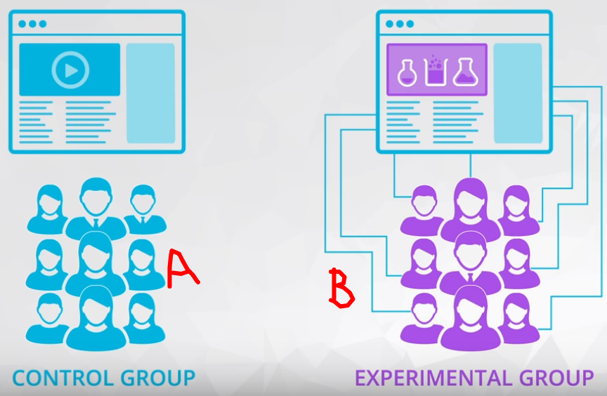
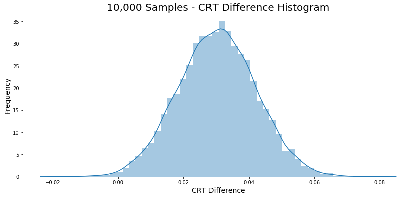
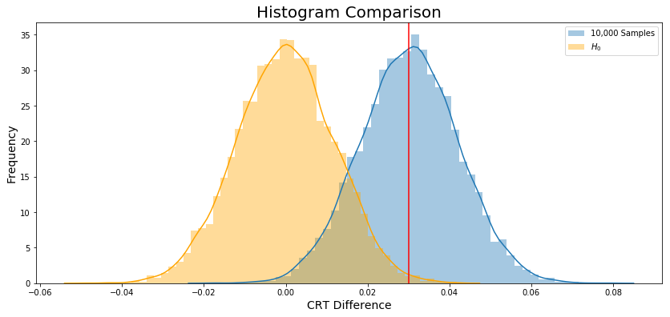

# ND111 - Advanced Statistics `Lesson13`

#### Tags
* Author : AH Uyekita
* Title  : _A/B Testing_
* Date   : 09/01/2019
* Course : Data Science II - Foundations Nanodegree
    * COD    : ND111
    * **Instructor:** Sebastian Thrun
    * **Instructor:** Josh Bernhard

********************************************************************************

## A/B Testing

This is an application of Confidence Intervals and Hypotheses Testing.

The A/B Testing is a comparison between two groups (A and B), as ilustrated in Figure 1.



<center><em>Figure 1 - Two group to be tested.</em></center>

>A/B tests are used to test changes on a web page by running an experiment where a control group sees the old version, while the experiment group sees the new version. A metric is then chosen to measure the level of engagement from users in each group. These results are then used to judge whether one version is more effective than the other. A/B testing is very much like hypothesis testing with the following hypotheses:

$$H_0 : \text{The new version is equal or worse than the older version.} \\
 H_1 : \text{The new version is better than the older version.} $$

Decision:

* If we fail to reject the null hypothesis, the results would suggest keeping the old version, or;
* If we reject the null hypothesis, the results would suggest launching the change.

#### Drawbacks {-}

>It can help you compare two options, but it can't tell you about an option you haven’t considered. It can also produce bias results when tested on existing users, due to factors like change aversion and novelty effect.

>* Change Aversion: Existing users may give an unfair advantage to the old version, simply because they are unhappy with change, even if it’s ultimately for the better.
>* Novelty Effect: Existing users may give an unfair advantage to the new version, because they’re excited or drawn to the change, even if it isn’t any better in the long run.

### Example: New Homepage

The Audacity company want to perform an A/B Testing of two versions of a new homepage.

$$H_0 : CRT_{new} - CTR_{old} \leq 0 \\
  H_1 : CRT_{new} - CTR_{old} > 0$$

Where CRT stands to Click Through Rate.

There are two version: `control` and `experiment`.

The difference between the CRT is about 0.03.

#### Bootstrapping

The bootstrapping provide a histogram presented in Figure 2.



The null hypothesis histogram is showed in Figure 3.


Finally, Figure 4 ilustrate both histogram.



#### P-value

Founded on the entire population (excepting the duplicated user id, etc.), I have calculated the `diff`.

```
diff = experiment_crt - control_crt = 0.030034443684015644
```

The `diff` could be interpreted as a threshold which I will use as delimiter, to do it I will calculate the proportion of $H_0$ (orange graph) that has a difference between CRT's higher than `diff`.

For this reason, I will calculate the average of a list of `bool`, which will return the proportion I want.

Based on the `p_value` of 0.5% we reject the $H_0$.

>**Conclusion:** Audacity should launch the new version of the home page. 
