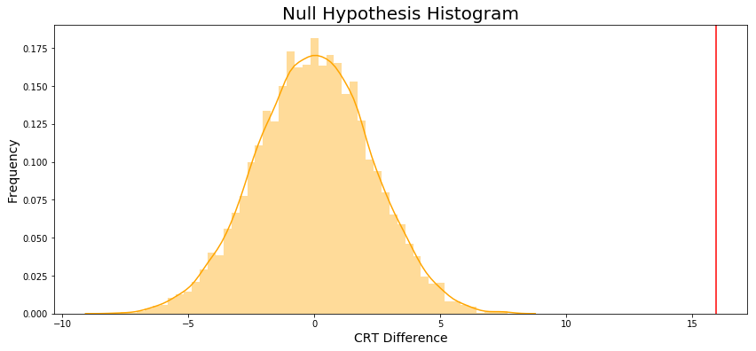
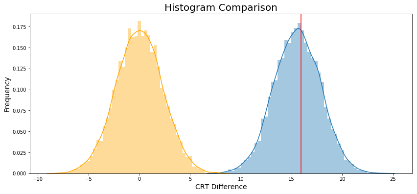
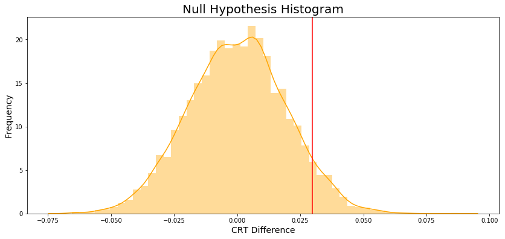

# ND111 - Advanced Statistics `Lesson13`

#### Tags
* Author : AH Uyekita
* Title  : _A/B Testing_
* Date   : 09/01/2019
* Course : Data Science II - Foundations Nanodegree
    * COD    : ND111
    * **Instructor:** Sebastian Thrun
    * **Instructor:** Josh Bernhard

********************************************************************************

## A/B Testing

This is an application of Confidence Intervals and Hypotheses Testing.

The A/B Testing is a comparison between two groups (A and B), as ilustrated in Figure 1.


<center><em>Figure 1 - Two group to be tested.</em></center>

>A/B tests are used to test changes on a web page by running an experiment where a control group sees the old version, while the experiment group sees the new version. A metric is then chosen to measure the level of engagement from users in each group. These results are then used to judge whether one version is more effective than the other. A/B testing is very much like hypothesis testing with the following hypotheses:

$$H_0 : \text{The new version is equal or worse than the older version.} \\
 H_1 : \text{The new version is better than the older version.} $$

Decision:

* If we fail to reject the null hypothesis, the results would suggest keeping the old version, or;
* If we reject the null hypothesis, the results would suggest launching the change.

#### Drawbacks {-}

>It can help you compare two options, but it can't tell you about an option you haven’t considered. It can also produce bias results when tested on existing users, due to factors like change aversion and novelty effect.

>* Change Aversion: Existing users may give an unfair advantage to the old version, simply because they are unhappy with change, even if it’s ultimately for the better.
>* Novelty Effect: Existing users may give an unfair advantage to the new version, because they’re excited or drawn to the change, even if it isn’t any better in the long run.

### Example: New Homepage

The Audacity company want to perform an A/B Testing of two versions of a new homepage.

$$H_0 : CRT_{new} - CTR_{old} \leq 0 \\
  H_1 : CRT_{new} - CTR_{old} > 0$$

Where CRT stands to Click Through Rate.

There are two version: `control` and `experiment`.

The difference between the CRT is about 0.03.

#### Bootstrapping {-}

**Example:** New version of Home page.

The bootstrapping provide a histogram presented in Figure 2.


The null hypothesis histogram is showed in Figure 3.


Finally, Figure 4 ilustrate both histogram.


#### P-value {-}

Founded on the entire population (excepting the duplicated user id, etc.), I have calculated the `diff`.

```
diff = experiment_crt - control_crt = 0.030034443684015644
```

The `diff` could be interpreted as a threshold which I will use as delimiter, to do it I will calculate the proportion of $H_0$ (orange graph) that has a difference between CRT's higher than `diff`.

For this reason, I will calculate the average of a list of `bool`, which will return the proportion I want.

Based on the `p_value` of 0.5% we reject the $H_0$.

>**Conclusion:** Audacity should launch the new version of the home page.

### Example: Average Reading Time

Same idea, two version of a website, one `control` and other `experiment`.

* Average Reading time of control: 115.38637100678429
* Average Reading time of experiment: 131.3208410471793
* Difference observed: 15.9

On average, visitor using the experiment version of website spent almost 16 more seconds.

Hypotheses posed:

$$H_0 : ART_{new} - ART_{old} \leq 0 \\
  H_1 : ART_{new} - ART_{old} > 0$$

Where ART stands to Average Reading Time.

#### Bootstrapping {-}

Let's apply the bootstrapping, and plot a histogram in Figure 5.


The null hypothesis histogram is showed in Figure 6.



Finally, Figure 7 ilustrate both histogram.



#### P-value {-}

The `p_value` is zero.

>**Conclusion:** Reject the $H_0$ because p_value < $\alpha$

Where $\alpha$ is 0.05.

### Example: Enrollment Rate

This is an example to show a case where the $H_0$ is failed to reject.

I will use the same principle of CRT to evalute the Enrollment rate.

* Enrollment rate control: 0.23452157598499063
* Enrollment rate experiment: 0.2642986152919928
* Difference observed: 0.02977703930700215

Hypotheses posed:

$$H_0 : ER_{new} - ER_{old} \leq 0 \\
  H_1 : ER_{new} - ER_{old} > 0$$

Where ER stands to Enrollment Rate.

#### Bootstrapping {-}

Let's apply the bootstrapping, and plot a histogram in Figure 8.


The null hypothesis histogram is showed in Figure 9.



Finally, Figure 10 ilustrate both histogram.


#### P-value {-}

The `p_value` is 0.0624.

>**Conclusion:** Due to p_value > $\alpha$ we fail to reject $H_0$.

Where $\alpha$ is 0.05.

### Bonferroni Correction

>If you remember from the previous lesson, the Bonferroni Correction is one way we could handle experiments with multiple tests, or metrics in this case. To compute the new bonferroni correct alpha value, we need to divide the original alpha value by the number of tests.

The new $\alpha$ will be:

$$\alpha_{adjusted} = \frac{\alpha}{4} = \frac{0.05}{4} = 0.0125$$

Based on the several test we have done:

* Enrollment Rate: 0.0624 (Read the Jupyther Notebook)
* Average Reading Duration: 0 (Read the Jupyther Notebook)
* Average Classroom Time: 0.0384 (Read the Jupyther Notebook)
* Completion Rate: 0.0846 (Read the Jupyther Notebook)

This new $\alpha$ will generate only **one** A/B Testing statistical significant.

|New Feature|p value|$\alpha_{adjusted}$|Result|$H_0$|
|:-:|:-:|:-:|:-:|:-:|
|Enrollment Rate|0.0624|0.0125|>|Fail to reject $H_0$|
|Average Reading Duration|0|0.0125|<|<strong>Reject $H_0$</strong>|
|Average Classroom Time|0.0384|0.0125|>|Fail to reject $H_0$|
|Completion Ratee|0.0846|0.0125|>|Fail to reject $H_0$|

This is the reason the Bonferroni method is considered conservative.

### Difficulties in A/B Testing

>As you saw in the scenarios above, there are many factors to consider when designing an A/B test and drawing conclusions based on its results. To conclude, here are some common ones to consider.

>* Novelty effect and change aversion when existing users first experience a change
>* Sufficient traffic and conversions to have significant and repeatable results
>* Best metric choice for making the ultimate decision (eg. measuring revenue vs. clicks)
>* Long enough run time for the experiment to account for changes in behavior based on time of day/week or seasonal events.
>* Practical significance of a conversion rate (the cost of launching a new feature vs. the gain from the increase in conversion)
>* Consistency among test subjects in the control and experiment group (imbalance in the population represented in each group can lead to situations like Simpson's Paradox) --- <cite>Udacity notebook</cite>
