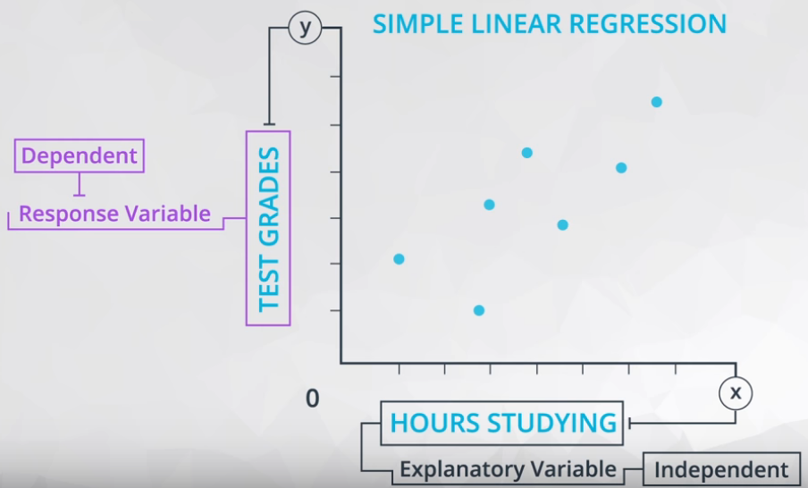
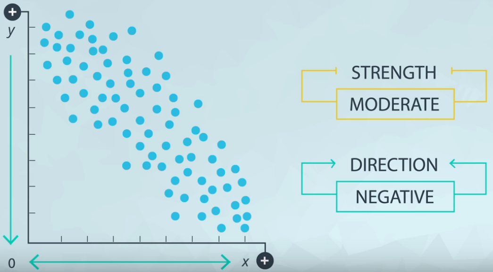
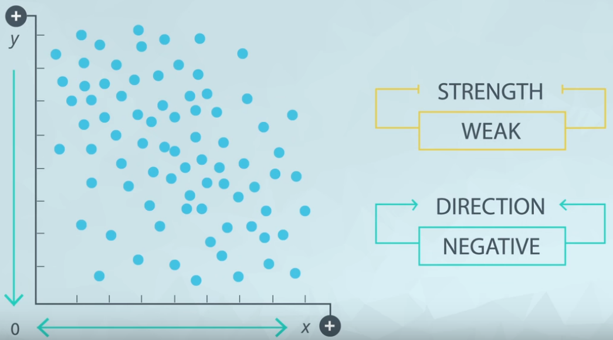
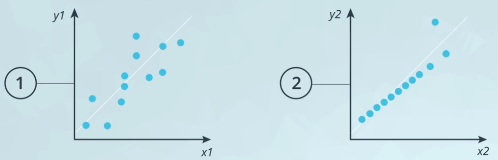
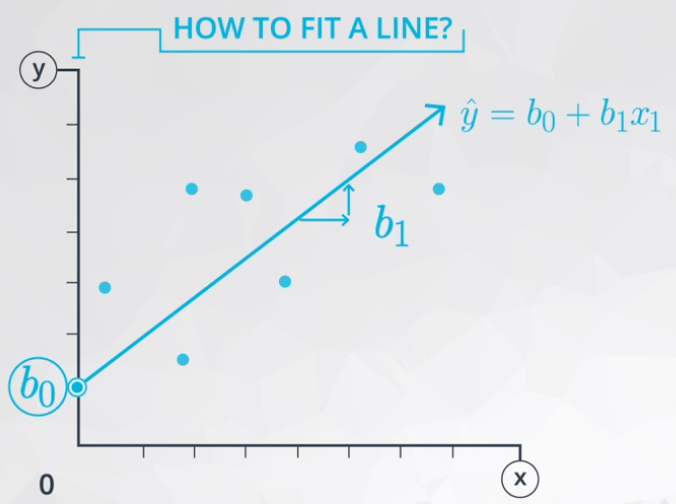
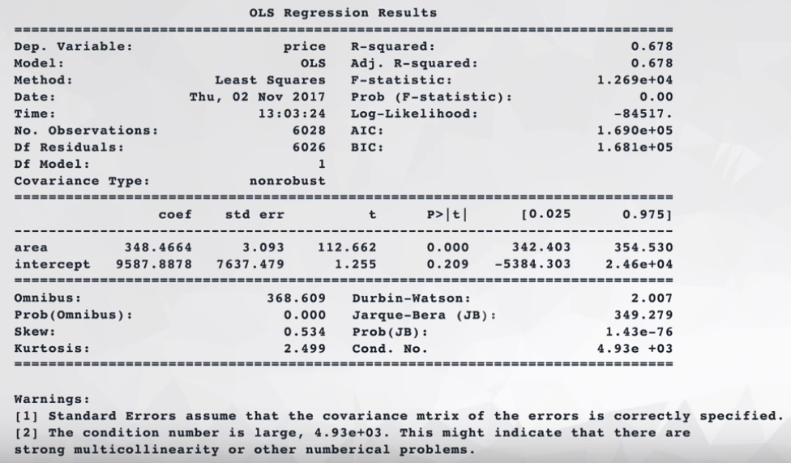
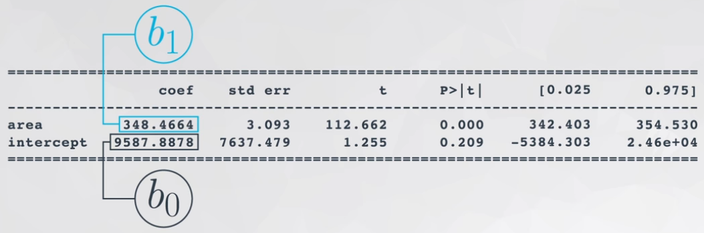
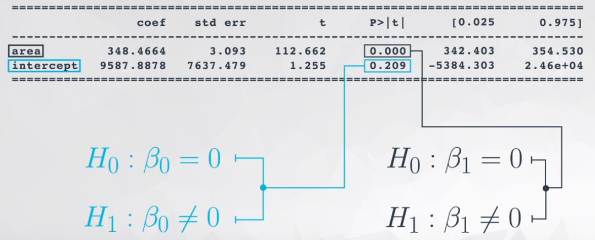
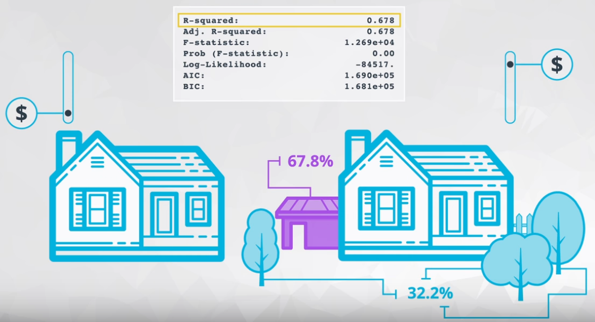

# ND111 - Advanced Statistics `Lesson14`

#### Tags
* Author : AH Uyekita
* Title  : _Regression_
* Date   : 10/01/2019
* Course : Data Science II - Foundations Nanodegree
    * COD    : ND111
    * **Instructor:** Sebastian Thrun
    * **Instructor:** Josh Bernhard

********************************************************************************

## Regression

Bear in mind, regression is a subject of the Supervised branch of Machine Learning. Figure 1 shows a simple big picture.


<center><em>Figure 1 - Machine Learning Branches.</em></center><br>

Some hot points in these two branches (there are other branches, but these two are the most know).

* Supervised: A machine learning technique where we are attempting to predict a label based on inputs.
    * Predict fraudulent transactions
    * Predict chance of default on a loan
    * Predict home prices
* Unsupervised: A machine learning technique where we are attempting to group together unlabeled data based on similar characteristics.
    * Customer segmentation
    * Group document that cover similar topics

The Linear and Logistic Regression fall into the Supervised Machine Learning branch.

### Introduction to Linear Regression

* Response variable or dependent (y): The variable you are interested in predicting, and;
* Explanatory variable or independent (x): The variable used to predicted the response.

>A common way to visualize the relationship between two variables in linear regression is using a scatterplot. You will see more on this in the concepts ahead. --- <cite>Udacity notebook</cite>

Figure 2 shows an example of a scatter plot.



<center><em>Figure 2 - Hours studying vs Test grades.</em></center><br>

#### Scatter Plot

>Scatter plots are a common visual for comparing two quantitative variables. A common summary statistic that relates to a scatter plot is the **correlation coefficient** commonly denoted by `r`.
>
>Though there are a few different ways to measure correlation between two variables, the most common way is with Pearson's correlation coefficient. Pearson's correlation coefficient provides the:
>
>1. Strength
>2. Direction
>
>of a linear relationship. Spearman's Correlation Coefficient does not measure linear relationships specifically, and it might be more appropriate for certain cases of associating two variables. --- <cite>Udacity notebook</cite>

Figure 3 shows an example of strong positive relationship.


<center><em>Figure 3 - Strong and Positive Relantionship.</em></center><br>

When x increase y also increase, and the points is very close from each other. Figure 4 shows the opposite of positive direction.



<center><em>Figure 4 - Moderate and Negative Relantionship.</em></center><br>

When x increase y decrease, and the points is a bit sparse. Figure 5 shows an example of scatter plot with weak strength.



<center><em>Figure 5 - Weak and Negative (??) Relantionship.</em></center><br>

Both, strength and direction is capture by the correlation (`r`).

* Correlation
    * Varies from -1 to +1;
    * Values close to -1 and +1 are very strong;
    * The signal (positive or negative) means the direction.


<center><em>Figure 6 - Example of Correlation.</em></center><br>

### Correlation Coefficients

This is highly field-dependent measure and these values are a general rule of thumbs.

Have in mind, in social sciences is very difficult to find a strong correlation (probably because human are very complex and hard to understand).

* Strong: $0.7 \leq |r| \leq 1.0$
* Moderate: $0.3 \leq |r| \leq .7$
* Weak: $0.0 \leq |r| \leq 0.3$

Sometimes a plot could help a lot, Figure 7 shows an example of two graphs with same correlation coefficients.



<center><em>Figure 7 - Two Graphics with same Correlation Coefficients.</em></center><br>

This problem presented in Figure 6 is part of the [Anscombe's Quartet][ref_c4_les14] images.

[ref_c4_les14]: https://en.wikipedia.org/wiki/Anscombe%27s_quartet

### Coefficients

A Linear Regression is a way to estimate the values of some coefficients:

* Intercept: The expected value of the response when the explanatory variable is 0 (zero);
    * $b_0:$ statistic value (sample)
    * $\beta_0:$ parameter value (population)
* Slope: The expected change in the response for each 1 unit increase in the explanatory variable.
    * $b_1:$ statistic value (sample)
    * $\beta_1:$ parameter value (population)

Based on the Intercept and Slope, the Linear Regression equation is presented in equation (1).

$$ \hat y = b_0 + b_1x $$

Where:
* $\hat y:$ is the predicted value of the response from the line.
* $y:$ is an actual response value for a data point in our dataset (not a prediction from our line).
* $b_0:$ is the intercept.
* $b_1:$ is the slope.
* $x_1:$ is the explanatory variable.

Figure 8 ilustrate this equation in a picture.



<center><em>Figure 8 - Linear Model and Equation.</em></center><br>

### Least-squares

This is a method (or even more an "algorithm") used to find the best slope of a line. Is is based on the distance between the _actual_ point ($y$) and the _estimated_ point ($\hat y$). The algorithm aims to minimize the this distance, following equation (1).

$$ \text{distance} = y - \hat y \tag{1}$$

Bear in mind, there are positive and negative distance and each one could anulate another, for this reason, we will use the same strategy applied in the _standard deviation_ squaring the distance as shown in equation (2).

$$ \text{distance}^2 = (y - \hat y)^2 \tag{2}$$

Generalizing this equation (2) for all points.

$$ \sum^n_{i = 1}\text{distance}^2 = \sum^n_{i = 1}(y - \hat y)^2 \tag{3}$$

### Fitting a Linear Model in Python

I will use the `statsmodels` package to perform the OLS. The chunk below ilustrate an example.

```py
# Loading the Library.
import statsmodels.api as sm

# Including the intercept.
df['intercept'] = 1

# Linear Model.
lm = sm.OLS(df['price'], df[['intercept', 'area']])

# Storing the results in a variable.
results = lm.fit()

# Printing the results using summary method.
results.summary()
```

The output of `results.summary()` is presented in Figure 9.



<center><em>Figure 9 - Output of OLS method from Statsmodels Package.</em></center><br>

### Interpretation

#### Statistical Significance {-}

It is possible to perform Hypotheses Testing for each coefficients in our linear models. The reason to keep an eye on these tests because it is possible to evaluate if exist a statistically significant linear relationship between a particular variable and the response.

Altough the hypothesis test for the intercept isn't useful in most cases.

The hypotheses behind the scenes for each x variable is:

$$ H_0 : slope_{population} = 0 \\
H_1 : slope_{population} \neq 0 \tag{4}$$

* Interpretations:
    * Fail to reject $H_0$: The x-variable is not relevant or signigicant to the model, remove it;
    * Reject $H_0$: We have evidence that the x-variable attached to that coefficient has a statistically significant linear relationship with the response. This in turn suggests that the x-variable should help us in predicting the response (or at least be better than not having it in the model).

Based on the Figure 9, and highlighting the results of the slope's, Figure 10 shows the estimate slope's and p-values.



<center><em>Figure 10 - Coefficients from OLS.</em></center><br>

Supported by the results from the OLS, the regression linear model is presented in equation (5).

$$ \underbrace{\hat y}_{\text{predicted home price}} = b_0 + b_1\underbrace{x}_{\text{home area}} \\ \ \\
\hat y = 9,588 + 348x \tag{5} $$

Now, let's take a look in the `p-values` showed in Figure 11.



<center><em>Figure 11 - p-values.</em></center><br>

Founded on the Hypotheses posed in equation (4):

* Intercept: The $b_0$ coefficient **fail to reject** the $H_0$ because the `p-value` of 0.209 is higher than the $\alpha$ (usually 0.05);
* Area: The $b_1$ coefficient **reject** the $H_0$ because the `p-value` is zero.

>**Conclusion:** Based on the results, area is statistically significant for predicting price, and the intercept is not useful.

#### R-Squared {-}

R-Squared in few words: The closer this value is to 1, the better our model fits the data.

* This coefficient varies from 0 (worse) to 1 (better);
* Is the squared of the correlation coefficient.

$$\text{R-Squared} = r^2$$

The Interpretation for this coefficient is the amount of variability in the response (y-variable) explained by the explanatory variables (x's-variables).

Figure 12 shows a excerpt of the `results.summary()`.



<center><em>Figure 12 - R-Squared Interpretation.</em></center><br>

As you can see, the R-Squared for this example is 0.678, which should be interpret as: 67.8% of the variability in price is explained by the area of the house. The remaining 32.2% of variability is due to characteristics of the home that are not the area.

>Many feel that Rsquared isn't a great measure (which is possible true), but I would argue that using cross-validation can assist us with validating with any measure that helps us understand the fit of a model to our data. [Here][url_c4_l14], you can find one such result on why an individual doesn't care for Rsquared. --- <cite>Udacity notebook</cite>

[url_c4_l14]: https://data.library.virginia.edu/is-r-squared-useless/


### New Package

In this lesson I will introduced to the [statsmodels][statsmodels_url] package.

[statsmodels_url]: https://www.statsmodels.org/stable/index.html

#### `sm.OLS()`

This methods creates a object to be used to estimate the coefficients of a ordinary least square.

```py
# Importing the library
import statsmodels as sm

# Any data frame with two variables.
df

# Creating this kind of objects.
lm = sm.OLS(RESPONDE_VARIABLE,EXPLORATORY_VARIABLES)
```
Usually the `RESPONDE_VARIABLE` is what you want to predict (y-variable), and `EXPLORATORY_VARIABLES` is everything you use to explain it (intercept and other x-variables).

A simplified example:

```py
lm = sm.OLS(df['y'],df[['intercept','x']])
```

#### `.fit()`

This methods use the object create from the `.OLS()` and calculate the coefficients.

```py
# Calculating the coefficients.
results = lm.fit()
```

#### `.summary()`

Founded on the output of `.fit()` methods prints a summary.

```py
results.summary()
```
In this `.summary()` you can find the p-values, coefficients, R-Squared, etc..
