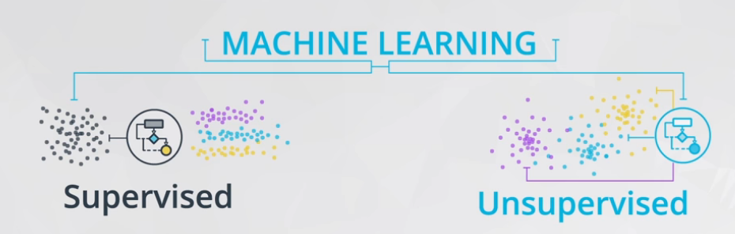

# ND111 - Advanced Statistics `Lesson14`

#### Tags
* Author : AH Uyekita
* Title  : _Regression_
* Date   : 10/01/2019
* Course : Data Science II - Foundations Nanodegree
    * COD    : ND111
    * **Instructor:** Sebastian Thrun
    * **Instructor:** Josh Bernhard

********************************************************************************

## Regression

Bear in mind, regression is a subject of the Supervised branch of Machine Learning. Figure 1 shows a simple big picture.

<em>Figure 1 - Machine Learning Branches.</em>
 

Some hot points in these two branches (there are other branches, but these two are the most know).

* Supervised: A machine learning technique where we are attempting to predict a label based on inputs.
    * Predict fraudulent transactions
    * Predict chance of default on a loan
    * Predict home prices
* Unsupervised: A machine learning technique where we are attempting to group together unlabeled data based on similar characteristics.
    * Customer segmentation
    * Group document that cover similar topics

The Linear and Logistic Regression fall into the Supervised Machine Learning branch.

### Introduction to Linear Regression

* Response variable or dependent (y): The variable you are interested in predicting, and;
* Explanatory variable or independent (x): The variable used to predicted the response.

>A common way to visualize the relationship between two variables in linear regression is using a scatterplot. You will see more on this in the concepts ahead. --- <cite>Udacity notebook</cite>

Figure 2 shows an example of a scatter plot.

<em>Figure 2 - Hours studying vs Test grades.</em>
 

#### Scatter Plot

>Scatter plots are a common visual for comparing two quantitative variables. A common summary statistic that relates to a scatter plot is the **correlation coefficient** commonly denoted by `r`.
>
>Though there are a few different ways to measure correlation between two variables, the most common way is with Pearson's correlation coefficient. Pearson's correlation coefficient provides the:
>
>1. Strength
>2. Direction
>
>of a linear relationship. Spearman's Correlation Coefficient does not measure linear relationships specifically, and it might be more appropriate for certain cases of associating two variables. --- <cite>Udacity notebook</cite>

Figure 3 shows an example of strong positive relationship.

<em>Figure 3 - Strong and Positive Relantionship.</em>
 

When x increase y also increase, and the points is very close from each other. Figure 4 shows the opposite of positive direction.

<em>Figure 4 - Moderate and Negative Relantionship.</em>
 

When x increase y decrease, and the points is a bit sparse. Figure 5 shows an example of scatter plot with weak strength.

<em>Figure 5 - Weak and Negative (??) Relantionship.</em>
 

Both, strength and direction is capture by the correlation (`r`).

* Correlation
    * Varies from -1 to +1;
    * Values close to -1 and +1 are very strong;
    * The signal (positive or negative) means the direction.

<em>Figure 6 - Example of Correlation.</em>
 

### Correlation Coefficients

This is highly field-dependent measure and these values are a general rule of thumbs.

Have in mind, in social sciences is very difficult to find a strong correlation (probably because human are very complex and hard to understand).

* Strong: $0.7 \leq |r| \leq 1.0$
* Moderate: $0.3 \leq |r| \leq .7$
* Weak: $0.0 \leq |r| \leq 0.3$

Sometimes a plot could help a lot, Figure 7 shows an example of two graphs with same correlation coefficients.

<em>Figure 7 - Two Graphics with same Correlation Coefficients.</em>
 

This problem presented in Figure 6 is part of the [Anscombe's Quartet][ref_c4_les14] images.

[ref_c4_les14]: https://en.wikipedia.org/wiki/Anscombe%27s_quartet

### Coefficients

A Linear Regression is a way to estimate the values of some coefficients:

* Intercept: The expected value of the response when the explanatory variable is 0 (zero);
    * $b_0:$ statistic value (sample)
    * $\beta_0:$ parameter value (population)
* Slope: The expected change in the response for each 1 unit increase in the explanatory variable.
    * $b_1:$ statistic value (sample)
    * $\beta_1:$ parameter value (population)

Based on the Intercept and Slope, the Linear Regression equation is presented in equation (1).

$$ \hat y = b_0 + b_1x $$

Where:
* $\hat y:$ is the predicted value of the response from the line.
* $y:$ is an actual response value for a data point in our dataset (not a prediction from our line).
* $b_0:$ is the intercept.
* $b_1:$ is the slope.
* $x_1:$ is the explanatory variable.

Figure 8 ilustrate this equation in a picture.

<em>Figure 8 - Linear Model and Equation.</em>
 

### Least-squares

.
