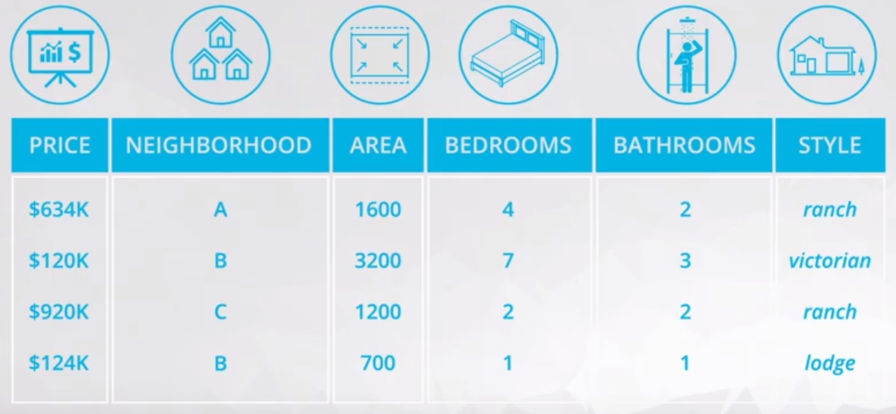
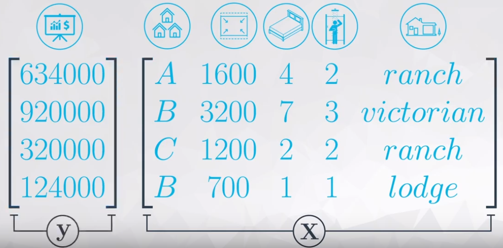
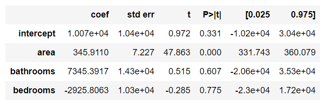
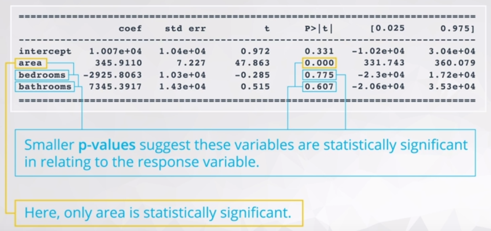
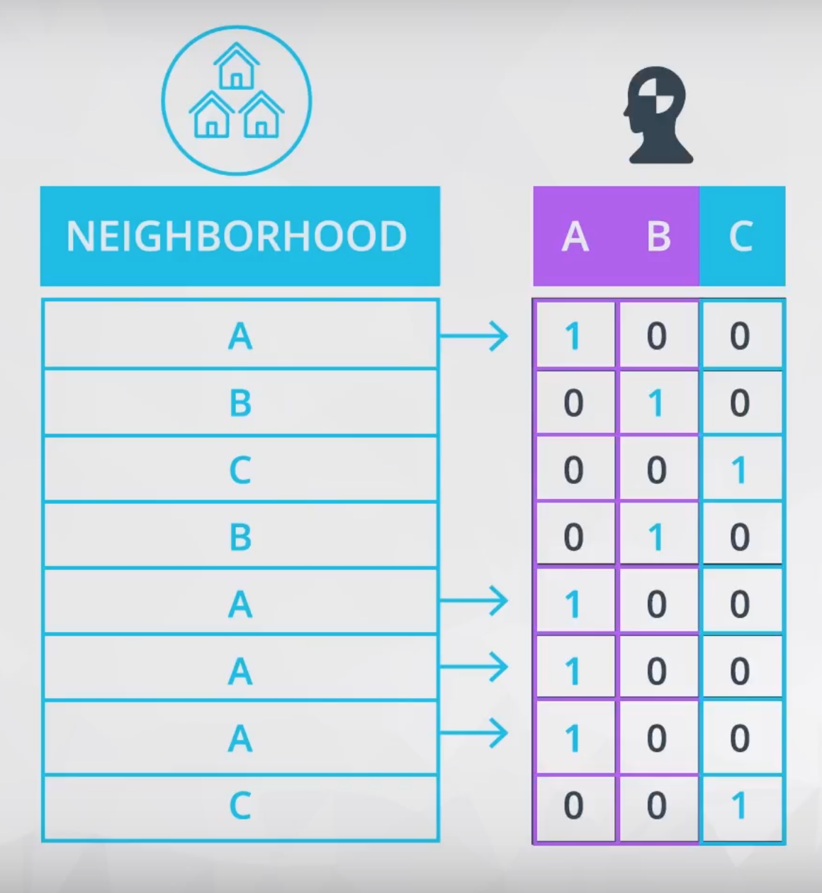
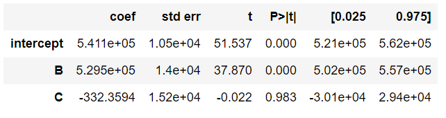
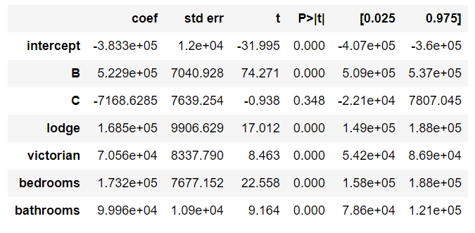
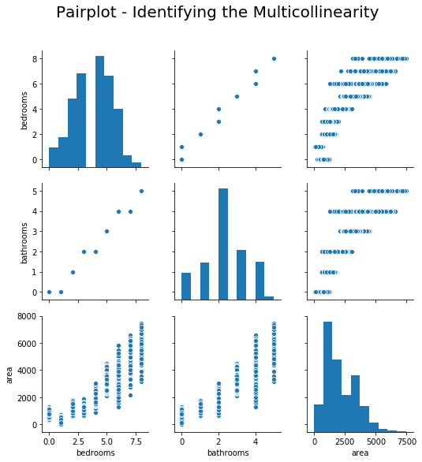
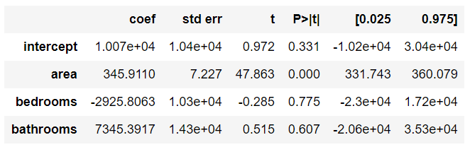

# ND111 - Advanced Statistics `Lesson15`

#### Tags
* Author : AH Uyekita
* Title  : _Multiple Linear Regression_
* Date   : 10/01/2019
* Course : Data Science II - Foundations Nanodegree
    * COD    : ND111
    * **Instructor:** Sebastian Thrun
    * **Instructor:** Josh Bernhard

#### Books Reference

* [An Introduction to Statistical Learning with Applications in R][book_ref_c4_l15]

[book_ref_c4_l15]: http://www-bcf.usc.edu/~gareth/ISL/ISLR%20First%20Printing.pdf

********************************************************************************

## Multiple Linear Regression

This is a generalization of the simple Linear Model, which allows us to use several explanatory variables, as you can see an example of Multiple Linear Regression in equation (1).

$$ \hat y = b_0 + b_1x_1 + b_2x_2 + b_3x_3 + b_4x_4 \tag{1} $$

Figure 1 ilustrate the variables which could be used to predic the  house's price.



<center><em>Figure 1 - House Price Dataset.</em></center><br>

Have in mind, in this table above there are quantitative and categorical variables.

* Quantitative:
    * Price, Area, Bedrooms, and Bathrooms;
* Categorical:
    * Neighborhood and Style.

All these variables will be used to predict the house's price, to do it so it is necessary a little of linear algebra, as you can see in the Figure 2.



<center><em>Figure 2 - Matrix notation.</em></center><br>

Where:

* $\bold X:$ Matrix of inputs;
* $\bold y:$ Vector of response that we want to predict.

After many steps of linear algebra, equation (2) resume the $\beta$ calculation.

$$ \beta = (\bold X' \bold X)^{-1} \bold X \bold y \tag{2}$$

Have in mind, the coefficients calculated in $\beta$ are the same shown in Figure 3 in column `coef`.

#### Interpretation {-}

Figure 3 presents outputs from the OLS of a generic dataset (house_prices.csv).



<center><em>Figure 3 - Coefficients, Standard Errors, etc.</em></center><br>

>In this video, the coefficients were all positive. Therefore, we can interpret each coefficient as the **predicted increase in the response for every one unit increase in the explanatory variable, holding all other variables in the model constant.**

This principles is the so-called [_ceteris paribus_][ceteris].

>_Ceteris paribus or caeteris paribus is a Latin phrase meaning "other things equal". English translations of the phrase include "all other things being equal" or "other things held constant" or "all else unchanged". A prediction or a statement about a causal, empirical, or logical relation between two states of affairs is ceteris paribus if it is acknowledged that the prediction, although usually accurate in expected conditions, can fail or the relation can be abolished by intervening factors._ --- <cite>Wikipedia</cite>

[ceteris]: https://en.wikipedia.org/wiki/Ceteris_paribus

#### Statistical Significance

Analogous to the simple Linear Model, it is important to analyse the `p-values` of each variable. Figure 4 shows the `p-values`.



<center><em>Figure 4 - Statistical Significance.</em></center><br>

As you can see, most of the variable do not have lower `p-values`, which suggest these variables are not statistically signigicant to the response variable. In this example, only `area` reject $H_0$ the others variables failed to reject $H_0$.

Signigicant bivariate relationships are **not** always signigicant in Multiple Linear Regression.

### Dummy Variable

This is a method to insert categorical variables in Multiple Linear Regressions. We will use 0 and 1 to encode this Dummy Variable, which will work creating new columns for each category of the variable. Figure 5 shows an example.



<center><em>Figure 5 - Converting Categorical Variable to Dummy Variable.</em></center><br>

Remember, the C columns is not necessary because is a complement of the other two columns (A and B). The dropped columns (in this case the C column) is the so-called **baseline**. What you need to understand about the **baseline** is:

>The coefficients you obtain from the output of your multiple linear regression models are then an indication of how the encoded levels compare to the baseline level (the dropped level). --- <cite>Udacity Notebook</cite>

The mathematical reason to drop one columns is to garantee the $\bold X$ matrix is invertible.

#### Interpretation {-}

The baseline will be used to calculate the real coefficients of each Dummy variable. Figure 6 shows an example of output of a Multiple Linear Regression.



<center><em>Figure 6 - Example of Coefficients from a Dummies Variables.</em></center><br>

The intercept is the value of the baseline (in other words it is the coefficient of A). To calculate the other coefficients you need to subtract the baseline from each coefficient.

* Coefficient A: 5.411e+05
* Coefficient B: 5.411e+05 - 5.295e+05 = 1070600.0
* Coefficient C: 5.411e+05 - 332.36 = 540767.6406

Coef C < Coef A < Coef B

Each of the coefficients provided by the OLS is a comparison with the baseline.

In a more complex example as presented in Figure 7.



<center><em>Figure 7 - Dummies Variables from two categories.</em></center><br>

There are "two" **baseline** variables: `A` and `ranch`.

* Coefficient A: -383300.0
* Coefficient B: -383300.0 + 5.229e5 = 139600.0
* Coefficient C: -383300.0 - 7168.63 = -390500.0
* ranch: -383300.0
* lodge: -383300.0 + 1.685e5 = -214800.0
* victorian: -383300.0 + 7.056e4 = -312770.0

### Problems in Multiple Linear Regression

Problems is sensible to the application of this Multiple Linear Regression.

* What is your model for?
    * Understand how is related x and y
    * Best predict the response variable
    * Which variable is really useful in predicting your response

Founded on the objectivies of the model, there are many possibilities of problems, below there are some common problems.

* A linear relationship does not exist
* Correlated errors
* Non-constant variance
* Outliers
* Multicollinearity

#### Multicollinearity {-}

Generally, we assume the explanatory variables are all uncorrelated with one another, but we want these explanatory variables are correlated with the responer variable.

An example of possible multicollinearity:

>We expected a bigger number of bedrooms and bathrooms when the house area increases.

There are two ways to identify the multicollinearity:

* Plotting the scatterplot matrix, or;
* Calculating the [Variance Inflation Factors][vifs_url] (VIFs)

**Scatterplot**

[vifs_url]: https://en.wikipedia.org/wiki/Variance_inflation_factor

Figure 8 shows the scatter plot of area, bedrooms, and bathrooms.



<center><em>Figure 8 - Scatterplot of area, bedrooms, and bathrooms.</em></center><br>

All three variables have strong and positive correlation.

OK! Let's calculate the Multiple Linear Regression using `area`, `bedrooms`, and `bathrooms` as explanatory variables to predict the `price`. Figure 9 shows the output of the `OLS` method.



<center><em>Figure 9 - Coefficients of a Multiple Linear Regression based on area, bedrooms, and bathrooms to predict price.</em></center><br>

Remember, we expected positive values of coefficients, but the bedrooms coefficient is negative. This is one of the side effect of multicollinearity, it could flip the signal, and produce a weird result.

**Calculating the VIF**

>The Variance Inflation Factor (VIF) is a measure of colinearity among predictor variables within a multiple regression. It is calculated by taking the the ratio of the variance of all a given model's betas divide by the variane of a single beta if it were fit alone. --- <cite>[Ernest Tavares Website][ernest_site]</cite>

[ernest_site]: https://etav.github.io/python/vif_factor_python.html

In other words, this means to calculate for each explanatory variable the R-squared adopting it as response variable, and later calculate the VIF according to the equation (3).

$$VIF_i = \frac{1}{1-R^2_i} \tag{3}$$

Where:

* $i:$ intercept, area, bedrooms, and bathrooms.

This is my original equation:

$$ price = intercept + area*b_1 + bedrooms * b_2 + bathrooms * b_3 $$

Where:

* Explanatory variables: intercept, area, bedrooms, and bathrooms.
* Response variable: price

I need to calculate the $R^2$ for each of these equations:

$$ intercept = area*b_1 + bedrooms * b_2 + bathrooms * b_3 \\ bedrooms = intercept + area*b_1 + bathrooms * b_3 \\
bathrooms = intercept + area*b_1 + bedrooms * b_3 \\
area = intercept + bathrooms*b_1 + bedrooms * b_3 $$

The result of the $R^2$ is presented in Table 1.

<center><strong>Table 1 - R-Squared used to Calculate the VIF.</strong></center>

|Response Variable|$R^2$|
|:-:|:-:|
|intercept|0.8635203885901309|
|area|0.8167890866692036|
|bedrooms|0.952048682065964|
|bathrooms|0.9473873926707678|

Table 2 shows the VIFs for each value of $R^2$.

<center><strong>Table 2 - VIFs.</strong></center>

|Response Variable|VIF|
|:-:|:-:|
|intercept|7.3271017529266529|
|area|5.458190136274525|
|bedrooms|20.854484153608585|
|bathrooms|19.006851223744377|

>When VIFs are greater than 10, this suggests that multicollinearity is certainly a problem in your model. Some experts even suggest VIFs of greater than 5 can be problematic. In most cases, not just one VIF is high, rather many VIFs are high, as these are measures of how related variables are with one another. --- <cite>Udacity notebook.</cite>

In this case I will remove the bathrooms variable, and update my equation:

$$ price = intercept + area * b_1 + bedrooms * b_2 \tag{4}$$

Following the same process, I will calculate the new $R^2$ and later the VIF's.

<center><strong>Table 3 - R-Squared used to Calculate the VIF.</strong></center>

|Response Variable|$R^2$|VIF|
|:-:|:-:|:-:|
|intercept|0.8350894909730524|6.063894932472694|
|area|0.8129232492956318|5.345399662089865|
|bedrooms|0.8129232492956316|5.3453996620898625|

There is an other way to calculate this VIF's using the `variance_inflation_factor` from `statsmodels.stats.outliers_influence`. It is much simpler to apply this methods, but it is quite hard to understand the hidden subject behind the scenes.

### Higher Order Terms

Adding higher order terms is a way to add non-linearity to explain the response variable.

* Higher Order Terms:
    * Interactions: $x_1x_2$
    * Quadratics: $x^2$
    * Cubics: $x^3$
    * Other higher orders terms: $x^n$

Adding these terms could improve the response results, but it makes harder to understand and explain the relationship between this higher orders terms.

For instance, $y_1$ do not have higher orders terms and $y_2$ has a interaction. Both equations are quite similar, except from the term $cx_1x_2$.

$$y_1 = ax_1 + bx_2 + d \\
  y_2 = ax_1 + bx_2 + cx_1x_2 + d$$

The derivate from each equation will return the slope coefficient.

$$\frac{\partial y_1}{\partial x_1} = a \\
  \frac{\partial y_2}{\partial x_1} = a + c \cdot x_2$$

In $\partial y_1/\partial x_1$ the slope is constant ($a$), whereas in $\partial y_2/\partial x_1$ the slope will varies according to the $c \cdot x_2$.

### New Method

In this lesson the pandas package method called `.get_dummies` will introduced.

#### `.get_dummies()`

This method returns a Data Frame with each category of the categorical variable as a new column.

```py
pd.get_dummies(df['categorical_variable'])
```
Remember, this method do not remove the baseline.
