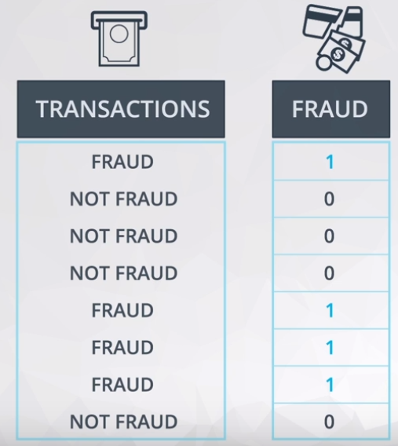

# ND111 - Advanced Statistics `Lesson16`

#### Tags
* Author : AH Uyekita
* Title  : _Logistic Regression_
* Date   : 10/01/2019
* Course : Data Science II - Foundations Nanodegree
    * COD    : ND111
    * **Instructor:** Sebastian Thrun
    * **Instructor:** Josh Bernhard

#### Related Courses

* [UD120 - Intro to Machine Learning][rel_ud120]

[rel_ud120]: https://classroom.udacity.com/courses/ud120

********************************************************************************

## Logistic Regression

Is used to predict a categorical response (yes or no, A or B, etc.).

Examples:

* Card transactions: Fraud or not?
* Click in the link: Yes or not?
* In a loan: default or not?

Anything else with only two outcomes. If the categorical has more than two it is classified as Multiclass Logistic Regression.

### Sigmoid function

The sigmoid function (also known as logistic function) is used to classify the categories in two values based in your probability `p` (later it will be discussed in detail).


<center><em>Figure 1 - Sigmoid function.</em></center><br>

Observe the two extreme values, 0 and 1, these two values will be used to describe the two categories of the variable you want to predict. Figure 2 shows an example.



<center><em>Figure 2 - How to interpret the categories of Transactions column.</em></center><br>

In other words, the outcome would be:

$$y \in \{0,1\}$$

Where:

* 0: Positive class (Yes, Spam)
* 1: Negative class (No, Not spam)

The equation used in a regular Linear Regression is stated in equation (1).

$$ y = a + b \cdot x_1 + c \cdot x_2   \tag{1}$$

Which could be noted as equation (2):

$$ \bold y = \underbrace{[a \ b \ c]}_{\theta^T} \cdot \underbrace{\begin{bmatrix} 1 \\ x_1 \\ x_2\end{bmatrix}}_{x} = \theta^T \cdot \bold x \tag{2}$$

The outcome $\bold y$ could have any real number and this is the reason to apply it to the sigmoid function, this action will delimited the outcome between 0 and 1. Equantion (3) shows how is the sigmoid function.

$$h_{\theta}(\bold y) = \frac{1}{1 + e^{- \bold y}} = \frac{1}{1 + e^{-\theta^T \bold x}}$$

Where:

* $\theta^T:$ Coefficients of a linear regression;
* $\bold x:$Training set.

Have in mind, the $\bold y$ will be defined as:

* $0.5 < \bold y \leq 1.0:$ round to 1;
* $0.0 \leq \bold y \leq 0.5:$ round to 0.

#### Interpretation {-}

The way to interpret the `coef` from the `.Logit()` is quite different from the `.OLS()`. Figure 3 shows an example of outcome from the Logistic Regression.


<center><em>Figure 3 - Example of Logistic Regression output.</em></center><br>

Equally to the Multiple Linear Regression the baseline still in the intercept, but the comparison is made by "times".

For instance:

$$e^{2.5465} = 12.76 \text{ times} $$

This means:

>On Weekdays the chance of fraud is 12.76 times more likely than on weekends. Have in mind, the weekend is our baseline.

It is not necessary to do math (add or subtract from the baseline).

$$e^{-1.4637} = 0.23 \text{ times} $$

This means:

>For each minute spent in transaction the fraud is 0.23 times more likely than on weekends.

In this case, this kind of conclusion is quite wierd, and for this reason we rephrase it.

$$1/e^{-1.4637} = 4.32 \text{ times} $$

>For each minute less spent on the transaction, the chance of fraud is 4.32 times more likely holding the day of the week constant.

### Model Diagnostic

The model diagnostic will be performed by the Confusion Matrix. Figure 4, 5, and 6 shows examples of this kind of matrix with differents values.


<center><em>Figure 4 - Confusion Matrix - Collin Powell Example.</em></center><br>


<center><em>Figure 5 - Confusion Matrix - George Bush Example.</em></center><br>


<center><em>Figure 6 - Confusion Matrix - Donald Rumsfeld - Example.</em></center><br>

Based on these example, recall and precision could be defined as:

* **Recall:** Out of all the items that are truly positive, how many were correctly classified as positive. Or simply, how many positive items were 'recalled' from the dataset.

$$\text{Recall} = \frac{\text{True Positive}}{\text{True Positive + False Negative}}$$

* **Precision:** Out of all the items labeled as positive, how many truly belong to the positive class.

$$\text{Recall} = \frac{\text{True Positive}}{\text{True Positive + False Positive}}$$

### Statistics vs Machine Learning


<center><em>Figure 7 - Comparison between Statistics and Machine Learning.</em></center><br>

### New Methods

#### `.drop()`

This method drop a column, is a part of pandas.

```py
pd.drop('column_to_be_dropped', axis = 1)

```

#### `.Logit()`

This method is anologous to the OLS and performs the Logistic Regression.

```py
import statsmodels as sm

sm.Logit('y_variable', ['intercept','x1_variable','x2_variable'])
```
