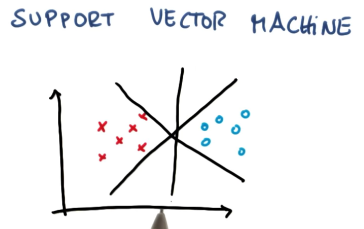
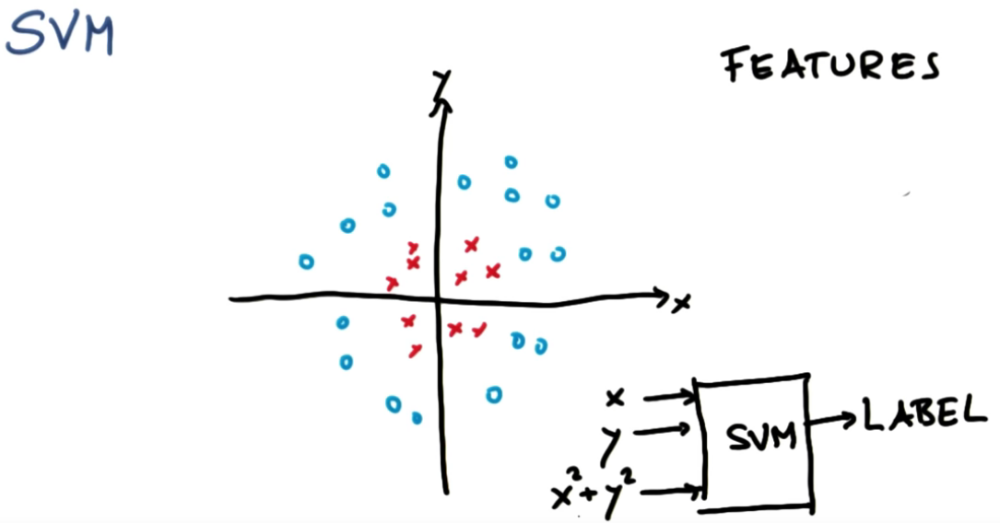
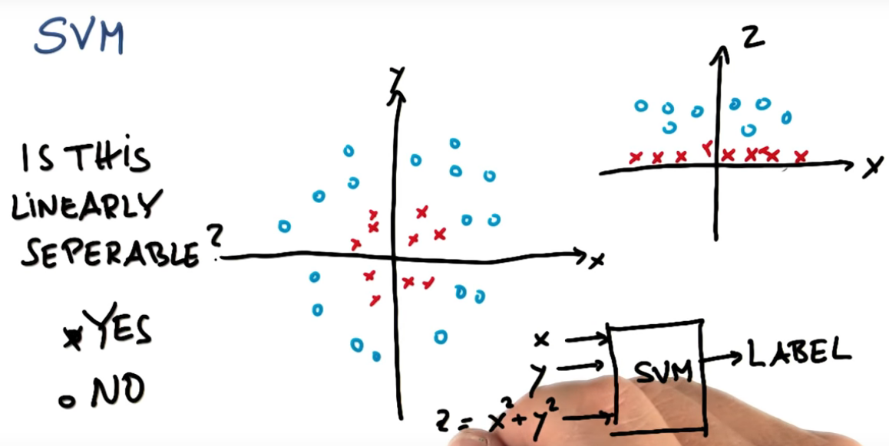
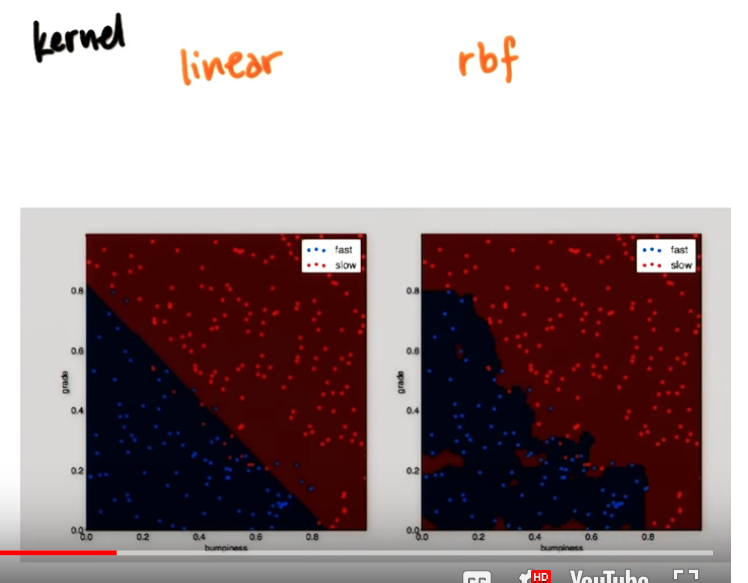

# ND111 - Intro to Machine Learning `Lesson03`

#### Tags
* Author : AH Uyekita
* Title  : _SVM_
* Date   : 14/01/2019
* Course : Data Science II - Foundations Nanodegree
    * COD    : ND111
    * **Instructor:** Katie Malone
    * **Instructor:** Sebastian Thrun

#### Python 2 Configuration

I have installed the Python 2 in Jupyter Notebook.

```bash
python2 -m pip install ipykernel
python2 -m ipykernel install --user
```

[Source](https://stackoverflow.com/questions/46391424/jupyter-notebook-install-python-2)


******************************************************************

## Support Vector Machine (SVM)

The Support Vector Machine was an algorithm invented by [Hava Siegelmann and Vladimir Vapnik][wikipedia_svm]. The objective of this algorithm is to fit a line to divide a group of point/features in two or more classes.

[wikipedia_svm]: https://en.wikipedia.org/wiki/Support-vector_machine

Figure 1 show the possibilities the line to segregate the two types of points.

<center>

<em>Figure 1 - Possible lines to divide the points in two groups.</em></center>

All the three lines could be a solution, but the SMV algorithm aims to maximaze the distance to the nearest point, which is the so-called **margin**.

Have in mind, the first objective of SMV is to classify correctly, later maximize the **margin**.

#### Additional notebooks {-}

For a better understanding about SVM, read the [bookdown of Machine Learning][bookdown_machine_learning] offered by Stanford and taught by Andrew Ng.

[bookdown_machine_learning]: a

This course is focused in application and do not talk much about the theoretical aspects.

### Scikit Learn

The Scikit Learn also has methods to calculate the SVM.

#### `SVC()`

This function creates an object classifier.

```py
clf = SVC(kernel = 'linear')
```
Remember, the `kernel` used is linar, which means the SVM will plot a straight line, and also could be lon-linear.

#### Non linear SVM

The non-linear SVM occurs when you adopt a non-linear kernel, as you can see in Figure 2.

<center>

<em>Figure 2 - Example of Non-linear SVM.</em></center>

There are several non-linear kernels:

* Poly;
* rbf (gives the curvy answer);
* Sigmoid, etc.

The uses of a polynomial gives the output of Figure 3.

<center>

<em>Figure 3 - Interpretation of $z = x^2 + y^2$.</em></center>

#### Parameters

This is characteristics that you define when you creating the classifier, so before you fitting the data. There are three:

* Kernel;
* Gamma, and;
* C.

Figure 4 shows two examples of output with different kernel.

<center>

<em>Figure 4 - Comparison between linear (on the left side) and rbf (on the right side).</em></center>

For this reason, the kernel could change completely the boundary.

```py
clf = sm.SVC(C = 1, gamma = 1, kernel = "rbf")
```

#### C

Controls trafeoff between smooth decision boundary and classifying training points correctly.

>A low C makes the decision surface smooth, while a high C aims at classifying all training examples correctly.

#### Gamma

Defines how far the influence of a single training example reaches.

>gamma defines how much influence a single training example has. The larger gamma is, the closer other examples must be to be affected.

#### Overfitting

Avoide the overfitting, in SVM there are three parameters which could lead overfitting.

* Kernel;
* C
* gamma


#### `.fit()`

Similarly to the `.fit()` from GaussianNB.
```py
# Fitting a model.
clf.fit(X_train,Y_train)
```
Where:

* X_train: is the "coordinates" of the points to train the data;
* Y_train: the answer of each pair of coordinates.

#### `.pred()`

Based on the `clf` it is possible to predict the values of a test dataframe.

```py
# After fitting the clf you can use to predict.
clf.pred(X_test)
```
