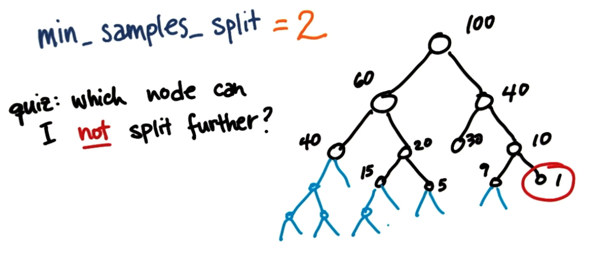
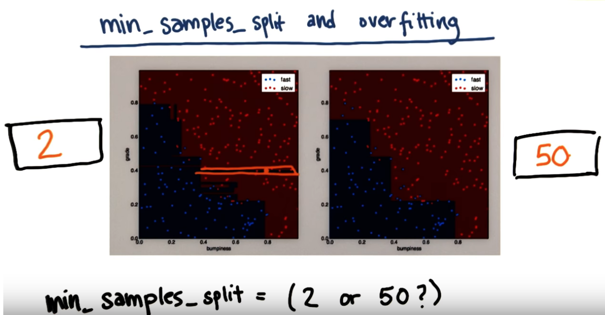
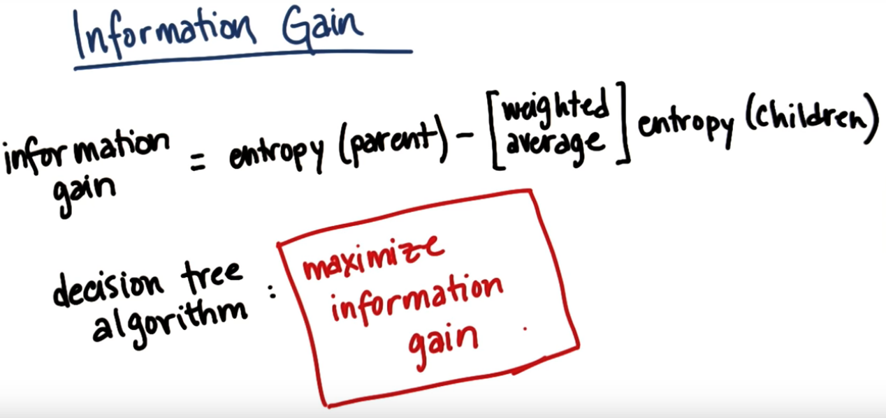
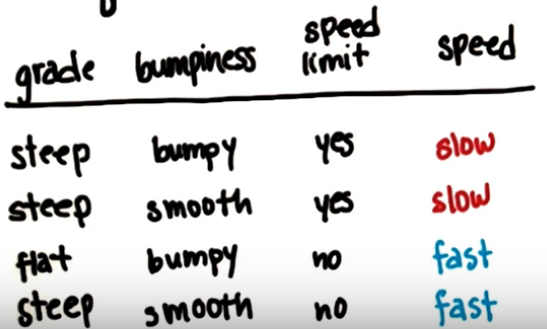
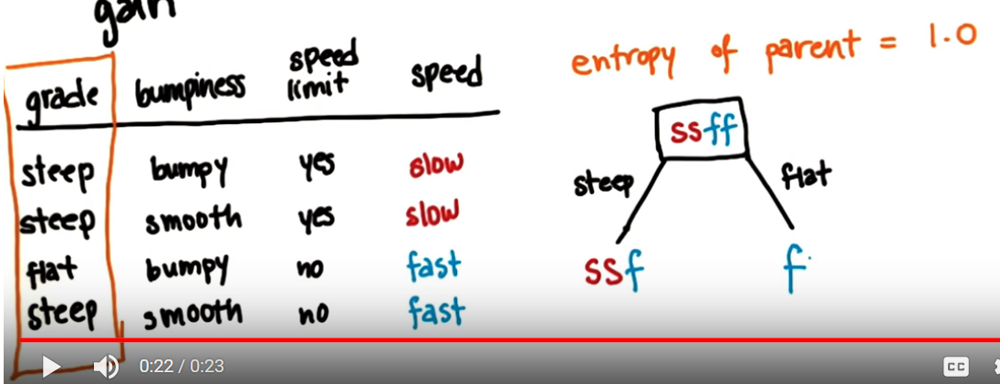
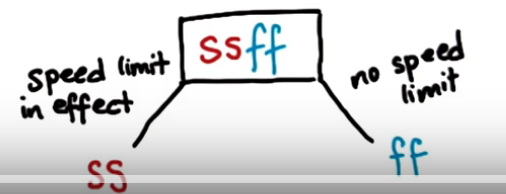

# ND111 - Intro to Machine Learning `Lesson04`

#### Tags
* Author : AH Uyekita
* Title  : _Decision Trees_
* Date   : 16/01/2019
* Course : Data Science II - Foundations Nanodegree
    * COD    : ND111
    * **Instructor:** Katie Malone
    * **Instructor:** Sebastian Thrun

******************************************************************

## Decision Trees

>A decision tree is a decision support tool that uses a tree-like model of decisions and their possible consequences, including chance event outcomes, resource costs, and utility. It is one way to display an algorithm that only contains conditional control statements.
>
>Decision trees are commonly used in operations research, specifically in decision analysis, to help identify a strategy most likely to reach a goal, but are also a popular tool in machine learning. --- <cite>[Wikipedia][decision_tree]</cite>

[decision_tree]: https://en.wikipedia.org/wiki/Decision_tree

In Scikit Learn you can also find the Decision Trees.

### Scikit Learn Decision Tree

This classifier has the same workflow from the other two (GaussianNB and SVM).

```py
# Import decision tree from sklearn.
from sklearn import tree

# Create the classifier using tree.
clf = tree.DecisionTreeClassifier()

# Fitting/Training the model.
clf.fit(df_train, labels_train)

# Predicting
pred = clf.predict(df_test)
```

### Parameters

The `.DecisionTreeClassifier()` has a lot of parameters to set up.

#### `min_samples_split`

This parameter set a limit of how deep the decision tree will go. Figure 1 shows an example of the extension of the Tree.

<center>

<em>Figure 1 - Example of leafs and nodes.</em></center><br>

As you can see the `min_samples_split` will go further for each node until reach the node with two leafs.

The effect of going further and further, it means, a very low number of `min_samples_split` is more likely prone to overfitting. You can see an example of overfitting in Figure 2.

<center>

<em>Figure 2 - Overfitting.</em></center><br>

#### Entropy

Bear in mind, the default function to measure the quality of a split in  `DecisionTreeClassifier()` is the `gini`index instead of the `entropy`.

The entropy controls how the decision tree decides where to split the data.

$$entropy = - \sum_i^n p_i \cdot (\ln(p_i))$$

When entropy is 1 there is no pattern, the data was spread equally on the "plot" and you can not realize where to split. On the other hand, when entropy is 0 there are a clearly areas to split.

Though, the entropy is applied to parents and child of the tree in a way that you will "compare" entropies from parents and child.

#### Gain

Founded on the entropies calculated from the parent and child, it is possible to calculate the gain.

$$\text{Information Gain} = entropy(parent) - [\text{weighted average]} \cdot entropy(children)$$

<center>

<em>Figure 3 - Information Gain.</em></center><br>

The object function of a decision tree is to maximize the information gain.

#### Example

Figure 4 shows a dataframe to be splited.

<center>

<em>Figure 4 - How to split using Decision Tree?.</em></center><br>

Bear in mind, the parent entropy of the all dataset is 1.

Now, let's use the **gain information** to decide which variable to use.

**Grade**

Ilustrating the decision tree using a tree, Figure 5 shows a summary.

<center>

<em>Figure 5 - The grade splitting.</em></center><br>

Splitting by grade flat has only fast, whereas steep has two slow and 1 gast. Let's calculate the probabilities/proportion in Table 1:

<center><strong>Table 1 - Table of quantity and proportion for Grade</strong></center>

||Steep|Flat|p<sub>steep</sub>|p<sub>flat</sub>|
|:-:|:-:|:-:|:-:|:-:|
|Slow|2|1|2/3|1/3|
|Fast|0|1|0/1|1/1|

Based on these probabilities, I can calculate the entropy of each category (steep and flat).

* Entropy calculation:

$$entropy(flat) = -(p_{flat,slow} \cdot \ln(p_{flat,slow}) + p_{flat,fast} \cdot \ln(p_{flat,fast})) = \\ -(1 \cdot \ln(1) + 0 \cdot \ln(0)) = 0 $$

$$entropy(steep) = -(p_{steep,slow} \cdot \ln(p_{steep,slow}) + p_{steep,fast} \cdot \ln(p_{steep,fast})) = -(\frac{2}{3} \cdot \ln(\frac{2}{3}) + \frac{1}{3} \cdot \ln(\frac{1}{3})) = 0.9183$$

* Information Gain:

$$\text{Information Gain} = 1 - (0.9182 \cdot \frac{3}{4} + 0 \cdot \frac{1}{4}) = 0.3112 $$

>The Gain of Information is 0.3112

<center><strong>Table 2 - Table of quantity and proportion for Bumpiness</strong></center>

||Steep|Flat|p<sub>steep</sub>|p<sub>flat</sub>|
|:-:|:-:|:-:|:-:|:-:|
|Bumpy|1|1|1/2|1/2|
|Smooth|1|1|1/2|1/2|

* Entropy calculation:

$$entropy(bumpy) = -(p_{bumpy,slow} \cdot \ln(p_{bumpy,slow}) + p_{bumpy,fast} \cdot \ln(p_{bumpy,fast})) = \\ -(0.5 \cdot \ln(0.5) + 0.5 \cdot \ln(0.5)) = 1 $$

$$entropy(smooth) = -(p_{smooth,slow} \cdot \ln(p_{smooth,slow}) + p_{smooth,fast} \cdot \ln(p_{smooth,fast})) = -(0.5 \cdot \ln(0.5) + 0.5 \cdot \ln(0.5)) = 1 $$

* Information Gain:

$$\text{Information Gain} = 1 - (1 \cdot \frac{2}{4} + 1 \cdot \frac{2}{4}) = 0$$

>For this variable there is no Gain of Information, which means we do not learn anything splitting by bumpiness.

<center><strong>Table 3 - Table of quantity and proportion for Speed Limit</strong></center>

||Steep|Flat|p<sub>steep</sub>|p<sub>flat</sub>|
|:-:|:-:|:-:|:-:|:-:|
|yes|2|0|2/2|0/2|
|no|0|2|0/2|2/2|

* Entropy Calculation:

$$entropy(yes) = -(p_{yes,slow} \cdot \ln(p_{yes,slow}) + p_{yes,fast} \cdot \ln(p_{yes,fast})) = \\ -(1 \cdot \ln(1) + 0 \cdot \ln(0)) = 0 $$

$$entropy(no) = -(p_{no,slow} \cdot \ln(p_{no,slow}) + p_{no,fast} \cdot \ln(p_{no,fast})) = -(0 \cdot \ln(0) + 1 \cdot \ln(1)) = 0 $$

* Information Gain:

$$\text{Information Gain} = 1 - (1 \cdot 0 + 1 \cdot 0) = 1$$

>Best information gain possible. You should split using this feature.

<center>

<em>Figure 6 - Speed Limit Decision Tree.</em></center><br>

#### Bias

Bias in machine learning, means an algorithm that almost "ignores" the data, it has almost no capacity to learn anything.

On the other hand, a machine learning very perceptive to data, will only replicate what it has seen before, it has no capacity to "generalize" a new situation. It is called algorithm with high variance.

What we are looking for is something in the middle of bias and high variance. This is the trade-off of bias-variance.


.
