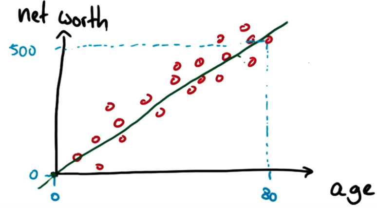
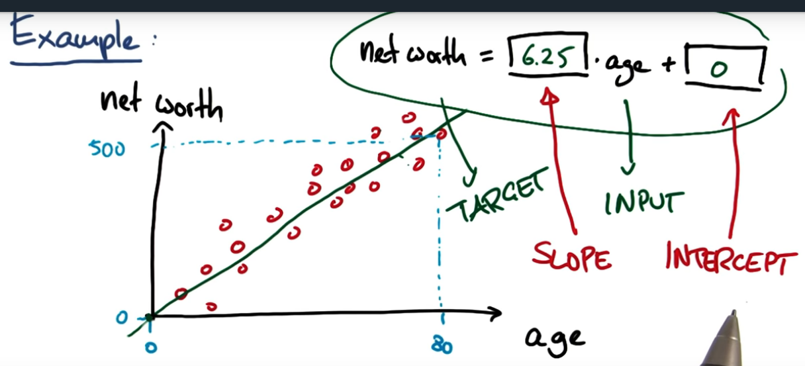
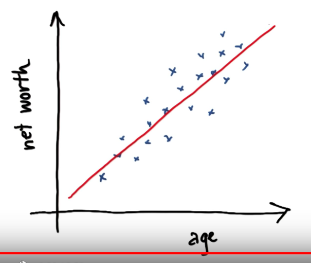
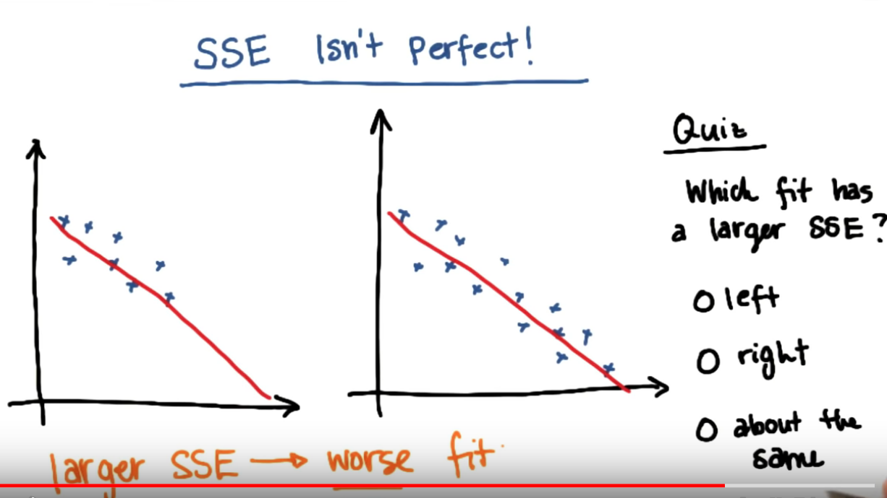
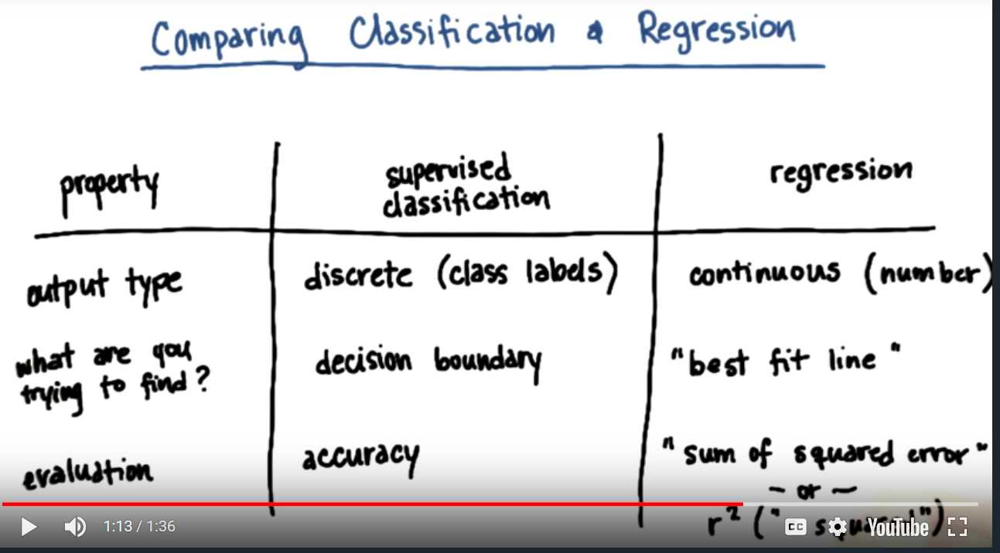
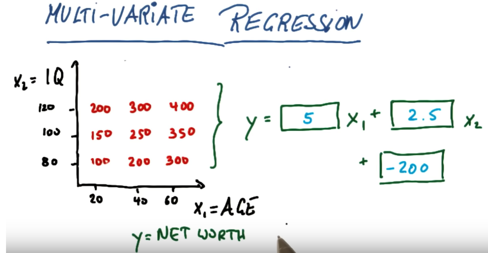

# ND111 - Intro to Machine Learning `Lesson07`

#### Tags
* Author : AH Uyekita
* Title  : _Regressions_
* Date   : 17/01/2019
* Course : Data Science II - Foundations Nanodegree
    * COD    : ND111
    * **Instructor:** Katie Malone
    * **Instructor:** Sebastian Thrun

******************************************************************

## Regressions

So far the output from the linear regression in this course was discrete, which means there is only two outputs (yes or no, 0 or 1, etc.).

In this lesson, we are going to build linear regression with continuous values, as you have learnt in the previous lessons, linear regression is part of the Supervised Learning. For this reason, we will be introduced to Continuous Supervised Learning.

Figure 1 shows an example.

<center>

<em>Figure 1 - Shows an example of Continuous Linear Regression.</em></center>

The interpretation is the same of the discrete one, so we have slope and intercept as you can check in Figure 2.

<center>

<em>Figure 2 - Shows an example of Continuous Linear Regression.</em></center>

Equation (1) shows the Linear Regression.

$$\text{net worth} = \underbrace{6.25}_{SLOPE} \cdot age + \underbrace{0}_{INTERCEPT} \tag{1}$$

The liner regression as also performed by Scikit Learn package.

### Scikit Learn

The package to calculate the Linear Regression in Scikit Learn is called `linear_model`.

```py
# Import the library of linear model from Scikit Learn.
from sklearn.linear_model import LinearRegression
```

Analogous to the Classifier problems, the linear regression also has a classifier, the so-called `.linearRegression()`.

```py
# Creating a Classifier
reg = linearRegression()
```
After that you need to fit the model using the `.fit()`.

```py
# Fitting/Training the classifier.
reg.fit(X, Y)
```
Where:

* X is the features training dataset;
* Y is the labels training dataset.

Finally, the let's calculate the coefficients by using the `.coef_`.

```py
# Calcularing the slope (or coefficients) of the linear regression.
reg.coef_()
```

```py
# Calcularing the intercept of the linear regression.
reg.intercept_()
```

```py
# Calcularing the R-Squared.
reg.score_()
```

#### Performance {-}

For the performance we need to use the `.score_` method. Recall, to use the test dataframe to calculate the score, because do not want to incurr in overfitting.

```py
# Calculating the r-squared.
reg.score_(feature_test, output_test)
```
The `.score_()` is the "same" o `.accuracy()`.

### Erros

Erros is not related with wrong, and means the difference between the predicted value and the actual value. Figure 3 shows crosses (actual values) and the predicted values (red line).

<center>

<em>Figure 3 - Actual Points and Predicted Line.</em></center>

Equation (2) shows how to calculate the error.

$$\text{error} = \text{actual point} - \text{predicted value} \tag{2}$$

The objective function to minimizee the error is presented in equation (3)

$$\text{Minimize} \sum^n_{\text{i = 1}} =(\text{Actual}_i - \text{Predicted}_i)^2 \tag{3}$$

We use algorithms to solve this problem:

* OLS (Ordinary Least Squares), or;
* Gradient Descent.

Both method will not be covered in this course (you can find it in Stanford Machine Learning offered by Coursera).

For the sake of this lesson we will use the sum of square erros as SEE (equation (3)). Figure 3 shows a shortcoming about this approach.

<center>

<em>Figure 4 - SSE is not perfect.</em></center>

As you increase the amount of points your SSE will increase also, so this is the shortcoming in SSE as evaluation metric.

### R-Squared

>How muchof my change in the output ($y$) is explained by the change in my input ($x$).

The R-Squared ($R^2$) varies from 0 to 1.

* 0: Line is not doing a great job of capturing trend in data;
* 1: Line does a good job of describing relationship between input($x$) and output($y$).

Have in mind, the $R^2$ is not affect by the number of point, independently it is varies from 0 to 1.

#### Comparison {-}

Figure 5 shows a comparison between Discrete and Continuous.

<center>

<em>Figure 5 - Comparison Table between Classification and Continuous.</em></center>

### Multivariate Regression

This is a different way to explain the multivariate I have seen before.

<center>

<em>Figure 6 - Graphic + Values.</em></center>

Based on the _ceteris paribus_ concept we will analize $x_1$ and $x_2$ separately.

$$y = \beta_1 \cdot x_1 + \beta_2 \cdot x_2 + \beta_0$$

* $\beta_1$

$$\beta_1 = \frac{300 - 100}{60-20} = 5$$

* $\beta_2$

$$\beta_2 = \frac{200-100}{120-80}=2.5$$

* $\beta_0$

$$\beta_0 = y - \beta_1 \cdot x_1 - \beta_2 \cdot x_2 = 100 - 5 \cdot 100 - 2.5 \cdot 80 \\
\beta_0 = -200$$
