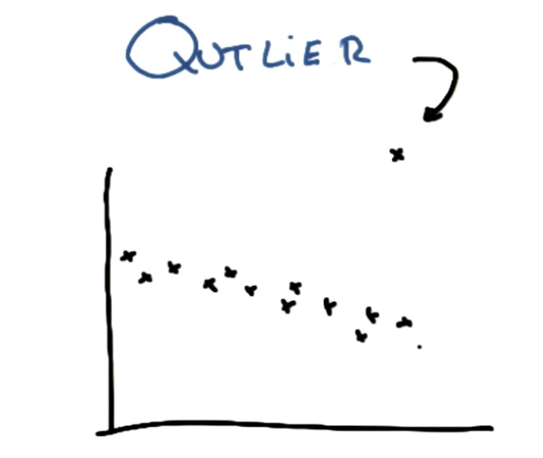

# ND111 - Intro to Machine Learning `Lesson08`

#### Tags
* Author : AH Uyekita
* Title  : _Outliers_
* Date   : 19/01/2019
* Course : Data Science II - Foundations Nanodegree
    * COD    : ND111
    * **Instructor:** Katie Malone
    * **Instructor:** Sebastian Thrun

******************************************************************

## Outliers

An example of outlier:

<center>

<em>Figure 1 - An outlier.</em></center>

The reason of outlier could varies:

* Sensor malfunction;
* Data Entry erros (Typos), and;
* "Freak events/Anomalies."

The sensor malfunction and data entry errors you can ignore, whereas the "freaks events" are what you must pay attention (bank fraud, etc.).

According to the application you need to treat the outliers as a "junkie" and in other cases what you really want to detect (anomalies).

```
1. Train
2. Remove Points with largest residual error (about 10%)
3. Re-train
```
