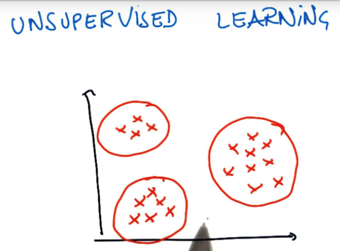

# ND111 - Intro to Machine Learning `Lesson09`

#### Tags
* Author : AH Uyekita
* Title  : _Clustering_
* Date   : 20/01/2019
* Course : Data Science II - Foundations Nanodegree
    * COD    : ND111
    * **Instructor:** Katie Malone
    * **Instructor:** Sebastian Thrun

******************************************************************

## Clustering

Clustering is part of the Unsupervised Learning and aims to classify unlabeled points in groups.

<center>

<em>Figure 1 - Example of Clustering.</em></center>

To perform the clusterization it is necessary to assume the number of clusters (beforehand), which could lead you sometimes to counterintuitive results or "wrong results". Due to the assumptions of cluster's number this is called unlabeled, we do not have results to compare with the fitted outputs.

### Scikit Learn

The Scikit Learn package has several methods of clusterization:

* K-means;
* DBSCAN;
* Ward hierarchical clustering, etc.

In this course, we will use the K-Means.

#### K-means {-}

>The KMeans algorithm clusters data by trying to separate samples in n groups of equal variance, minimizing a criterion known as the inertia or within-cluster sum-of-squares. This algorithm requires the number of clusters to be specified. It scales well to large number of samples and has been used across a large range of application areas in many different fields. --- <cite>[Scikit Learn][scikit_learn_kmeans]</cite>

[scikit_learn_kmeans]: https://scikit-learn.org/stable/modules/clustering.html#k-means

>k-means clustering is a method of vector quantization, originally from signal processing, that is popular for cluster analysis in data mining. k-means clustering aims to partition n observations into k clusters in which each observation belongs to the cluster with the nearest mean, serving as a prototype of the cluster. This results in a partitioning of the data space into Voronoi cells. --- <cite>[Wikipedia][wiki_k_means]</cite>

[wiki_k_means]: https://en.wikipedia.org/wiki/K-means_clustering

The basic idea of clustering (using K-means) is to calculate the distance (squared distance) of each point to the so-called centroid (the core of the cluster) and minimize the sum of all distances (objective function). Each point will belong to only one cluster.

>In practice, the k-means algorithm is very fast (one of the fastest clustering algorithms available), but it falls in local minima. That’s why it can be useful to restart it several times. --- <cite>[Scikit Learn][scikit_learn_kmeans_2]</cite>

[scikit_learn_kmeans_2]: https://scikit-learn.org/stable/modules/generated/sklearn.cluster.KMeans.html#sklearn.cluster.KMeans

```py
# Importing the Scikit Learn and Kmeans
from sklearn.cluster import KMeans
```
#### Classifier {-}

The classifier of K-Means is the `.KMeans()`.

```py
# Creating the classifier.
kmeans = KMeans(n_clusters=2)
```

Where:

* n_clusters: Is the number of cluster, you must define it.

#### Fitting {-}

Training the classifier.

```py
# Fitting the classifier.
kmeans.fit(X)
```
Where:

* X: Is the dataframe with the points to be clustered. Usually, it is a list of tuples.

#### Predict {-}

Creates a "vector" with the clusterization output.

```py
# This perform the "clusterization".
kmeans.predict(X)
```
Where:

* X: Could be the same X from the `.fit()` or new points.
