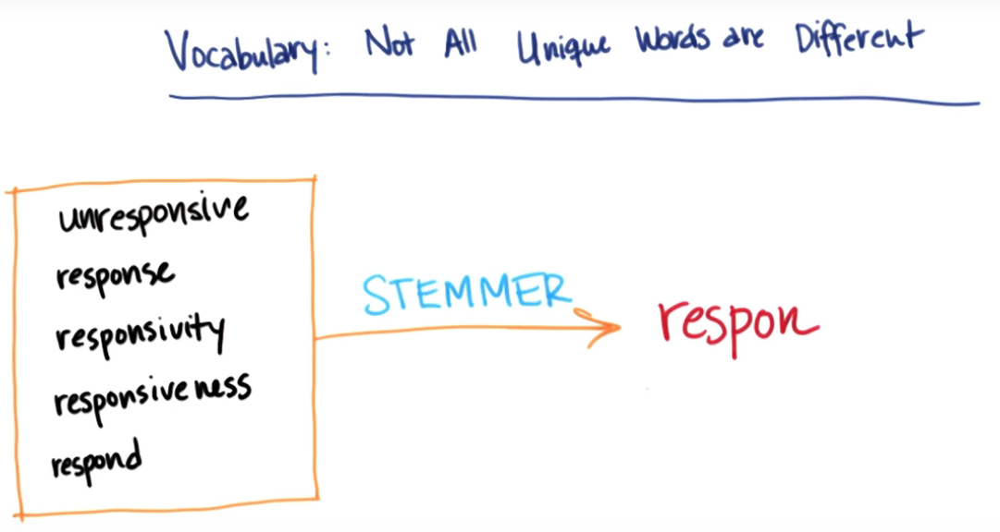

# ND111 - Intro to Machine Learning `Lesson11`

#### Tags
* Author : AH Uyekita
* Title  : _Text Learning_
* Date   : 21/01/2019
* Course : Data Science II - Foundations Nanodegree
    * COD    : ND111
    * **Instructor:** Katie Malone
    * **Instructor:** Sebastian Thrun

******************************************************************

## Text Learning

The first concept to introduce is the existency of bag of words, it is a kind of "dictionary" with all words, which could be used in a text.

>The bag-of-words model is a simplifying representation used in natural language processing and information retrieval (IR). In this model, a text (such as a sentence or a document) is represented as the bag (multiset) of its words, disregarding grammar and even word order but keeping multiplicity. The bag-of-words model has also been used for computer vision. --- <cite>[Wikipedia][wiki_bag]</cite>

[wiki_bag]: https://en.wikipedia.org/wiki/Bag-of-words_model

In Scikit Learng package you can create the "bag of words".

### CountVectorizer

This is the method to create "bag of words" of Scikit Learn package, you can find this package in `feature_extraction.text`.

```py
# Importing the CountVectorizer.
from sklearn.feature_extraction.text import CountVectorizer
```

The CountVectorizer works also any other package of Scikit Learn. You need to create the classifier.

#### Classifier

To create a classifier you just need to call the function.

```py
# Creating a classifier
vectorizer = CountVectorizer()
```
After that we have a classifier to work.

#### Fit

This method will create a kind of list of word from all your corpus. This list contains a kind of key for each word.

```py
# Creating a list of words.
vectorizer.fit(corpus)
```
Where:

* corpus: Is your text or email.

#### Transform

This method will "count" the frequency of each of word in a given corpus.

```py
# Counting the frequency of each word.
vectorizer.transform(corpus)
```
Now the `vectorizer` store a list of tuples.

$$\text{(document, key words, frequency)}$$

You can check the key of the word using the `.vocabulary_.get("word")`.

### Stopwords

The Stopwords has low information and has high frequency in the corpus. Probably will increase the noise in the study.

Examples: the, an, will, have, and, I, you, proper names, etc.

We can access the Stopwords from the [NLTK package][nltk] (Natural Language Toolkit).

[nltk]: https://www.nltk.org

#### NLTK Package

This is the Natural Language Toolkit and you can access it importing from the nltk package.

```py
# Importing the nltk
from nltk.corpus import stopwords
```

Now, you can create a list of stopwords.

```py
sw = stopwords.words('english')
```

### Stemmer

This is a way to bundle some words with same meaning. Figure 1 shows an example.

<center>

<em>Figure 1 - Example of words with "same" meaning.</em></center>

All words has the same "root".

Fortunately, nltk package has stemmer available to use.

#### Stem

The stemmer we will use in this lesson is the snowball, but there are many other available.

```py
# Importing the Snowball Stemmer
from nltk.stem.snowball import SnowballStemmer
```
In this stemmer you can use english, french, spanish words, so you need to identify the language.

```py
# Creating stemmer
stemmer = SnowballStemmer("english")
```
An example to see the stem (root) of the word.

```py
# What is the stem of responsiveness?
stemmer.stem("responsiveness")
```
As output you will have: `u 'respons'`

This process of stemming must be performed before the "bag-of-words", because you will change the words by stem and later count the frequency of each one of them.

### TfIdf Representation

* TF: Term frequency
* Idf: Inverse document frequency

The TfIdf willgives the inverse of the frequency, which should be interpret as:

>Words with few frequency (it means rare words) has "more information" (or distinguish more from the other words).
