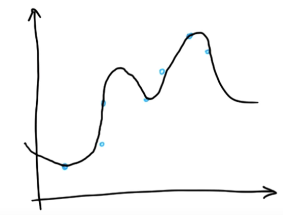
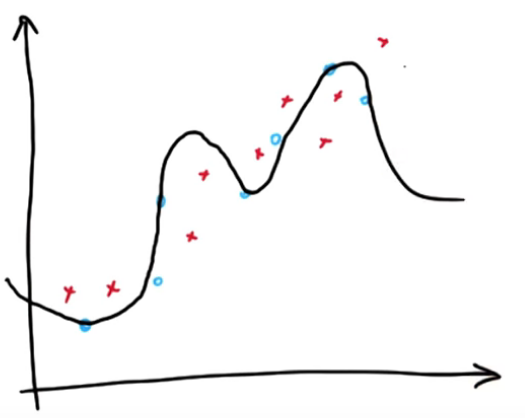
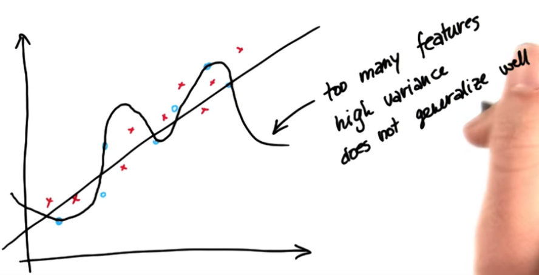
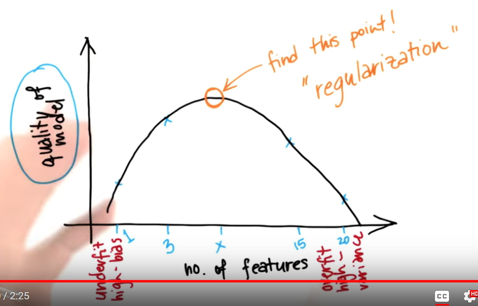

# ND111 - Intro to Machine Learning `Lesson12`

#### Tags
* Author : AH Uyekita
* Title  : _Feature Selection_
* Date   : 23/01/2019
* Course : Data Science II - Foundations Nanodegree
    * COD    : ND111
    * **Instructor:** Katie Malone
    * **Instructor:** Sebastian Thrun

******************************************************************

## Feature Selection

The aims of feature selection is to optimize the number of features, which will capture the trends and patterns of the data. There are two majors in Feature Selection.

* Selecting the best features, it means removing features with low importance or do not help;
* Adding new features also known as Feature Engineering.

>In machine learning and statistics, feature selection, also known as variable selection, attribute selection or variable subset selection, is the process of selecting a subset of relevant features (variables, predictors) for use in model construction. Feature selection techniques are used for four reasons:
>
>* simplification of models to make them easier to interpret by researchers/users,
>* shorter training times,
>* to avoid the curse of dimensionality,
>* enhanced generalization by reducing overfitting (formally, reduction of variance)
>
>The central premise when using a feature selection technique is that the data contains some features that are either redundant or irrelevant, and can thus be removed without incurring much loss of information. Redundant and irrelevant are two distinct notions, since one relevant feature may be redundant in the presence of another relevant feature with which it is strongly correlated. --- <cite>[Wikipedia][wiki_feature_selection]</cite>

[wiki_feature_selection]: https://en.wikipedia.org/wiki/Feature_selection

### Adding new features

You can create a feature using the data on your disposal, creating ratios, for instance.

>**Feature engineering** is the process of transforming raw data into features that better represent the underlying problem to the predictive models, resulting in improved model accuracy on unseen data. --- <cite>[Feature Engineering][website_feat_eng]</cite>

[website_feat_eng]: https://machinelearningmastery.com/discover-feature-engineering-how-to-engineer-features-and-how-to-get-good-at-it/

### Removing features

$$\text{Why might you want to ignore a feature?}$$

* It is noisy;
* It causes overfitting;
* It is strongly related (higly correlated) with a feature that's already present;
* Additional features slow down training/testing process.


#### Features != Information {-}

Information is what we are looking for and we use the features to access this information. We aim to use the minimal number of features to best describe/explain the information.

#### Scikit Learn {-}

The Scikit Learn has the feature selection module, which has two way to feature reduction:

* SelectPercentile;
    * Will select the features based on the percentile defined in this method;
* SelectKBest;
    * Will select a specific number of features defined in this method.

#### Bias-variance Dilemma and No of Features {-}

Table 1 shows the trade-off between the goodness and simplicity of the model.

<center><strong>Table 1 - Trade-off between Overfitting and Oversimplified models.</strong></center>

|High Bias|High Variance|
|:-:|:-:|
|pays little attention to data|pays too much attention to data (does not generalize well)|
|Oversimplified|Overfits|
|High error on training set. Low r², Large SSE|Much higher error on test set than on training set|
|Few features used|Many features, carefully optimized performance on training data.|

Our objectivies:

* Few Features;
* Large r<sup>2</sup>, and;
* Low SSE.

An example of a High variance problem is presented in Figure 1.

<center>

<em>Figure 1 - Model with high variance.</em></center>

After new acquisition of points, Figure 2 shows these new points.

<center>

<em>Figure 2 - Model with high variance and new points.</em></center>

Finally, Figure 3 shows the best model, a straight line.

<center>

<em>Figure 3 - Best model (a straight line), Model with high variance and new points.</em></center>

### Regularization

Regularization is a way to balance the erros with number of features.

>In mathematics, statistics, and computer science, particularly in machine learning and inverse problems, regularization is the process of adding information in order to solve an ill-posed problem or to prevent overfitting. --- <cite>[Wikipedia][wiki_regularization]</cite>

[wiki_regularization]: https://en.wikipedia.org/wiki/Regularization_(mathematics)

Figure 4 shows the behaviour of the quality in respect to the number of features.

<center>

<em>Figure 4 - The quality curve based on the number of features.</em></center>

#### Regularization in Regression {-}

Method for automatically penalizing extra features.

>This is a form of regression, that constrains/ regularizes or shrinks the coefficient estimates towards zero. In other words, this technique discourages learning a more complex or flexible model, so as to avoid the risk of overfitting. --- <cite>[Toward Data Science][toward_ds_reg]</cite>

[toward_ds_reg]: https://towardsdatascience.com/regularization-in-machine-learning-76441ddcf99a

$$\text{minimize\ \ \ } SSE + \lambda |\beta|$$

Where:

* $\lambda:$ penalty parameter;
* $\beta:$ coefficient of regression.

For instance:

$$y = m_1x_1 + m_2x_2 + m_3x_3 + m_4x_4 + b$$

Where:

* Features: $x_1$, $x_2$, $x_3$, and $x_4$;
* Coefficients: $m_1$, $m_2$, $m_3$, and $m_4$.

The Lasso algorithm will test removing one feature at a time and calculate the fit. The contribution of the features multiplied by the penalty parameter will determina if this feature is relavant of not.

### Scikit Learn

The [Lasso Regression][scikit_learn_lasso] lives in the `linear_model` module of Scikit Learn Package.

[scikit_learn_lasso]: https://scikit-learn.org/stable/modules/generated/sklearn.linear_model.Lasso.html

```py
# Importing the lasso moduleself.
import sklearn.linear_model.Lasso
```

#### Lasso {-}

As any other module in Scikit Learn, we need to create a kind of classifier.

```py
# Creating the classifier.
regression = Lasso()
```

#### `.fit()` {-}

The `.fit()` will be used to calculate the coefficients.

```py
# Training the data.
regression.fit(feature , labels)
```

Where:

* features: Is the features of the regression.
* labels: the results (have in mind, this is a supervised learning algorithm)

#### `.predict()`

Is used to predict.

```py
# Predicting a value using the coefficients.
regression.predict([[new_point]])
```

#### `.coef_` {-}

Print the coefficients of the regression.

```py
# Print the coefficients.
regression.coef_
```
* coef_: if the values is low it is not relevant.
