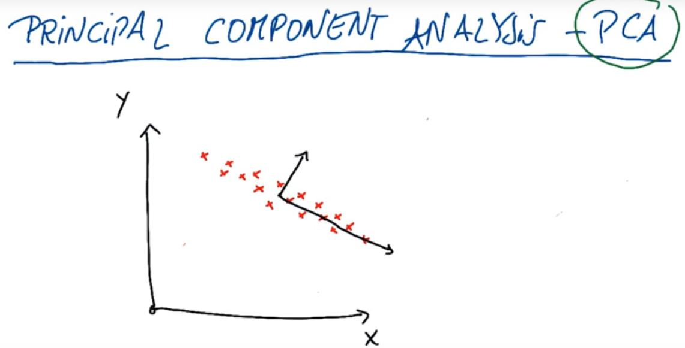
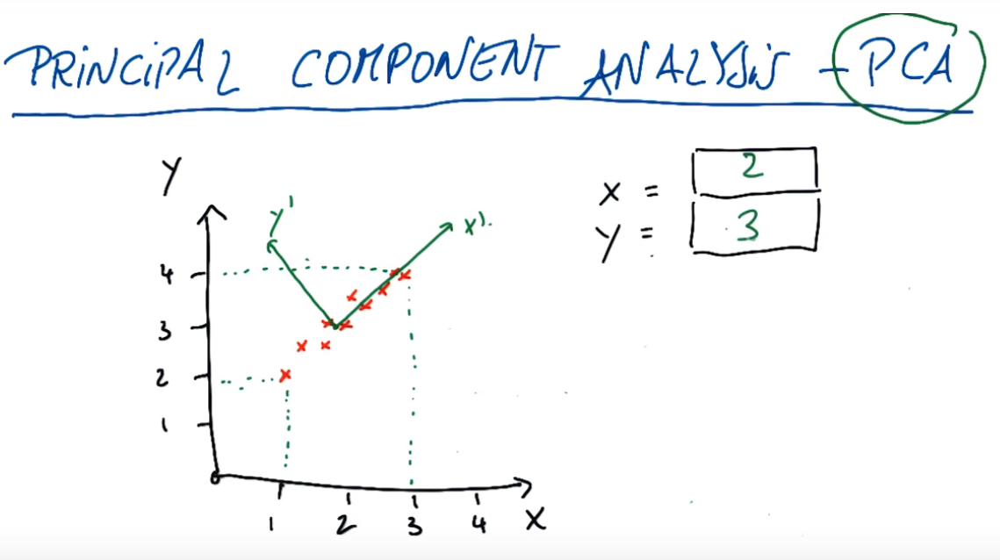
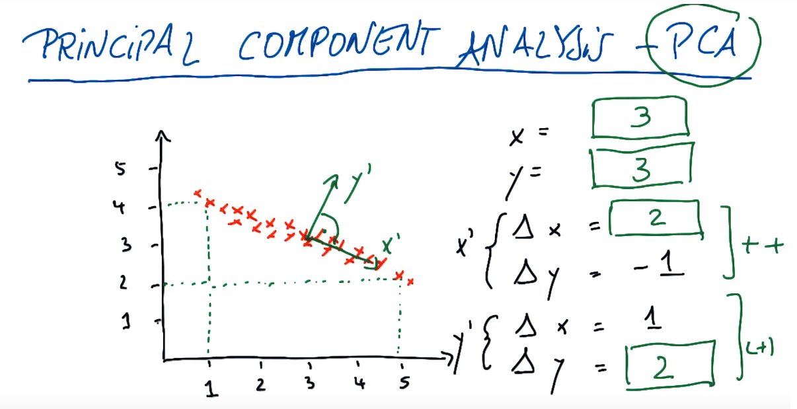

# ND111 - Intro to Machine Learning `Lesson13`

#### Tags
* Author : AH Uyekita
* Title  : _Principal Component Analysis_
* Date   : 23/01/2019
* Course : Data Science II - Foundations Nanodegree
    * COD    : ND111
    * **Instructor:** Katie Malone
    * **Instructor:** Sebastian Thrun

******************************************************************

## Principal Components Analysis

Principal Components Analysis is a way to decrease the dimensions of a problem. Changing the coordinate system to "gather" the most of the variance is the objective when you apply PCA.

>Examples of dimensionality reduction methods include Principal Component Analysis, Singular Value Decomposition and Sammon’s Mapping.

<center>

<em>Figure 1 - Points and the representation of the new base (coordinate system).</em></center>

The new coordinate system will capture the most of the variance when the points are projected to the new X axis.

Figure 2 shows an example using numbers.

<center>

<em>Figure 2 - In this example the origin of the new coordinates will be in the (x,y) = (2,3).</em></center>

As you can see, the new coordinates is composed by $x'$ and $y'$, we also cound notate both coordinates using the original coordinates, considering this the $x'$ and $y'$ as a vectors.

$$x' = \begin{pmatrix} \Delta x_x \\ \Delta y_x \end{pmatrix} = \begin{pmatrix} 3-2=1 \\ 4-3=1 \end{pmatrix}$$

$$y' = \begin{pmatrix} \Delta x_y \\ \Delta y_y \end{pmatrix} = \begin{pmatrix} 1-2=-1 \\ 4-3=1 \end{pmatrix}$$

The PCA require a orthogonal and normalized base, for this reason, it is necessary to normalize $x'$ and $y'$.

$$x' = \begin{pmatrix} \frac{1}{\sqrt2} \\ \frac{1}{\sqrt2} \end{pmatrix}$$

$$y' = \begin{pmatrix}\frac{-1}{\sqrt2} \\ \frac{1}{\sqrt2} \end{pmatrix}$$

Figure 3 shows an example without normalization.

<center>

<em>Figure 3 - Orthogonal Base without normalization.</em></center>

### Review of PCA

* Sistematized way to transform input features into principal components;
* Use principal components as new features;
* Principal Components are directions in data that maximize variance (minimize information loss) when you project/compress down onto them;
* More variance of data along a Principal Component, higher that Principal Component is ranked;
* Most variance/most information -> First Principal Component;
* Second most information (without overlapping with the first PC) -> Second PC;
* Maximum number of PC is equal to the number of inputs features.

### When to use PCA

* Latent features driving the patterns in data;
* Dimensionality reduction
    * Visualize high dimensional
    * Reduce noise
    * Make other algorithms (regression, classification) work better due to fewer inputs

### PCA in Scikit Learn

Scikit Learn also has the [PCA][scikit_learn_pca] module.

```py
# Importing the module of PCA from Scikit Learn.
from sklearn.decomposition import PCA
```
[scikit_learn_pca]: https://scikit-learn.org/stable/modules/generated/sklearn.decomposition.PCA.html


#### `.PCA()`

Creates a classifier.

```py
# Creates a classifier to be trained.
pca = PCA(n_components = 1)
```
Where:

* n_components: Is the number of principla componentes you want.

#### `.fit()`

As any other module from Scikit Learn, it will fit/train the classifier.

```py
# Fitting/training your model.
pca.fit(X)
```
Where:

* X: Is your dataset of features, probably an array of lists.

$$array(\underbrace{[feature1,feature2,feature3]}_{observation_1},...,\underbrace{[feature1,feature2,feature3]}_{observation_n})$$


#### `.transform()`

This step will aply the dimensionality reduction.
```py
# Dimensionality reduction.
pca.transform(X)
```

#### `.explained_variance_ratio_`

Percentage of variance explained by each of the selected components.

```py
# Print the values of all component.
pca.explained_variance_ratio_
```
