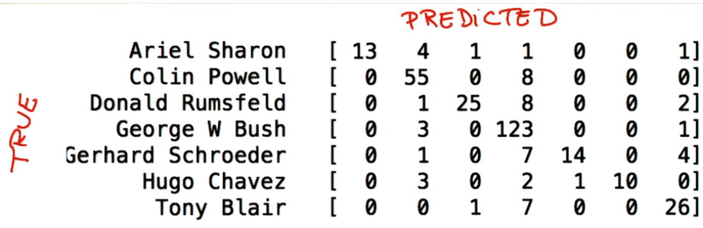

# ND111 - Intro to Machine Learning `Lesson15`

#### Tags
* Author : AH Uyekita
* Title  : _Evaluation Metrics_
* Date   : 24/01/2019
* Course : Data Science II - Foundations Nanodegree
    * COD    : ND111
    * **Instructor:** Katie Malone
    * **Instructor:** Sebastian Thrun

******************************************************************

## Evaluation Metrics

The confusion matrix allow us to visualize the concepts of Precision and Recall. Figure 1 shows an example of Confusion Matrix.

<center>

<em>Figure 1 - Example of Confusion Matrix.</em></center>

**For each label (Ariel Sharon, Colin Powell, etc.) of this matrix there are a value of precision and recall.**

* The matrix diagonal is the True Positive;

$$\text{True Positive} = \begin{bmatrix} 13 \\ 55 \\ 25 \\ 123\\ 14 \\ 10 \\26 \end{bmatrix}$$

* The summation of the columns (except the diagonal value) is the False Positive;

$$\text{False Positive} = \begin{bmatrix} 0 \\ 12 \\ 2 \\ 33 \\ 1 \\ 0 \\ 8 \end{bmatrix}$$

* The summation of the row (except the diagonal value) is the False Negative.

$$\text{False Negative} = \begin{bmatrix} 7 \\ 8 \\ 11 \\ 4 \\ 12 \\ 6 \\ 8 \end{bmatrix}$$

What is the interpretation of True Positive, False Positive,, and False Negative?

* True Positive: When the label is true and the predict is true;
* False Positive: When the label is false and the predict is true;
* False Negative: When the label is true and the predict is false, and;
* True Negative: When the labels is false and the predict is false.

Table 1 summarize these four classification.

|Label|Predict|Classification|
|:-:|:-:|:-:|
|True|True|True Positive|
|True|False|False Negative|
|False|True|False Positive|
|False|False|True Negative|

Based on these four classification, it is possible to create two new ratios.

### Precision

This is the Precision equation.

$$\text{Precision} = \frac{\text{True Positive}}{\text{True Positive + False Positive}} \tag{1}$$

**A higher value of Precision:** The model tend to have less `False Positive`. It means, when the model flag any observation in the test dataset, there are a high chance to be true.

### Recall

This is the Recall equation.

$$\text{Recall} = \frac{\text{True Positive}}{\text{True Positive + False Negative}} \tag{2}$$

**A higher value of Recall:** The model tend to have less `False Negative`, It means the model have a high rate to "classify" correctly.

### Scikit Learn

The Scikit Learn package has a module to calculate the Precision and Recall.

```py
# Importing module to calculate the Precision
from sklearn.metrics import precision_score

# Importing module to calculate the Recall
from sklearn.metrics import recall_score
```

Both module has the same use.

```py
# Calculating the Precision acoording to equation 1.
precision_score(y_true, y_pred)

# Calculating the Recall according to equation 2.
recall_score(y_true, y_pred)
```
