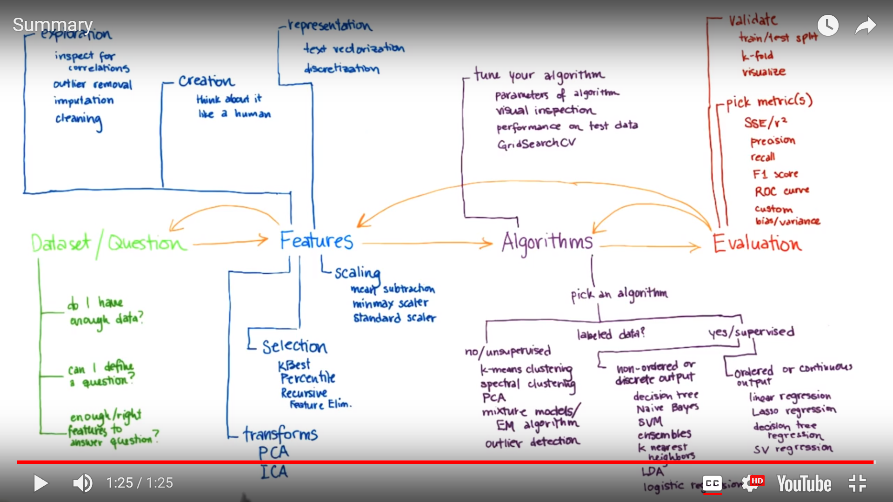

# ND111 - Intro to Machine Learning `Lesson16`

#### Tags
* Author : AH Uyekita
* Title  : _Trying it all together_
* Date   : 24/01/2019
* Course : Data Science II - Foundations Nanodegree
    * COD    : ND111
    * **Instructor:** Katie Malone
    * **Instructor:** Sebastian Thrun

******************************************************************

## Big picture

<em>Figure 1 - Machine Learning Big Picture</em>

