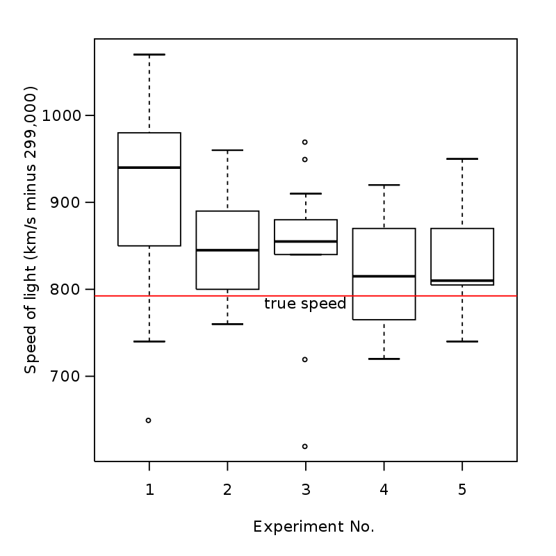

# ND111 - Data Visualisation `Lesson01`

#### Tags
* Author : AH Uyekita
* Title  : _Introduction to Data Visualisation_
* Date   : 12/01/2019
* Course : Data Science II - Foundations Nanodegree
    * COD    : ND111
    * **Instructor:** Matt Leonard
    * **Instructor:** Josh Bernhard

Copyright (c) 2018 Copyright Holder All Rights Reserved.

********************************************************************************

## Introduction to Data Visualisation

Data visualisation combine two skills:

* Design and artistic component to create something beautiful and compelling;
* Strong scientific and mathematical component to deliever the right insights.

### Anscombe's Quartet

>Anscombe's quartet comprises four datasets that have nearly identical simple descriptive statistics, yet appear very different when graphed. Each dataset consists of eleven (x,y) points. They were constructed in 1973 by the statistician Francis Anscombe to demonstrate both the importance of graphing data before analyzing it and the effect of outliers on statistical properties. He described the article as being intended to counter the impression among statisticians that "numerical calculations are exact, but graphs are rough." --- <cite>[Wikipedia][wiki_anscombe]</cite>

[wiki_anscombe]: https://en.wikipedia.org/wiki/Anscombe%27s_quartet

The introduction to the Anscombe's Quartet is to show good examples to see the pattern of the data in a simple graph.

Figure 1, 2, 3, and 4 presents the four groups of data of Anscombe Quartet, each of these groups has the same mean and standard deviation (rounding 2 digits).

<em>Figure 1 - Data from group 1.</em>

<em>Figure 2 - Data from group 2.</em>

<em>Figure 3 - Data from group 3.</em>

<em>Figure 4 - Data from group 4.</em>

These figure shows example of data visualisation of differentes dataframes, with equals descriptive statistics. This is the reason to use Data Visualisation, observe patters that is not clear using only number and summaries of data.

### Univariate

This is usually one column plot.

For quantitative data:

* Histogram

* Normal Quantile Plot
*

* [Stem and Leaf Plot][stem_leaf]

* Box and Whisker Plot

[stem_leaf]: https://en.wikipedia.org/wiki/Stem-and-leaf_display

In most of the cases you will use **histogram**.

For categorical data:

* Bar Chart

* Pie Chart

* Pareto Chart

In most of the cases you will use **bar chart**.

Pie chart and 3D chart should be avoided.

### Bivariate

The most common plot using two variables is the scatter plot shown below.

### Line Plots

Usually used in plots over the time.

>Line plots are a common plot for viewing data over time. These plots allow us to quickly identify overall trends, seasonal occurrences, peaks, and valleys in the data. You will commonly see these used in looking at stock prices over time, but really tracking anything over time can be easily viewed using these plots.

It is possible to identify using this kind of plot:

* Seasonality;
* Overal trend: Going up or going down;
* Peaks, etc.

#### What is the Question?

>The key to building great data visualizations is in aiming them at answering the questions you want answered. This presentation gave a number of ways to show the exact same data in different ways depending on the question you want to answer.

#### What About with More Than Two Variables?

>Here you were able to see a number of different visuals for comparing more than two variables - there isn't a right answer in choosing these plots - and this is where the science can become more of an art. In the next quiz, you will see why we might choose one plotting method vs. another using some of the same data from the video.

* Comparing two or more categorical Variables

* 3 variables - Sales, time, and products.

* Stacked line chart to show proportion between products.

* Stacked bar chart.

### Dashboard

Is a way to interact to the data, allowing you to increase the number of variables to show.

### Introduction to Visual Encodings

>Encoding in data viz basically means translating the data into a visual element on a chart/map/whatever you’re making. You need to do it right, because doing it right will mean that other people looking at your visualisations can understand what you’re trying to say or show. --- <cite>[Reference in Medium][ref_medidum]</cite>

Here’s a non-exhaustive list of ways you can encode data:

* Size
* Shape
* Colour
* Grouping
* Area
* Position
* Saturation
* Line pattern
* Line weight
* Angle
* Connections

[ref_medidum]: https://medium.com/@sophiewarnes/whats-visual-encoding-in-data-viz-and-why-is-it-important-7406bc88b4b4
