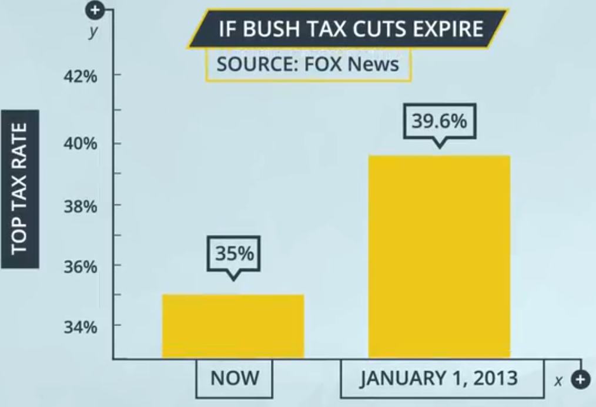

# ND111 - Data Visualisation `Lesson02`

#### Tags
* Author : AH Uyekita
* Title  : _Design_
* Date   : 21/01/2019
* Course : Data Science II - Foundations Nanodegree
    * COD    : ND111
    * **Instructor:** Matt Leonard
    * **Instructor:** Josh Bernhard

************************************************

## Design

This lesson is based on the book of [Cole Nussbaumer Knaflic][cole_website] called "Storytelling with Data".

[cole_website]: http://www.storytellingwithdata.com

She stresses that six lessons of communicating with data:

>* Understand the context - this means knowing your audience and conveying a clear message about what you want your audience to know or do with the information you are providing.
>
>* Choose an appropriate visual display - this was covered in the last lesson. Check out the lesson titled recap in the previous section if you need a quick refresher.
>
>* Eliminate clutter - you should only provide information to the user that helps convey your message.
>
>* Focus attention where you want it - build visualizations that pull attention to the message you want to highlight.
>
>* Think like a designer - you will learn a number of design principles in this lesson to assist as you start to put together your own data visualizations.
>
>* Tell a story - your visualizations should give the audience a story. The most powerful data visualizations move people to take action. --- <cite>Udacity notebook</cite>

### Exploratory vs. Explanatory Analyses

>There are two main reasons for creating visuals using data:
>
>* Exploratory analysis: is done when you are searching for insights. These visualizations don't need to be perfect. You are using plots to find insights, but they don't need to be aesthetically appealing. You are the consumer of these plots, and you need to be able to find the answer to your questions from these plots.

<em>Figure 1 - Exploratory Analysis.</em>

>* Explanatory analysis: is done when you are providing your results for others. These visualizations need to provide you the emphasis necessary to convey your message. They should be accurate, insightful, and visually appealing. --- <cite>Udacity notebook</cite>

<em>Figure 2 - Explanatory Analysis.</em>

### What Makes a Bad Visual?

Visuals that do not convey the message well. It could be reason from:

* Misleading type of graphic;

An example of Bad Visualization is presented in Figure 3.

<em>Figure 3 - The y scale is edited to convey a higher difference.</em>

The picture above want to convey a huge difference than it actually is by zooming in.

* Hidding an important information or Visuals that distract the audience.

Figure 4 shows an example of graphic which hides and distract the information.

<em>Figure 4 - Too many colors and piece of data changing position.</em>

In the picture above there are too many colors and this make difficult to convey the message and also distract the audience. An other problem observed is some sector position has changed position.

<em>Figure 5 - Racetrack charts.</em>

Although the sector have the same percentage the length is tottaly different, this could lead some confusion. Other problem is the sequence, the red one suggests that this group is more important that the blue one.

### Encodings

What is visual encodings?

Visual encondings are mapping from data to display elements.

<em>Figure 6 - Visual Enconding.</em>

What is display elements?

* X axis and Y axis;
* Size of points and width of bars;
* Shape of points;
* Texture;
* Angle;
* Length, etc.

 In other words, it is how to best convey the information using these elements.

### Chart Junk

This is all visual elements that do not aggregate anything to your graphic, and could be remove it with any loss of information. The bad thing is this junk could distract your audience. Examples of chart junkies:

* Heavy or Dark grid lines;
* Unnecessary text;
* Pictures surrounding or within graphs
* shading and 3D graphics
* Ornamented chart axes

### Data-ink Ratio

the Data-ink ratio was defined by Edward Tufte.

$$\text{ratio data-ink} = \frac{\text{amount of ink used to describe the data}}{\text{total amount of ink in the visual}}$$

* The higher data-ink ratio: Large amount of ink is actually used to describe the data (information);
* The low data-ink ratio: Suggest that you are using ink to add something not related to the data and probably not describing what you want to convey. These elements should be removed.

Figure 7 shows an example of two graphics with low and high ink-ratio.

<em>Figure 7 - Low and High ink-ratio.</em>

### Lie Factor

The Lie factor is a ratio to evaluate the "proportion" of the bars, graphic, etc. This ratio was also defined by Edward Tufte.

$$\text{Lie factor} = \frac{\text{size of effect shown in graphic}}{\text{size of effect shown in data}}$$

Where:

* effect: is the difference you are comparing.

Figure 8 shows an example of how to calculate the Lie Factor.

<em>Figure 8 - Lie Factor.</em>

As you can see the size of the doctor is not proportional to the percentage variation. The Lie Factor of this picture is presented in equation (1).

$$\text{Lie Factor} = \frac{379}{125} = 3.03\tag{1}$$

Any Lie Factor greater than 1 suggests that your visual is misleading.

### Colors

Colors could be very useful to split your data into groups. Figure 9 present a good use of colors.

<em>Figure 9 - Good use of colors.</em>

Therefore, the colors could be misleading also as you can see in Figure 10.

<em>Figure 10 - Bad use of colors.</em>

In this case the colors in not convey any new information, also it is distracting the audience.

Tips:

* Get in right in black and white;
* Less intense colors;
* Colors selections that facilitate communication.

### Shape and Size

<em>Figure 11 - Shape and Size.</em>

* Color shape: Are best used to categorical variables;
* Marker size: Best used for adding another quantitative variable.

Rather than adding additional enconding to the same graphic, try to break up our visual into parts where each part of your message can be conveyed.

### Tell a Story

You should tell a story to present the results.

* Start with a compelling question;
    * Supplement your question with engaging visuals
    * Deeper question to help the audience to understand
* Repetition is a good thing;
* Highlight the answer;
* Call your audience to action.
