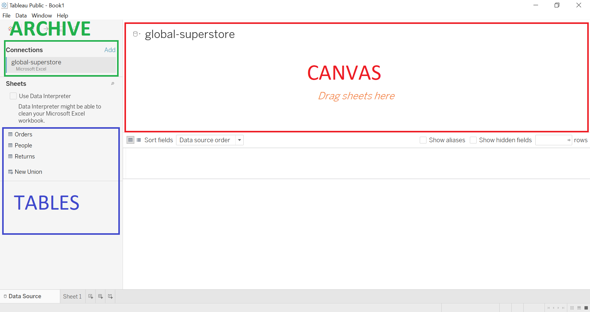

# ND111 - Data Visualisation `Lesson03`

#### Tags
* Author : AH Uyekita
* Title  : _Data Visualization in Tableau_
* Date   : 22/01/2019
* Course : Data Science II - Foundations Nanodegree
    * COD    : ND111
    * **Instructor:** Matt Leonard
    * **Instructor:** Josh Bernhard

************************************************

## Data Visualization in Tableau

This lesson aims to give a very breaf introduction to Tableau.

### Exploratory Analisis

Tableau is generally used to perform the Exploratory Analysis, posing questions and trying to find its solutions. The basic idea of tableau is to use visualisation to understand the data.

As you can see, tableau will import data and will manage it for you by simple commands. It makes the Exploratory Analisis very easy and it is sure a hand tool to use.

### Tableau Public

In this lesson we will use the Tableau Public, which is compounded by a straightforward platform. Figure 1 shows the framework.

<em>Figure 1 - Tableau Public Layout.</em>

Usually, the Tableau was used to create three final products:

* Worksheets;
    * This is a one visualization;
* Dashboards, and;
    * Multiple visualizations;
* Story.
    * This is a "combination" of  Worksheets, Dashboards, and a workflow to explain the whole story.
