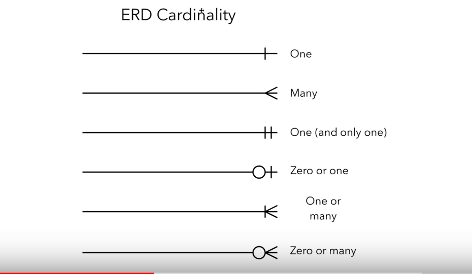

# SQL for Data Analysis

#### Tags {-}

* Author : AH Uyekita
* Title  :  _SQL for Data Analysis_
* Date   : 14/12/2018
* Course : Data Science II - Foundations Nanodegree
    * COD    : ND111
    * **Instructor:** [Derek Steer][derek]

[derek]: https://modeanalytics.com

<h4>Notebooks in ModeAnalytics</h4>

* <a href="https://modeanalytics.com/ah_uyekita/reports/03e5141ea602" target="_blank">Lesson 01</a>
* <a href="https://modeanalytics.com/ah_uyekita/reports/7a7293af2041" target="_blank">Lesson 02</a>
* <a href="https://modeanalytics.com/ah_uyekita/reports/9a9bccedfc63" target="_blank">Lesson 03 - Part 01</a>
* <a href="https://modeanalytics.com/ah_uyekita/reports/67d5f05b7443" target="_blank">Lesson 03 - Part 02</a>
* <a href="https://modeanalytics.com/ah_uyekita/reports/c44f93e9f2d4" target="_blank">Lesson 04</a>
* <a href="https://modeanalytics.com/ah_uyekita/reports/25f24649e397" target="_blank">Lesson 05</a>


<h3>Software/Tool</h3>

Although this is not a requirement, I have created an account at Mode Analytics, it is the same tool used by the Derek (instructor) to teach SQL. Some good points in this tool:

* You can find the _Parch and Posey_ database available in this tool;
* You can create very good documentation about your queries;
    * There is an option to create Jupyter Notebook or a complete Report;
* Far better tool from the Udacity embedded tool;
* It is free.


## SQL Basics

### Entity Relationship Diagrams (ERD)

This is a way to see (visualize) the relationship between different spreadsheets, in other words, how is structure a database. In a database, there are several tables, and each table has your own attributes, based on the cardinality they could interact with each other.

#### Entities

This is a simple spreadsheet with information about anything you want, but keep in mind to: store new observations by rows and features/variables by column.


My example is a table called `Marks`, which has `mark id`, `student id`, `subject id`, `date` and `mark` as attributes. The other column is the variable's type.

#### Atributte

An attribute is a feature we want to keep track.

#### Relationship

Is a way to connect two tables.


Remember, this line has some properties, that is named as cardinality.

#### Cardinality

Cardinality represents a notation of how the information between tables will interact with each other.



Additional videos with good content.

[Video 1 - Lucidchart][erd_1]
[Vídeo 2 - Lucidchart][erd_2]

[erd_1]: https://www.youtube.com/watch?v=QpdhBUYk7Kk&vl=en
[erd_2]: https://www.youtube.com/watch?v=-CuY5ADwn24

***
### SQL Introduction

SQL is a Language used to manage this interactions between tables, allowing us to access the stored database. The meaning of SQL is:

> Structured Query Language

It is very popular in Data Analysis because:

* Easy to understand
* Easy to learn
* Used to access very large datasets directly where is stored
* Easy to audit and replicate
* It is possible to run multiple queries at onde
* Almost do not have a limit of rows/observations
* Ensure the data Integrity, it is not possible to register a half child if you have defined this field as an integer
* SQL is very fast
* Database provide the data sharing, everybody could access the data simultaneously, which is good due to a standardization of database

SQL provides also functions such as:

* Summation
* Count
* Max and min
* Mean, etc.

Have in mind, probably we are going to manipulate data, and rarely updating or change values.

SQL is not case sensitive, so the best practices is to write the clauses/staments in upper case.

**Best practices**
```sql
SELECT first_column
  FROM my_table
```
**Bad one**
```sql
SelecT first_column
from my_table
```
Bear in mind, the indentation is not a requirements but helps a lot to understand your code.

#### SQL vs. NoSQL

Extracted from the class notes.

>You may have heard of NoSQL, which stands for not only SQL. Databases using NoSQL allow for you to write code that interacts with the data a bit differently than what we will do in this course. These NoSQL environments tend to be particularly popular for web based data, but less popular for data that lives in spreadsheets the way we have been analyzing data up to this point. One of the most popular NoSQL languages is called MongoDB. Udacity has a full course on MongoDB that you can take for free here, but these will not be a focus of this program.
>NoSQL is not a focus of analyzing data in this Nanodegree program, but you might see it referenced outside this course!

### Clauses

Tell the database what to do.

#### `DROP TABLE`

Remove a table from the database.

#### `CREATE TABLE`

Create a new table.

#### `SELECT`

Is also know as query, is used to create a new table with the selected variables. You can use `*` if you want to select all columns.
```sql
SELECT first_column, second_column, last_column
  FROM first_table;
```

#### `LIMIT`

This is the same of `.head()` but this could only load a few lines to analyses the table.

```sql
SELECT first_column
  FROM my_table
LIMIT 1000            /* Will load the firs 1000 lines*/
```

#### `ORDER BY`

It is possible to order by in ascendant and descendent way.

**ascendant**
```sql
SELECT first_column, second_column, last_column
  FROM my_table
ORDER BY last_column /*ascendanting*/
LIMIT 1000
```

**descendent**
```sql
SELECT first_column, second_column, last_column
  FROM my_table
ORDER BY last_column DESC, second_column /*descending for last_column*/
LIMIT 1000
```
This last query will returns:

* Last_column ordered by the highest to lowest;
* The second_column will be the lowest to highest.

#### `WHERE`

Apply a filter to find a specific customer or anything else.
```sql
SELECT first_column, second_column, last_column
  FROM my_table
WHERE first_column = 100
ORDER BY second_column
LIMIT 100
```
All staments possible to use.
* `>` (greater than)
* `<` (less than)
* `>=` (greater than or equal to)
* `<=` (less than or equal to)
* `=` (equal to)
* `!=` (not equal to)

If the argument of the WHERE clause is not a number, you must use single quotes.
```sql
SELECT first_column, second_column, last_column
  FROM my_table
WHERE first_column = 'Hello World!'
ORDER BY second_column
LIMIT 100
```

### Derived Columns

Is a new column created from the query. It is similar to the `mutate` function from R.

This is the operator to create a derived column:

* `*` (Multiplication)
* `+` (Addition)
* `-` (Subtraction)
* `/` (Division)

```sql
SELECT id, (standard_amt_usd/total_amt_usd)*100
FROM orders
LIMIT 10;
```
Will display without a specific name (?column?).

#### `AS`

If you use the `AS` the derived column will be name as you define (in other words "alias").

```sql
SELECT id, (standard_amt_usd/total_amt_usd)*100 AS std_percent, total_amt_usd
FROM orders
LIMIT 10;
```
Best pratices: No capital letters, descriptive names, etc.

### Introduction to "Logical Operators"

In the next concepts, you will be learning about Logical Operators. Logical Operators include:

#### LIKE

Using with WHERE clause could search some patterns.

```sql
SELECT first_column, second_column, last_column
  FROM my_table
WHERE last_column LIKE '%ello%'
```
The `%` is called wild-card.

#### IN

It is the same in Python or R. `IN` will be used to filter the dataset based on a list.
```sql
SELECT first_column, second_column, last_column
  FROM my_table
WHERE last_column IN (100, 200)
```
This example will filter the rows of last_column with values of 100 or 200.

#### NOT

`NOT` return the reverse/opposite.

```sql
SELECT first_column, second_column, last_column
  FROM my_table
WHERE last_column NOT IN (100, 200)
```
This example will remove all observations equals to 100 or 200.

Possible uses:

* NOT IN
* NOT LIKE

#### AND

Logical statment usually to make some filtration.

```sql
SELECT *
FROM orders
WHERE standard_qty > 1000 AND poster_qty = 0 AND gloss_qty = 0;
```
#### BETWEEN

Sometimes AND statment could be replaced by BETWEEN, this is much clearly to understand. BUT the BETWEEN is inclusive, which means the endpoints will be included in the filter.

```sql
SELECT name
FROM accounts
WHERE name NOT LIKE 'C%' AND name LIKE '%s';
```
#### OR

Well, this is a logical operator.

```sql
SELECT id
FROM orders
WHERE gloss_qty > 4000 OR poster_qty > 4000;
```

## SQL Joins

### Joins

When a table is splited the performance to update or just to make a query is better than a big one. The reason is the quantity of data to read. This is one of the reason to split dataset in several tables, even more, sometimes in convinient to split because the type of data stored.

The reason of JOIN is to "bind" two datasets into one. Here we need to use the period `.` (table.colums) to reference which column/variable we want to select.

```sql
SELECT accounts.name, orders.occurred_at
  FROM orders
JOIN accounts
ON orders.account_id = accounts.id;
```
The result of this query is two columns (`name` and `occured_at`), and to linked by the `account_id` and `id`.

#### Primary Key (PK)

Is a columns with unique values used to map a variable.

#### Foreign Key (FK)

Is a Primary Key from the other table. We use the PK and FK to link the tables.

Based on the new information about `PK` and `FK`. Let's insert a picture to visualize the database.


I want to Join these tables. My query:

```sql
SELECT orders.*
FROM orders
JOIN accounts
ON orders.account_id = accounts.id;
```

What I need to realize:

* `PK` and `FK` **always** will be allocated in `ON`.
* `FROM` and `JOIN` each one with one table.

#### Binding three tables

It is possible to "chaining" three tables.

```sql
SELECT *
FROM web_events
JOIN accounts
ON web_events.account_id = accounts.id
JOIN orders
ON accounts.id = orders.account_id
```
In this case, I will import all columns, but I may want few columns.

```sql
SELECT web_events.channel, accounts.name, orders.total
FROM web_events
JOIN accounts
ON web_events.account_id = accounts.id
JOIN orders
ON accounts.id = orders.account_id
```
#### Alias

Alias is a form to "short" the name of columns, the first method is using `AS`, but it could be simplified by only a space.

* Example 1

```sql
Select t1.column1 aliasname, t2.column2 aliasname2
FROM tablename AS t1
JOIN tablename2 AS t2
```
**or**
```sql
Select t1.column1 aliasname, t2.column2 aliasname2
FROM tablename t1
JOIN tablename2 t2
```
* Example 2

```sql
SELECT col1 + col2 AS total, col3
```
**or**
```sql
SELECT col1 + col2 total, col3
```
**or**

#### `INNER JOIN`

Returns rows which appears in both tables.

```sql
SELECT table_1.id, table_1.name, table_2.total
  FROM table_2
    JOIN table_1
      ON table_2.account_id = table_1.id
```
These last examples are all `INNER JOINS`, and will return a new dataframe (intersection between two dataframes).

#### `OUTER JOIN`

There are two kinds of OUTER JOINs

* Left outer JOIN, and;
* Right outer JOIN.

This two new JOINs has a property to pull rows that only exist in one table, it means some rows might have NULL values. The standard for this course will be to use only the left outer join.

## SQL Aggregations

### Aggregations Functions

This is functions return a single row with the aggregated value.

* sum;
* min;
* max;
* mean, etc.

#### NULL

NULL is no a value, it is different from ZERO or a space, for this reason you can not use equal (`=`) to find it, for do so you must use `IS`. The NULL is ignored in all aggregatins functions, and it is defined as a property of the data.

For the _Parch and Posey_ dataset, NULL is equal to zero.

```sql
WHERE something IS NULL
WHERE something IS NOT NULL
```

##### NULLs - Expert Tip

There are two common ways in which you are likely to encounter NULLs:

* NULLs frequently occur when performing a LEFT or RIGHT JOIN. You saw in the last lesson - when some rows in the left table of a left join are not matched with rows in the right table, those rows will contain some NULL values in the result set.
* NULLs can also occur from simply missing data in our database.

### Functions

#### COUNT()

Count the number of rows. If the entire line has only NULLs, this line will be noted counted.

Simple Example:
```sql
SELECT COUNT(*)
FROM accounts;
```

Example with filter
```sql
SELECT COUNT(*) AS order_count
FROM some_table
WHERE any_column > 100 AND any_column < 200;
```

Example with column selection
```sql
SELECT COUNT(account.id)
FROM accounts;
```
#### SUM()

Perform the summation among rows. You must define which columns will be applied the sum function.

```sql
SELECT SUM(poster_qty)
FROM demo.orders;
```

#### MAX() and MIN()

Return a rows with the minimun or maximum of a given column.

```sql
SELECT MAX(poster_qty) AS max_poster_qty,
       MIN(standard_qty) AS min_standard_qty
FROM demo.orders;
```

#### GROUP BY

Divide the non-grouped column into groups, which means the aggregated function will be calculated by group.

* The GROUP BY always goes between WHERE and ORDER BY.

Example 1:
```sql
SELECT a.name, o.occurred_at
FROM accounts a
JOIN orders o
ON a.id = o.account_id
ORDER BY o.occurred_at
LIMIT 1;
```
Same example but indexing by number:
```sql
SELECT a.name, o.occurred_at
FROM accounts a
JOIN orders o
ON a.id = o.account_id
ORDER BY 2
LIMIT 1;
```

_OBS.: The index used in ORDER BY clause is to refence o.occurred_at._

#### DISTINCT

DISTINCT is always used in SELECT statements, and it provides the unique rows for all columns written in the SELECT statement. Therefore, you only use DISTINCT once in any particular SELECT statement.

```sql
SELECT DISTINCT column1, column2, column3
FROM table1;
```

#### HAVING

>HAVING is the “clean” way to filter a query that has been aggregated, but this is also commonly done using a subquery. Essentially, any time you want to perform a WHERE on an element of your query that was created by an aggregate, you need to use HAVING instead.

Note extracted from the class notes.

```sql
SELECT s.id, s.name, COUNT(*) num_accounts
FROM accounts a
JOIN sales_reps s
ON s.id = a.sales_rep_id
GROUP BY s.id, s.name
HAVING COUNT(*) > 5
ORDER BY num_accounts;
```

### DATE

To GROUP BY a date is quite complicated because each time is (obviously) different, for this, reason is necessary to "round" the time/date to group them.

#### DATE_TRUNC

Common trunctions are:

* day;
* month, and;
* year.

Sintaxe:

DATE_TRUNC(‘[interval]’, time_column)

Where:

* microsecond
* millisecond
* second
* minute
* hour
* day
* week
* month
* quarter
* year
* century
* decade
* millenium

For further explanaition about [date][link_more]

[link_more]: https://blog.modeanalytics.com/date-trunc-sql-timestamp-function-count-on/

```sql
SELECT demo.accounts.name,
       DATE_TRUNC('month', demo.orders.occurred_at) AS year_month,
       SUM(demo.orders.gloss_amt_usd) AS sum_gloss_usd
FROM demo.orders
JOIN demo.accounts
ON demo.orders.account_id = demo.accounts.id
WHERE demo.accounts.name = 'Walmart'
GROUP BY year_month, demo.accounts.name
ORDER BY sum_gloss_usd DESC
LIMIT 1;
```

#### DATE PART

Extract part of the date

### CASE

Create a new column, derivate column, with a kind classification (assign a value into this new column according to the statment).

```sql
SELECT account_id,
       occurred_at,
       total,
       CASE WHEN total > 500 THEN 'Over 500'
            WHEN total > 300 AND total <= 500 THEN '301 - 500'
            WHEN total > 100 AND total <= 300 THEN '101 - 300'
            ELSE '100 or under' END AS total_group
FROM demo.orders
LIMIT 10;
```
Creates the total_group column.

#### With AGGREGATION

Combining the CASE clause with aggregations function could be a power tool, because the WHERE clause only evaluate one statement, using WHEN CASE it is possible to evaluate several staments.

```sql
SELECT demo.orders.account_id,
       demo.orders.total_amt_usd,
       CASE WHEN demo.orders.total_amt_usd >= 3000 THEN 'Large'
            ELSE 'Small' END AS level
FROM demo.orders
LIMIT 10;
```

## SQL Subqueries & Temporary Tables (Advanced)

### Subqueries

This is a way to nest queries, it means: The result of one query will be used as FROM to the next query.

```sql
SELECT *
FROM(SELECT something
     FROM   interesting) AS table_1
```
In the example above, I have one query nested to another. Bear in mind, I must give a alias to the nested query.

If the result of the subquery is a single value, you are allowed to insert this subquery wherever you want.

### WITH

Also known as _Common Table Expression_ (CTE), is a kinf of subquery but could be more helpful if someone is going to read the code. Due to the possibility to write the code in fragments an assign name, this is very handy.

**Example**
```sql
WITH my_with_example AS (SELECT ... MY CODE)

SELECT something
FROM my_with_example
```
As you can see it provide a better way to code because the code became more readable.

## Data Cleaning (Advanced)

### Data Cleaning

#### LEFT and RIGHT

It is the same of Excel functions.

```sql
SELECT LEFT(2, something) AS lefty_part_of_simething
FROM interesting
```
The example above will create a new column with the first two, from the left to right, character of something.

```sql
SELECT RIGHT(2, something) AS lefty_part_of_simething
FROM interesting
```
Almost the same, but start from the right to the left.

#### LEN

Returns the string length.

```sql
SELECT LEN(something)
FROM interesting
```

#### POSITION and STRPOS

POSITION will find a pattern in the string and will return the position (from the left to the right).

```sql
SELECT POSITION(',', something) /*Looking for a coma*/
FROM interesting
```

The STRPOS has the same use and same results.

```sql
SELECT STRPOS(something, ',') /*Looking for a coma*/
FROM interesting
```
Both functions are case sensitive.

#### LOWER and UPPER

Converts string into all lower or all upper cases.

```sql
SELECT LOWER(something)
FROM interesting
```
#### CONCAT

Bind/Combine/Concatenate strings (in different) columns into a new column.

**Example 1**
```sql
SELECT CONCAT(first_name, ' ',last_name) AS complete_name /* The ' ' is the space between strings*/
FROM interesting
```
You can use ||.

**Example 2**
```sql
SELECT first_name || ' ' || last_name AS complete_name /* The ' ' is the space between strings*/
FROM interesting
```
#### CAST

CAST allow to convert one type to another.

**Example 1**
```sql
SELECT CAST(year || month || day AS date) AS formatted_date
FROM interesting
```

The same of Example 1, but with a different notation to CAST clause.

**Example 2:**
```sql
SELECT (year || month || day AS date)::date AS formatted_date
FROM interesting
```
CAST is useful to converter strings into numbers or dates.

#### COALESCE

Converts NULL fields into Zero.

## Project 01 - Chinook

<h4>Questions</h4>

All exercises of this chapter I have stored in the Mode Analytics platform.

[Optional Questions][sol_ma]

[sol_ma]: https://modeanalytics.com/ah_uyekita/reports/5e871f63f8b2

<h4>Project Submitted</h4>

I have written all the project in Mode Analytics because is a better place to coding.

* I can perform SQL queries;
* I can create graphics;
* An opportunity to get knowledge in a new tool.

[Project 01 in Mode Analytic][project]

[project]: https://modeanalytics.com/ah_uyekita/reports/e77643786160

********************************************************************************

### Project Submission

To submit your project, please do the following:

* Review your project against the project Rubric. Reviewers will use this to evaluate your work.
* Create your slides with whatever presentation software you'd like (e.g. Google Slides, PowerPoint, Keynote, etc.).

In order to review your presentation, you will need to save your slides as a PDF. You can do this from within Google Slides by selecting File > Download as > PDF Document.

***

<iframe src="https://modeanalytics.com/ah_uyekita/reports/e77643786160/embed" width="100%" height="300" frameborder="0"></iframe>