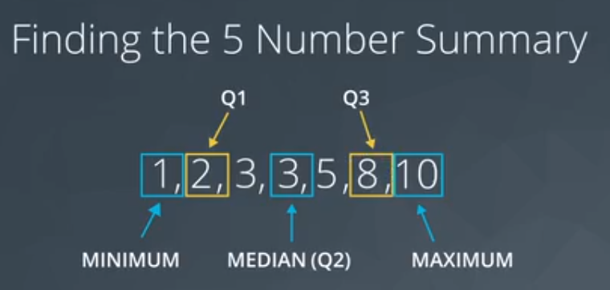
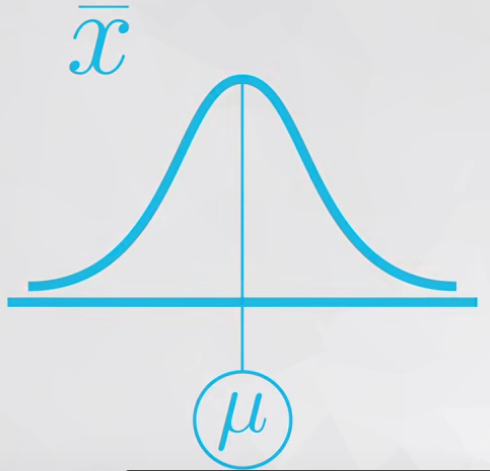
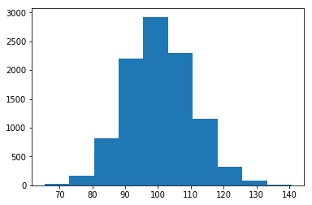
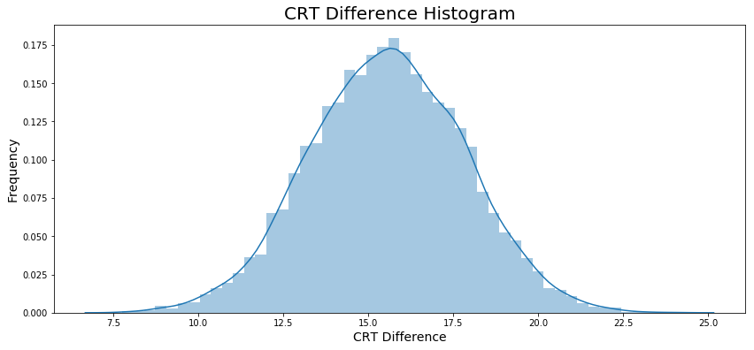
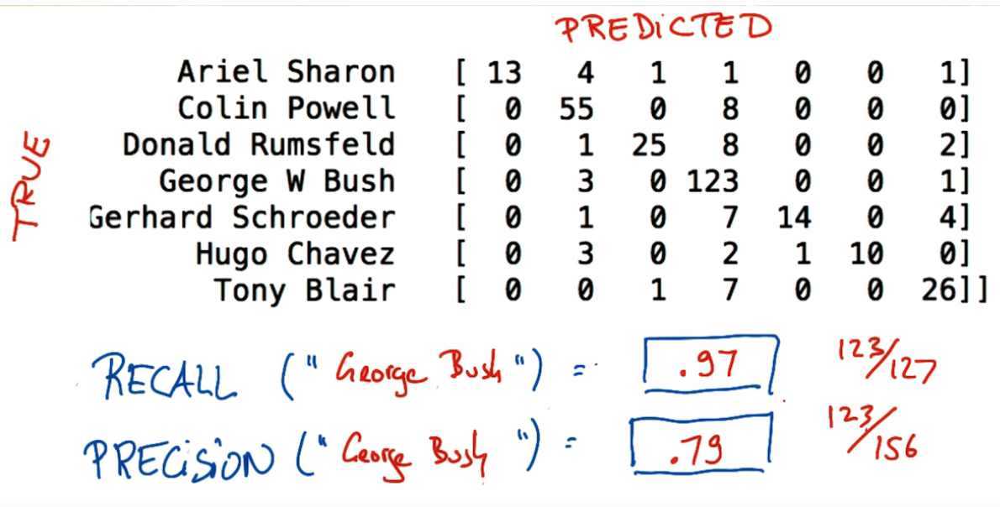

# Advanced Statistics


<h4>Tags</h4>

* Author : AH Uyekita
* Title  :  _Advanced Statistics_
* Date   : 02/01/2019
* Course : Data Science II - Foundations Nanodegree
* COD    : ND111

<h4>Related Courses</h4>

* [UD170 - Introduction to Inferential Statistics][rel_1]
* [UD170 - Introduction to Descriptive Statistics][rel_2]

[rel_1]: https://classroom.udacity.com/courses/ud201
[rel_2]: https://classroom.udacity.com/courses/ud827

<h2>Outline</h2>

* [x] Lesson 01 - Descriptive Statistics - Part 1
* [x] Lesson 02 - Descriptive Statistics - Part 2
* [x] Lesson 03 - Admissions Case Study
* [x] Lesson 04 - Probability
* [x] Lesson 05 - Binomial Distribution
* [x] Lesson 06 - Conditional Probability
* [x] Lesson 07 - Bayes Rule
* [x] Lesson 08 - Python Probability Practice
* [x] Lesson 09 - Normal Distribution Theory
* [x] Lesson 10 - Sampling Distributions and the Central Limit Theorem
* [x] Lesson 11 - Confidence Intervals
* [x] Lesson 12 - Hypothesis Testing
* [x] Lesson 13 - Case Study: A/B Tests
* [x] Lesson 14 - Regression
* [x] Lesson 15 - Multiple Linear Regression
* [x] Lesson 16 - Logistic Regression
* [x] Project 03 - Analyze A/B Test Results

## Descriptive Statistics `Lesson 01`

This lesson is a kind of review.

### What is data?

Data could be whatever thing: Text, Spreadsheets, video, images, database, etc.

### Data types

* Quantitative Data: Allow us to perform mathematical operations with data (1, 2, 3, 4, etc.);
    * Continuous: Could be any real number (Age);
    * Discrete: Only integer number (Number of persons);
* Categorical Data: Used to label a group or a set of items (blue, yellow, red, etc.);
    * Ordinal: There are a way to put the categories in a scale (Very good, so-so, very poor);
    * Nominal: It is impossible to put the categories in order (blue, yellow, orange, etc.);

### Measures of Center

#### Categorical

The categorical data is analyzed doing a simple summary to count the total of each category has.

#### Quantitative

Four main aspects when analysing **quantitative** data:

* Measures of `Center`
    * Mean
    * Median: The median splits our data so that 50% of our values are lower and 50% are higher.
        * Even number of elements: single values.
        * Odd number of elements: average between two "center" values.
    * Mode: The mode is the most frequently observed value in our dataset.
        * No mode: If all observations in our dataset are observed with the same frequency, there is no mode.
        * Many modes: If two (or more) numbers share the maximum value, then there is more than one mode.
* Measures of `Spread`
* The `Shape` of the Data
* `Outliers`


## Quantitative Data `Lesson 02`

### Measures of Spread

>How far are points from one another.

Common values of spread:

* Range;
* Interquartile range (IQR);
* Standard Deviation, and;
* Variance.

#### Histogram

Figure 1 shows an example of histogram.


This is a way to visualize the quantitative data.

### Five Number Summary

These are the number:

* Maximum;
* Third quartile or Q3 (75%);
* Second quartile (it is the same of mean) or Q2 (or 50%);
* First quartile or Q1 (25%), and;
* Minimum.

First step to do is order the values, as you can see in Figure 2 (odd set of values).



As you can see, Q1 and Q3 are the median of the data on either sides of Q2.

The range is defined as:

$$ \text{Range} = maximum - minimum \tag{1}$$

The Interquartile is define as:

$$ \text{Interquartile} = Q3 - Q1 \tag{2}$$

For a even set of values I need to calculate the "average" of two values.


#### Boxplot

The boxplot graphic is a way to visualize the spread of the data.


It could be useful for quickly comparing the spread of two data sets.

Based on the Figure 4, the graphic on the right shows that in the weekends the number of dogs varies much more than on weekdays (looking to the range).

### Standard Deviation

>Meaning: On average, how much each point varies from the mean of the points.

First, I need to define the "distance" between mean and each observation. "Distance" could be interpreted as the difference of these two values. The issue observed in this difference are positive and negative values. For this reason, the square is used to turn everything positive (because later I can square root).

* Standard Deviation is frequently used to compare spread of different groups.
* Having higher standard deviation is associated with having higher risk.

$$ \text{Standard Deviation} = \frac{1}{n} \sum_{i = 1}^n (\bar x - x_i)^2 \tag{3}$$

### Shape

The shape is related to the histogram form, Figure 5 shows an example.


* Left Skewed
    * is pulled to the "begining"
    * median stays close to the mode
    * GPA, Age of death, Asset price changes
* Simmetric (example: Normal distribution or bell curve)
    * mean = median = mode;
    * Examples: heights, weights, scores, precipitation, etc.
* Right Skewed
    * mean is pulled to the tail
    * median stays close to the mode
    * Amount of drug left in your bloodstream over time, distribution of wealth, human athletic abilities.

>Side note: If you aren't sure if your data are normally distributed, there are plots called normal quantile plots and statistical methods like the Kolmogorov-Smirnov test that are aimed to help you understand whether or not your data are normally distributed. Implementing this test is beyond the scope of this class, but can be used as a fun fact.

### Outliers

>Data points thah fall very far from the rest of the values in our dataset.

The "very far" is quite generic and could be interpreted in many forms. One way to visualize it is plotting a histogram, as you can see in Figure 6.


1. Note they exist and the impact on summary Statistics
2. If typo, remove or fix it.
3. Understand why they exist, and the impact on questions we are trying to answer
4. Reporting the 5 number summary is better than mean and standard deviation when outliers are present
5. Be careful in reporting know how to ask the right questions

### Descriptive vs Inferential

Descriptive Statistics: Describing Collected Data
Inferential Statistics: Drawing conclusions about a population based on data collected from sample of individuals from that population.

## Admissions Case Study `Lesson 03`

### Simpson's Paradox

In this example lesson, you learned about Simpson's Paradox, and you had the opportunity to apply it to a small example with Sebastian, as well as work through similar example in Python.

In the lessons ahead, you will be learning a lot by following along with Sebastian, but it is really important to put these ideas to practice using data and computing, because that is how you will apply these skills in a day to day environment as a Data Analyst or Data Scientist.

It is so easy to get caught up in looking at full aggregates of your data. Hopefully, the examples here serve as a reminder to look at your data multiple ways.

### Case Study


## Probability `Lesson 04`

### Introduction to Probability

Do not confound Statistics and Probability.

* Probability: Make preditcions about the future events based on models, and;
    * Here I want to predict data!
* Statistics: Analyze data from past events to infer what those models or causes could be.
    * Here I use data to preditc!

Figure 1 shows the relation between these two subjects.


#### Fair Coin

The probability notation is based on the 0 to 1 scale, where 0 means zero percentage and 1 means 100 percentage. The example below is a 50%.

$$ P(HEADS) = 0.5 $$

To be a fair coin the tail probability it is the same of heads.

$$ P(TAILS) = 0.5 $$

#### Loaded Coin

Its occurs when the $P(HEADS)$ is different of $P(TAILS)$. Bear in mind, in the equation 1.

$$ P(HEADS) + P(TAILS) = 1 \tag{1}$$

**Example 1:** {HEADS, HEADS} = $P(H, H)$ for a fair coin.

$P(H) = P(T) = 0.5$

To ilustrate this solution, let's draw the Truth Table (Table 1)

<center><strong>Table 1 - Truth Table for a Fair Coin</strong></center>

|Flip 1|Flip 2|Probability|
|:-:|:-:|:-:|
|H|H|$ 0.5 * 0.5 = 0.25 $|
|H|T|$ 0.5 * 0.5 = 0.25 $|
|T|H|$ 0.5 * 0.5 = 0.25 $|
|T|T|$ 0.5 * 0.5 = 0.25 $|
|||$ SUM = 1.0 $|

The probability of P(H, H) is 0.25.

**Example 2:** {HEADS, HEADS} = $P(H, H)$ for a loaded coin.

$ P(H) = 0.6 $
$ P(T) = 0.4 $

To ilustrate this solution, let's draw the Truth Table (Table 2)

<center><strong>Table 2 - Truth Table for a Loaded Coin</strong></center>

|Flip 1|Flip 2|Probability|
|:-:|:-:|:-:|
|H|H|$ 0.6 * 0.6 = 0.36 $|
|H|T|$ 0.6 * 0.4 = 0.24 $|
|T|H|$ 0.4 * 0.6 = 0.24 $|
|T|T|$ 0.4 * 0.4 = 0.16 $|
|||$ SUM = 1.0 $|

The probability of P(H, H) is 0.36.

**Example 3:** Three coins flipped. What is the probability of only one heads in three coins flipped. Adopting a fair coin ($ P(H) = 0.5 $).

$P_1(Only one H)$

<center><strong>Table 3 - Truth Table for a Loaded Coin</strong></center>

|Flip 1|Flip 2|Flip 3|Probability|Has only one heads?|$P_1$|
|:-:|:-:|:-:|:-:|:-:|:-:|
|H|H|H|$ 0.5 * 0.5 * 0.5 = 0.125 $|No|0|
|H|H|T|$ 0.5 * 0.5 * 0.5 = 0.125 $|No|0|
|H|T|H|$ 0.5 * 0.5 * 0.5 = 0.125 $|No|0|
|H|T|T|$ 0.5 * 0.5 * 0.5 = 0.125 $|Yes|0.125|
|T|H|H|$ 0.5 * 0.5 * 0.5 = 0.125 $|No|0|
|T|H|T|$ 0.5 * 0.5 * 0.5 = 0.125 $|Yes|0.125|
|T|T|H|$ 0.5 * 0.5 * 0.5 = 0.125 $|Yes|0.125|
|T|T|T|$ 0.5 * 0.5 * 0.5 = 0.125 $|No|0|
||||$ SUM = 1.0 $|$ SUM = 3 \text{ cases} $|$ SUM = 0.375 $|

The $ P_1 $ is 0.375.

**Example 4:** Three coins flipped. What is the probability of only one heads in three coins flipped. Adopting a loaded coin ($ P(H) = 0.6 $).

$P_2(Only one H)$

<center><strong>Table 3 - Truth Table for a Loaded Coin</strong></center>

|Flip 1|Flip 2|Flip 3|Probability|Has only one heads?|$P_2$|
|:-:|:-:|:-:|:-:|:-:|:-:|
|H|H|H|$ 0.6 * 0.6 * 0.6 = 0.216 $|No|0|
|H|H|T|$ 0.6 * 0.6 * 0.4 = 0.144 $|No|0|
|H|T|H|$ 0.6 * 0.4 * 0.6 = 0.144 $|No|0|
|H|T|T|$ 0.6 * 0.4 * 0.4 = 0.096 $|Yes|0.096|
|T|H|H|$ 0.4 * 0.6 * 0.6 = 0.144 $|No|0|
|T|H|T|$ 0.4 * 0.6 * 0.4 = 0.096 $|Yes|0.096|
|T|T|H|$ 0.4 * 0.4 * 0.6 = 0.096 $|Yes|0.096|
|T|T|T|$ 0.4 * 0.4 * 0.4 = 0.064 $|No|0|
||||$ SUM = 1.0 $|$ SUM = 3 \text{ cases} $|$ SUM = 0.288 $|

The $ P_2 $ is 0.288.

### Bernoulli Distribution

Founded on this introduction, let's generalize this concept using the Bernoulli Distribution.

>In probability theory and statistics, the Bernoulli distribution, named after Swiss mathematician Jacob Bernoulli, is the discrete probability distribution of a random variable which takes the value 1 with probability ${\displaystyle p}$  and the value 0 with probability ${\displaystyle q=1-p,}$  that is, the probability distribution of any single experiment that asks a yes–no question; the question results in a boolean-valued outcome, a single bit of information whose value is success/yes/true/one with probability p and failure/no/false/zero with probability q. It can be used to represent a (possibly biased) coin toss where 1 and 0 would represent "heads" and "tails" (or vice versa), respectively, and p would be the probability of the coin landing on heads or tails, respectively. In particular, unfair coins would have ${\displaystyle p\neq 1/2.}$

>The Bernoulli distribution is a special case of the binomial distribution where a single trial is conducted (so n would be 1 for such a binomial distribution). It is also a special case of the two-point distribution, for which the possible outcomes need not be 0 and 1. -- <cite>[Wikipedia][source_bern_1]</cite>

Rede more in [wolfram][source_bern_2].

[source_bern_1]: https://en.wikipedia.org/wiki/Bernoulli_distribution
[source_bern_2]: http://mathworld.wolfram.com/BernoulliDistribution.html

#### Summary

>Here you learned some fundamental rules of probability. Using notation, we could say that the outcome of a coin flip could either be T or H for the event that the coin flips tails or heads, respectively.

>Then the following rules are true:

* Probability of a Event
> $$\bold{P(H)} = 0.5$$

* Probability of opposite event
> $$\bold{1 - P(H) = P(\text{not H})} = 0.5$$

>where $\bold{\text{not H}}$ is the event of anything other than heads. Since, there are only two possible outcomes, we have that $\bold{P(\text{not H}) = P(T)} = 0.5$. In later concepts, you will see this with the following notation: $\bold{\lnot H}$.

* Probability of composite event

$$ P * P * P * \dots * P $$

It is only true because the events are independent of one another, which means the outcome of one does not affect the outcome of another.

>* Across multiple coin flips, we have the probability of seeing n heads as $\bold{P(H)^n}$. This is because these events are independent.

>We can get two generic rules from this:

>1. The probability of any event must be between 0 and 1, inclusive.

>2. The probability of the compliment event is 1 minus the probability of an event. That is the probability of all other possible events is 1 minus the probability an event itself. Therefore, the sum of all possible events is equal to 1.

>3. If our events are independent, then the probability of the string of possible events is the product of those events. That is the probability of one event AND the next AND the next event, is the product of those events.

#### Looking Ahead

>You will be working with the Binomial Distribution, which creates a function for working with coin flip events like the first events in this lesson. These events are independent, and the above rules will hold. <cite>from Text: Recap + Next Steps</cite>


### Conditional Probability

Here the first event will affect the second one. Figure 1 shows an example of it.

![Figure 1][fig_1]

[fig_1]: 01-img/c4_l6_01.png

<center><em>Figure 1 - Example of conditional probability.</em></center>

The first event is to determine the bird type, and the second event the probability to run on the morning. Have in mind, these two birds has different probability to run on the morning.

* The early bird has 0.02;
* The night owl has 0.00.

#### Medical Example

Supose a patient with a disease, the probability of this patient has cancer is 0.9 and to be free cancer is 0.1.

$$P(cancer) = 0.1 \\
  P(\neg \ cancer) = 0.9 \tag{1}$$

To be honest, we do not know if this patient has cancer, so it is necessary to apply a test. This test is not perfect, it means, there are a probability to indicates a false positive and a false negative.

For this reason, I introduce the conditional probability.

$$ P(Positive | cancer) = 0.9 \tag{2}$$

_What is the meaning of this notation?_

Given the patient has cancer, the probability of this test indicates positive is 0.9. Thus, given the patient has cancer and the test indicates negative is 0.1, as shown in equation (3).

$$ P(Negative | cancer) = 0.1 \tag{3}$$

Analogous to the case of the patient do not has cancer.

$$ P(Positive | \neg \ cancer) = 0.2 \\
   P(Negative | \neg \ cancer) = 0.8 \tag{2} $$

Table 1 shows a representation in a tabular way.

<center><strong>Table 1 - Truth Table for Medical Example</strong></center>

|Disease|Test|$P_{disease}$|$P_{test}$|P|Q1: Test Positive?|Q1: Answer|
|:-:|:-:|:-:|:-:|:-:|:-:|:-:|
|No|Negative|$P(\neg \ cancer) = 0.9$|$P(Negative\|\neg \ cancer) = 0.8$|0.72|No|0|
|No|Positive|$P(\neg \ cancer) = 0.9$|$P(Positive\|\neg \ cancer) = 0.2$|0.18|Yes|0.18|
|Yes|Negative|$P(cancer) = 0.1$|$P(Negative\| cancer) = 0.1$|0.01|No|0|
|Yes|Positive|$P(cancer) = 0.1$|$P(Positive\| cancer) = 0.9$|0.09|Yes|0.09|
|||||$SUM = 1$||$SUM = 0.27$|

>What is the probability the test is positive?

**Q1: 0.27**

#### Coin flip example {-}

Two coins, one fair and other loaded.

* Coin 1: $P_1(HEADS) = P_1(TAILS) = 0.5$;
* Coin 2: $P_2(HEADS) = 0.9$ and $P_2(TAILS) = 0.1$.

![Figure 2][c4_l6_02]

[c4_l6_02]: 01-img/c4_l6_02.png

<center><em>Figure 2 - Coin Example of conditional probability.</em></center>

_What is the probability of this sequence HEADS and TAILS?_

|Coin|Flip 1|Flip 2|$P_{coin}$|$P_{Flip 1}$|$P_{Flip 2}$|P|Q2: HEADS then TAILS?|Q2: answer|
|:-:|:-:|:-:|:-:|:-:|:-:|:-:|:-:|:-:|
|1|H|H|0.5|0.9|0.9|0.405|No|0|
|1|H|T|0.5|0.9|0.1|0.045|Yes|0.045|
|1|T|H|0.5|0.1|0.9|0.045|No|0|
|1|T|T|0.5|0.1|0.1|0.005|No|0|
|2|H|H|0.5|0.5|0.5|0.125|No|0|
|2|H|T|0.5|0.5|0.5|0.125|Yes|0.125|
|2|T|H|0.5|0.5|0.5|0.125|No|0|
|2|T|T|0.5|0.5|0.5|0.125|No|0|
| | | |   |   |   |$SUM = 1$||$SUM = 0.170$

#### Summary

>In this lesson you learned about conditional probability. Often events are not independent like with coin flips and dice rolling. Instead, the outcome of one event depends on an earlier event.

>For example, the probability of obtaining a positive test result is dependent on whether or not you have a particular condition. If you have a condition, it is more likely that a test result is positive. We can formulate conditional probabilities for any two events in the following way:

>* $P(A|B) = \frac{P(A\text{ }\cap\text{ }B)}{P(B)}$
>* $P(A ∩ B)$

>In this case, we could have this as:

>$$P(positive|disease) = \frac{P(\text{positive }\cap\text{ disease})}{P(disease)}$$

>where ∣ represents "given" and $\cap$ represents "and". --- <cite>Class notes - Text: Summary
</cite>

## Binomial Distribution `Lesson 05`

>In probability theory and statistics, the binomial distribution with parameters n and p is the discrete probability distribution of the number of successes in a sequence of n independent experiments, each asking a yes–no question, and each with its own boolean-valued outcome: a random variable containing a single bit of information: success/yes/true/one (with probability p) or failure/no/false/zero (with probability q = 1 − p). A single success/failure experiment is also called a Bernoulli trial or Bernoulli experiment and a sequence of outcomes is called a Bernoulli process; for a single trial, i.e., n = 1, the binomial distribution is a Bernoulli distribution. The binomial distribution is the basis for the popular binomial test of statistical significance. <cite>[Wikipedia][wiki_bin_dis]</cite>

[wiki_bin_dis]: https://en.wikipedia.org/wiki/Binomial_distribution

**Example 1:** 5 coin flips. $P(\text{two HEADS})$.

* The order of the HEADS do not matter.

What's the number of combinations?

|Flip 1|Flip 2|Flip 3|Flip 4|Flip 5|
|:-:|:-:|:-:|:-:|:-:|
|H|?|?|?|?|
|H|H|?|?|?|
|5|4|1|1|1|

You can place H in 5 places, after place the first H you only have 4 places. For this reason, there are 20 posibilities.

$$ P_1 = 5 * 4 = 20 $$

Bear in mind, the H's are equal and you can swap each one.

|$H_1$|$H_2$|
|:-:|:-:|
|?|?|
|2|1|

So there are two possible H's to insert in the $H_1$

$$ P_2 = 2 * 1 = 2 $$

What this $P_2$ means?

> You have two equals instances so the $P_1$ has double entries. The good part is the $P_2$ is used to "fix" it.

$$ P = \frac{P_1}{P_2} = \frac{20}{2} = 10 $$

**Example 2:** 10 coin flips. $P(\text{four HEADS})$.

* The order of the HEADS do not matter.

What's the number of combinations?

|Flip 1|Flip 2|Flip 3|Flip 4|Flip 5|Flip 6|Flip 7|Flip 8|Flip 9|Flip 10|
|:-:|:-:|:-:|:-:|:-:|:-:|:-:|:-:|:-:|:-:|
|H|?|?|?|?|?|?|?|?|?|
|H|H|H|T|H|T|T|T|T|T|
|10|9|8|1|7|1|1|1|1|1|

You can place H in 10 places, after place the first H you only have 9 places. For this reason, there are ($10*9*8*7$) posibilities.

$$ P_1 = 10*9*8*7 = 5,040 $$

Bear in mind, the H's are equal and you can swap each one.

|$H_1$|$H_2$|$H_3$|$H_4$|
|:-:|:-:|:-:|:-:|
|?|?|?|?|
|4|3|2|1|

So there are two possible H's to insert in the $H_1$

$$ P_2 = 4 * 3 * 2 * 1 = 24 $$

What this $P_2$ means?

> You have two or more equals instances so the $P_1$ has "double" entries. The good part is the $P_2$ is used to "fix" it.

$$ P = \frac{P_1}{P_2} = \frac{5,040}{24} = 210 $$

### Equation

Founded on the examples above, it is possible to write a equation, given 10 flips ($k$) and an expected 3 heads ($n$).

$$ P = \frac{P_1}{P_2} = \frac{10 * 9 * 8}{\underbrace{3 * 2 * 1}_{3!}}$$

Let's multiply by ($7 * 6 * 5 * 4 * 3 * 2 * 1$) or simply by $7!$.

$$ P = \frac{P_1}{P_2} = \frac{10 * 9 * 8 * 7!}{3! * 7!} = \frac{\overbrace{10!}^{k!}}{\underbrace{3!}_{n!} * \underbrace{7!}_{(k-n)!}} = \frac{k!}{n!(k-n)!} \tag{1}$$

Equation (1) is also noted as:

$$ C_{n,k} = \begin{pmatrix} n \\ k \end{pmatrix} \tag{2}$$

Equation (2) will only calculate the number of combinations. We can aggregate the probability.

* $P(H)$: for heads;
* $P(T)$: for tails;

Given the 10 coins flips, the probability for a single instance, no matter the order:

_Obs.: Do not confound with permutation notation._

$$ P_{k,n} = P(H)^n * P(T)^{k-n}$$
$$ P_{10,3} = P(H)^3 * P(T)^{7}\tag{3}$$

For a fair coin.

$$ P_{10,3} = 0.5^3 * 0.5^{7} = 0.000976563 \tag{4}$$

The value of $P(10,3)$ is for a single time, I know there are many instances where could happen 3 heads, for this reason I use the combination.

$$ C_{10,3} = \begin{pmatrix} 10 \\ 3 \end{pmatrix} = \frac{10!}{7!*3!} = 120$$

The probability to happen 3 heads in 10 flips coins is:

$$ P(10|3) = C_{10,3} * P_{10,3} = 120 * 0.000976563 = 0.1171875 $$

Expanding this concept to a all around equation:

$$ P(k|n) = \underbrace{C_{k,n}}_{\text{note 1}} * \underbrace{P_{k,n}}_{\text{note 2}} \tag{5}$$

* note 1: Probability to occur the given _combination_ (3 heads and 7 tails) over the all combinations ($10^2 = 1,024$);
* note 2: Probability based on the coins (heads and tails probabilities).

#### Additional Info

Do not confound Permutation with Combination.

* Combination: When the order does not matter;
* Permutation: When the order is important.

Read more in [mathplanet][binomial_source].

[binomial_source]: https://www.mathplanet.com/education/algebra-2/discrete-mathematics-and-probability/permutations-and-combinations

## Conditional Probability `Lesson 06`

Here the first event will affect the second one. Figure 1 shows an example of it.

![Figure 1][c4_l6_01]

[c4_l6_01]: 01-img/c4_l6_01.png

<center><em>Figure 1 - Example of conditional probability.</em></center>

The first event is to determine the bird type, and the second event the probability to run on the morning. Have in mind, these two birds has different probability to run on the morning.

* The early bird has 0.02;
* The night owl has 0.00.

### Medical Example

Supose a patient with a disease, the probability of this patient has cancer is 0.9 and to be free cancer is 0.1.

$$P(cancer) = 0.1 \\
  P(\neg \ cancer) = 0.9 \tag{1}$$

To be honest, we do not know if this patient has cancer, so it is necessary to apply a test. This test is not perfect, it means, there are a probability to indicates a false positive and a false negative.

For this reason, I introduce the conditional probability.

$$ P(Positive | cancer) = 0.9 \tag{2}$$

_What is the meaning of this notation?_

Given the patient has cancer, the probability of this test indicates positive is 0.9. Thus, given the patient has cancer and the test indicates negative is 0.1, as shown in equation (3).

$$ P(Negative | cancer) = 0.1 \tag{3}$$

Analogous to the case of the patient do not has cancer.

$$ P(Positive | \neg \ cancer) = 0.2 \\
   P(Negative | \neg \ cancer) = 0.8 \tag{2} $$

Table 1 shows a representation in a tabular way.

<center><strong>Table 1 - Truth Table for Medical Example</strong></center>

|Disease|Test|$P_{disease}$|$P_{test}$|P|Q1: Test Positive?|Q1: Answer|
|:-:|:-:|:-:|:-:|:-:|:-:|:-:|
|No|Negative|$P(\neg \ cancer) = 0.9$|$P(Negative\|\neg \ cancer) = 0.8$|0.72|No|0|
|No|Positive|$P(\neg \ cancer) = 0.9$|$P(Positive\|\neg \ cancer) = 0.2$|0.18|Yes|0.18|
|Yes|Negative|$P(cancer) = 0.1$|$P(Negative\| cancer) = 0.1$|0.01|No|0|
|Yes|Positive|$P(cancer) = 0.1$|$P(Positive\| cancer) = 0.9$|0.09|Yes|0.09|
|||||$\sum = 1$||$\sum = 0.27$|

>What is the probability the test is positive?

**Q1: 0.27**

#### Coin flip example

Two coins, one fair and other loaded.

* Coin 1: $P_1(HEADS) = P_1(TAILS) = 0.5$;
* Coin 2: $P_2(HEADS) = 0.9$ and $P_2(TAILS) = 0.1$.

![Figure 2][fig_2]

[fig_2]: 01-img/c4_l6_02.png

<center><em>Figure 2 - Coin Example of conditional probability.</em></center>

_What is the probability of this sequence HEADS and TAILS?_

|Coin|Flip 1|Flip 2|$P_{coin}$|$P_{Flip 1}$|$P_{Flip 2}$|P|Q2: HEADS then TAILS?|Q2: answer|
|:-:|:-:|:-:|:-:|:-:|:-:|:-:|:-:|:-:|
|1|H|H|0.5|0.9|0.9|0.405|No|0|
|1|H|T|0.5|0.9|0.1|0.045|Yes|0.045|
|1|T|H|0.5|0.1|0.9|0.045|No|0|
|1|T|T|0.5|0.1|0.1|0.005|No|0|
|2|H|H|0.5|0.5|0.5|0.125|No|0|
|2|H|T|0.5|0.5|0.5|0.125|Yes|0.125|
|2|T|H|0.5|0.5|0.5|0.125|No|0|
|2|T|T|0.5|0.5|0.5|0.125|No|0|
| | | |   |   |   |$\sum = 1$||$\sum = 0.170$

#### Summary

>In this lesson you learned about conditional probability. Often events are not independent like with coin flips and dice rolling. Instead, the outcome of one event depends on an earlier event.

>For example, the probability of obtaining a positive test result is dependent on whether or not you have a particular condition. If you have a condition, it is more likely that a test result is positive. We can formulate conditional probabilities for any two events in the following way:

>* $P(A|B) = \frac{P(A\text{ }\cap\text{ }B)}{P(B)}$
>* $P(A ∩ B)$

>In this case, we could have this as:

>$$P(positive|disease) = \frac{P(\text{positive }\cap\text{ disease})}{P(disease)}$$

>where ∣ represents "given" and $\cap$ represents "and". --- <cite>Class notes - Text: Summary
</cite>

## Bayes Rule `Lesson 07`

The person who writes down this theorem.

>Thomas Bayes (/beɪz/; c. 1701 – 7 April 1761) was an English statistician, philosopher and Presbyterian minister who is known for formulating a specific case of the theorem that bears his name: Bayes' theorem. Bayes never published what would become his most famous accomplishment; his notes were edited and published after his death by Richard Price. --- <cite>[Wikipedia - Thomas Bayes][wiki_thomas_bayes]</cite>

[wiki_thomas_bayes]: https://en.wikipedia.org/wiki/Thomas_Bayes

### Cancer Example

The probability to a person has cancer is 1% and the probability to the test gives positive is 90%. If a person do not has cancer the probability of the test gives negative is 90%.

_What is the probability of a given positive test the person has cancer?_

|Disease|Test|$P_{disease}$|$P_{test}$|P|Q1: Test positive?|Q1: answer|
|:-:|:-:|:-:|:-:|:-:|:-:|:-:|
|No|Negative|0.99|0.90|0.891|No|0|
|No|Positive|0.99|0.10|0.099|Yes|0.099|
|Yes|Negative|0.01|0.10|0.001|No|0|
|Yes|Positive|0.01|0.90|0.009|Yes|0.009|
|||||||SUM = 0.108|

Bear in mind, the probability of a false positive is 0.099, which is 11 times bigger than the a truth valeu of 0.009.

Figure 1 ilustrate this situation.


Given the test is positive, the probability of this person has cancer is:

$$ P(C\|Positive) = \frac{P(C,Positive)}{P(C,Positive) + P(\neg \ C,Positive)} = \frac{0.009}{0.009 + 0.099} = 0.08333$$

### Bayes Rule

From the example above, I can point out some definitions:

**Prior:**

This is a information before the test.

 $$ P(C) = 0.01 \\ P(\neg C) = 0.99 \tag{1}$$

**Joint:**

Now, I will apply the test for a given positive result.

$$ P(C,Positive) = P(C) * \underbrace{P(Positive\|C)}_{Sensibility} \\
   P(\neg C,Positive) = P(\neg \ C) * \underbrace{P(Positive\| \neg \ C)}_{Sensibility} \tag{2} $$

For a negative result.

   $$ P(C,Negative) = P(C) * \underbrace{P(Negative\|C)}_{Specitivity} \\
      P(\neg \ C,Negative) = P(\neg \ C) * \underbrace{P(Negative\| \neg \ C)}_{Specitivity} \tag{3}$$

**Normalization:**

This is performed for each result (Positive and Negative).

$$ P(Positive) = P(C,Positive) + P(\neg \ C,Positive) \tag{4}$$

**Posterior:**

Divide the $P(C,Positive)$ and $P(\neg  C,Positive)$ by $P(Positive)$.

$$P(C|Positive) = \frac{P(C,Positive)}{P(Positive)} \tag{5}$$

$$P(\neg C|Positive) = \frac{P(\neg C,Positive)}{P(Positive)} \tag{6}$$

Finally, the Bayes equation could be generalized as:

$$P(A|B) = \frac{P(A) * P(B|A)}{P(B)} \tag{7}$$

## Python Probability Practice `Lesson 08`

Some methods interesting to take notes.

#### `.random.randint()`

Generates a random value.
```r
np.random.randint(0, 2, size=10000)
```
In the example above, the line code will generate a sample of 10,000 number from 0 to 1 (the 2 is not inclusive).

#### `.random.choice()`

Generates a radom value with different loads.

```r
np.random.choice([0, 1], size=10000, p=[0.8, 0.2]))
```

In the example the loads are 0.8 and 0.2.

#### `random.binomial()`

This method is an other way to simulate a coin flip.

```r
np.random.binomial(10, 0.5, 1000000)
```

The example above will flip 10 coins (with a fair rate due to the 0.5), with a sample of 1 million.

The result of this methods is a "aggregation" of the success events, which means the output varies from 0 to 10.

## Normal Distribution Theory `Lesson 09`

Comparison between a simple probability, binomial distribution, and normal distribution.

|Type|Quantity|
|:-:|:-:|
|Bernoulli|1|
|Binomial|10|
|Normal|1000|

Along this chapter I have seen the evolution from the simple probability (Bernoulli), to a Binomial, and finally a Normal distribution.

The difference is the size of the "sample".

### Equations

* Bernoulli

$$ P(HEADS) = P(HEADS)^n \tag{1}$$

* Binomial

$$P(n,k) = \frac{n!}{(n-k)!k!} p^k * (1-p)^{n-k} \tag{2}$$

* Normal (or Gaussian or Gauss or Laplace–Gauss) distribution

$$N(x;\mu,\sigma^2) = \frac{1}{\sqrt{2\pi\sigma^2}}\exp^{-\frac{1}{2} \frac{(x-\mu)^2}{\sigma^2}} \tag{3}$$

$\mu$: mean;
$\sigma^2$: variance.

## Sampling distributions and Central Limit Theorem `Lesson 10`

Recap of Inferential Statistics.

#### Inferential Statistics

>In order to assure you are comfortable with the ideas surrounding inferential statistics. The next 4 concepts are aimed at the difference between Descriptive and Inferential Statistics. Actually applying inferential statistics techniques to data will be taught in later lessons.

#### Probability to Statistics

>This begins a set of lessons that will be more data oriented in the way that you are applying ideas, and less probability oriented.

>Often we use statistics to verify conclusions of probability through simulation. Therefore, simulation (similar to the python lesson you completed earlier) will be a large part of the way we show mathematical ideas moving forward.

##### Solutions

>It is in your best interest to work through the solution notebooks on your own before looking at the solutions available for this course. However, if you get stuck or would like to double check your solutions, notice all of the solutions and data are available in the resources tab of this course. This is true for all of the following lessons as well. --- <cite>Class notes</cite>

#### Comparison Descriptive and Inferential Statistics

>In this section, we learned about how Inferential Statistics differs from Descriptive Statistics.

>* `Descriptive statistics` is about describing our collected data using the measures discussed throughout this lesson: measures of center, measures of spread, shape of our distribution, and outliers. We can also use plots of our data to gain a better understanding.


>* `Inferential Statistics` is about using our collected data to draw conclusions to a larger population. Performing inferential statistics well requires that we take a sample that accurately represents our population of interest.

>A common way to collect data is via a survey. However, surveys may be extremely biased depending on the types of questions that are asked, and the way the questions are asked. This is a topic you should think about when tackling the the first project.

>We looked at specific examples that allowed us to identify the

>* Population - our entire group of interest.
>* Parameter - numeric summary about a population
>* Sample - subset of the population
>* Statistic numeric summary about a sample

### Sampling distribution

>A sampling distribution is the distribution of a statistic. Here we looked the distribution of the proportion for samples of 5 students. This is key to the ideas covered not only in this lesson, but in future lessons.

### Notation


<center><strong>Figure 1</strong></center>


>As you saw in this video, we commonly use Greek symbols as parameters and lowercase letters as the corresponding statistics. Sometimes in the literature, you might also see the same Greek symbols with a "hat" to represent that this is an estimate of the corresponding parameter.

### Other Sampling Distribution

It is possible to use other statistics.

* Standard Deviation
* Variance
* Difference in Means

The difference between parameters and statistics is the last one is varies and the first is fixed.

### Law of Large Number

This theorem preconizes the greater the number of the samples/trials the average of this sample will be close to the population mean. This is the reason we have simulated samples sizes of 10,000.

* Increasing the size of the sample the mean of this sample will be closer to the population mean.

[Read more in Wikipedia][wiki_lln] and [Investopedia][investopedia_lln]

[wiki_lln]: https://en.wikipedia.org/wiki/Law_of_large_numbers
[investopedia_lln]: https://www.investopedia.com/terms/l/lawoflargenumbers.asp

### Central Limit Theorem

Quite similar with the LLN theorem, but this is related to the shape of sample. It is necessary to plot a histogram to see the miracle.

* Increasing the size of the sample the shape of the sample will be closer to a normal distribution.



<center><strong>Figure 2</strong></center>

>The Central Limit Theorem states that with a large enough sample size the sampling distribution of the mean will be normally distributed.

>The Central Limit Theorem actually applies for these well known statistics:

>1. Sample means ($\bar x$)
>2. Sample proportions ($p$)
>3. Difference in sample means ($\bar x_1 - \bar x_2$)
>4. Difference in sample propostions ($p_1 - p_2$)

But is not applied to:

1. Variance or Standard Deviation
2. Correlation coeficient
3. Maximum value

>And it applies for additional statistics, **but it doesn't apply for all statistics!**. You will see more on this towards the end of this lesson.

Examples CLT in Figures 3 and 4.


<center><strong>Figure 3</strong></center>



<center><strong>Figure 4</strong></center>

Varying the value of the sample from 3 to 100, the bell shape could be identified.

### Bootstrapping

>Bootstrapping is a technique where we sample from a group with replacement.

>We can use bootstrapping to simulate the creation of sampling distribution, which you did many times in this lesson.

>By bootstrapping and then calculating repeated values of our statistics, we can gain an understanding of the sampling distribution of our statistics.

## Confidence Intervals `Lesson 11`

Have in mind this is a part of Inference Statistical.

In this lesson we are going to use the sampling method to create our interval of confidence. The steps is very simple:

* From a population gather a sample;
* Based on this sample draw many new samples (e.g. 10,000);
    * The size of these 10,000 samples should be "large" (e.g. 200);
    * You can use the `replace = True` to work with Bootstrapping;
* Calculate some statistics (of this 200 elements): mean or difference of means;
* Plot a histogram of this statistics (should have 10,000 elements to plot).

Plotting this histogram you can take some conclusions about the data. For example:

- If you decided to use difference of means, you can check if the two "samples" are equals, or greater or less than.

>Assuming you control all other items of your analysis:

>1. Increasing your sample size will decrease the width of your 2. confidence interval.
>2. Increasing your confidence level (say 95% to 99%) will increase the width of your confidence interval.

>You saw that you can compute:

>1. The confidence interval **width** (Confidence Interval Width) as the difference between your upper and lower bounds of your confidence interval.
>2. The **margin of error** (MOE) is half the confidence interval width, and the value that you add and subtract from your sample estimate to achieve your confidence interval final results. --- <cite>Udacity class notes</cite>

### Practical and Statistical Significance

* Confidence Intervals will provide a Statistical Significance to be used as bedrock of a conclusion.
* Practical Significance is something from outside of the Confidence Interval and could decide if this solution is good or not. The Practical Significance takes account other variables (costs, lack of employee, time, etc.).

### Traditional Methods vs Bootstrapping Confidence Intervals

The Bootstrapping Methods can perform all traditional methods of Confidence Intervals with minors differences when the sample is a true representation of the population.

>With large sample sizes, these end up looking very similar. With smaller sample sizes, using a traditional methods likely has assumptions that are not true of your interval. Small sample sizes are not ideal for bootstrapping methods though either, as they can lead to misleading results simply due to not accurately representing your entire population well.

Traditional Methods of Confidence Intervals:

* T-Test: Population mean;
* Two sample T-test: Comparing two means;
* Z-Test;
* Chi-squared test;
* F-test.

### Misinterpretation of Confidence Intervals

The aim of a Confidence Interval is to calculate parameter, a single value of a entire population, which could be:

* mean
* standard deviation
* difference between two means (two populations means)
* Any other numeric summary in the population

Confidence Interval **do not** allow us to tell about any specific individual of this population.

>Confidence intervals take an aggregate approach towards the conclusions made based on data, as these tests are aimed at understanding population parameters (which are aggregate population values).

>Alternatively, machine learning techniques take an individual approach towards making conclusions, as they attempt to predict an outcome for each specific data point.

>In the final lessons of this class, you will learn about two of the most fundamental machine learning approaches used in practice: linear and logistic regression. --- <cite>Udacity Class notes</cite>

### New Methods

#### `.sample()`

Will sample a data frame, you can use `replace = True` if you are wondering perform a bootstrap.

```py
my_population.sample(100, replace = True)
```
For above example the sample size is 100 and there is replacement (which denotes it is a boootstrapping process).

#### `.percentile()`

This is a numpy method, and gives the percentile from a given value.

```py
np.percentile(df, 0.5), np.percentile(df, 99.5)
```

There are two `.percentile()` representing a two tailed confidence interval of 99%.

## Hypothesis Testing `Lesson 12`

Is a way to answer a given question. First step is convert/transform this question in hypothesis. Then, gather data to answer/justify which hypothesis are likely to be true.

**Example:** Hypothesis Examples.

My question:

$$ \text{What is the most favorite ice cream flavor?} $$

I have pose two hypothesis about ice cream.

$$H_0: \text{Chocolate is most favorite.} \\
  H_1:\text{Vanilla is most favorite.} $$

After pose hypothesis, I need to collect data to support my hypothesis (if is `True` or `False`).

Have in mind, Confidence Intervals and Hypoteshis Testing allow us to draw conclusions about the **population** only using **sample data**.

#### $H_0$ - Null hypotheses {-}

The $H_0$ hypothesis is also known as _Null hypothesis_ and this hypothesis stand to be true **before** collect any data.

Commonly, the Null hypothesis is a statement of two groups being equal or "zero" effect.

Usually, the Null hypothesis tend to hold these mathematical operators:

1. $=$
2. $\leq$
3. $\geq$

#### $H_1$ - Alternative hypotheses {-}

The $H_1$ hypothesis must be competing (in comparison with the $H_0$) and non-overlaping hypothesis.

This hypothesis is always associate with what we want or what we want to prove is `True`.

Usually, the Alternative hypothesis tend to hold these mathematical operators:

1. $\neq$
2. $>$
3. $<$

**Example:** Innocent until proven guilty.

My question:

$$ \text{Guilty or innocent?} $$

Which could be translated as:

$$H_0: \text{We believe everyone to be innocent initially.} \\
  H_1:\text{Guilty.} $$

Before any collect data the $H_0$ hypothesis is `True`, and we will collect data/evidence to test which hypothesis is supported.

**Example:** New website's version.

My question:

$$ \text{Which version of website has more traffic?} $$

In terms of hypothesis:

$$H_0: \text{The newer version has less traffic than the older version.} \\
  H_1:\text{The newer version has more traffic than the older version.} $$

Using mathematical notation and based on the average traffic ($\mu$).

$$H_0: \mu_{new} \leq \mu_{old} \\
  H_1: \mu_{new} > \mu_{old} $$

Bear in mind, the $H_1$ hypothesis is our expectation (the new website has a better performance than the older version), and now we need to collect/gather data to analyze which hypothesis is supported.

### Type of Errors

Before any explanation about erros, let's ilustrate the four (4) potential outcome of a given $H_0$ and $H_1$ in Figure 1, based on the judicial example.


<center><em>Figure 1 - Four potential outcome from a Hypothesis Testing.</em></center>

<br>

We can classify each of this outcome as ilustraded in Table 1.

<div>
<center>
<strong>Table 1 - Decision Classification.</strong>

<table>
<tr>
<td></td>
<td><strong><ruby>Guilty<rt>Truth</rt></ruby></strong></td>
<td><strong><ruby>Innocent<rt>Truth</rt></ruby></strong></td>
</tr>
<tr>
<td><strong><ruby>Guilty<rt>Jury</rt></ruby></strong></td>
<td>correct decision 1</td>
<td>mistake 1 - False Positive</td>
</tr>
<tr>
<td><strong><ruby>Innocent<rt>Jury</rt></ruby></strong></td>
<td>mistake 2 - False Negative</td>
<td>correct decision 2</td>
</tr>
</table>

</center>
</div>

* correct decision 1: Innocent person judged as innocent :+1: ;
* correct decision 2: Guilty person judged as guilty :+1: ;
* mistake 1: Innocent person judged as guilty :-1: ;
    * So-called **Type 1 Errors**;
* mistake 2: Guilty person judged as innocent :-1: ;
    * So-called **Type 2 Errors**.

#### Type 1 Errors ($\alpha$)

This is the mistake 1 from **Table 1**.

$$ \text{The worse of the two types of errors.} $$

Put a innocent person in jail.

This happens when the $H_1$ (alternative hypothesis) in chosen, but actually the $H_0$ is `True`.

$$ \text{False Positive} $$

#### Type 2 Errors ($\beta$)

This is the mistake 2 from **Table 2**.

Let a guilty person free.

This happens when the $H_0$ (null alternative) in chosen, but actually the $H_1$ is `True`.

$$ \text{False Negative} $$

#### Meaning of $\alpha$

>What is the meaning of $\alpha$?

This is a threshold of how many of this kind of error (the worst one!) we are allowed to commit, leting the rest of the erros in type 2 errors. Generally, this $\alpha$ is quite low value, and varies according to the field.

* $\alpha$
    * Medical: 0.01
    * Business and Research: 0.05

**Example:** Sky diving using Parachute.

In this job you are in charge of check the parachutes.You need to decide if the parachute is well prepare to a sky dive. There are 4 possible outcomes from your work.

* Accept a well prepare parachute;
    * This is a correct decision;
* Accept a shortcoming parachute;
    * This is an error type 1 the worse outcome because it will kill the skydiver;
* Reject a well prepare parachute;
    * This is an error type 2 because the parachute is OK but you wrongly reject it;
* Reject a shortcoming parachute;
    * This is a correct decision because the parachute is not well prepare.

Figure 2 ilustrate it.


<center><em>Figure 2 - Four potential outcome from a Hypothesis Testing of a Skydiver.</em></center>

<br>

Bear in mind, for this example an $\alpha$ of 0.01 is still very high.

#### Common Hypothesis Testing

* T-test: population mean
* Two sample t-test: difference in means
* Paired t-test: Comparing after and before of a same individual
* One sample z-test: population proportion
* Two sample z-test: difference between population proportion

### Selecting a hypothesis

$$ \text{Which hypothesis is more likely to be True?} $$

There are two ways to select these hypothesis.

1. Using Confidence Intervals: Sampling distribution of our statistics.
2. Simulating what we believe to be true under the null hypothesis, and than seeing if our data is actually consistent with that

#### Using Confidence Intervals

Create the Confidence Intervals and check where is it.

In the example of coffee drinkers, the interval was entirely below 70, which would suggest the null (the population mean is less than 70) is actually true.

1. Bootstrapping a sample
2. Calculate the statistics
3. Plot the histogram to visualize
4. Calculte the upper and lower bounds from the Confidence Intervals
5. Check if the $H_0$ or $H_1$ is in this Confidence Interval.

#### Traditional way

1. We assume the $H_0$ is `True`.
2. We know the sampling distribution is normal
3. We will use the closest value of the $H_0$, which is almost 70.
4. Based on the standard deviation of the sampling distribution we could estimate the distribution from the $H_0$.
5. Plot the histogram
6. Check the statistics and the hypothesis $H_0$.
7. Decide to reject $H_0$ or not.

### P-value

Based on the Bootstrapping process the P-value could be interpreted as: a statistics of how many samples will be higher/lower than the threshold defined in the hypothesis.

In the exercises the P-value is an "average" of all 10,000 samples if it is higher, lower, or in the tails of a specific parameter. This "average" (in fact is a "vector" of zero or one due to the comparison) is the probability of a sample has higher/lower values from the parameter.

Bear in mind, if 100 samples say to reject the $H_0$ but the others 9,900 say the opposite there are a probability of 100/10,000 to incurr in error Type 1. In other words, the 100/10,000 is the so-called **p-value**.

The relationship between **p-value** and $\alpha$:

* **p-value**  < $\alpha$ (or small p-value): Reject $H_0$
* **p-value** $\geq \alpha$ (or Large p-value): Fail to reject $H_0$

[Reference][refe_lesson12_c4]

[refe_lesson12_c4]: https://rebeccaebarnes.github.io/2018/05/01/what-is-a-p-value

For a small $\alpha$ (less than 10/10,000, for instance) probably you will accept the $H_0$, in the case of:

$$H_0: \mu \leq 0 \\ H_1: \mu > 0$$

There are three forms to allocate the $\alpha$, as you can see in Figure 3.


## A/B Testing `Lesson 13`

This is an application of Confidence Intervals and Hypotheses Testing.

The A/B Testing is a comparison between two groups (A and B), as ilustrated in Figure 1.


<center><em>Figure 1 - Two group to be tested.</em></center>

>A/B tests are used to test changes on a web page by running an experiment where a control group sees the old version, while the experiment group sees the new version. A metric is then chosen to measure the level of engagement from users in each group. These results are then used to judge whether one version is more effective than the other. A/B testing is very much like hypothesis testing with the following hypotheses:

$$H_0 : \text{The new version is equal or worse than the older version.} \\
 H_1 : \text{The new version is better than the older version.} $$

Decision:

* If we fail to reject the null hypothesis, the results would suggest keeping the old version, or;
* If we reject the null hypothesis, the results would suggest launching the change.

#### Drawbacks {-}

>It can help you compare two options, but it can't tell you about an option you haven’t considered. It can also produce bias results when tested on existing users, due to factors like change aversion and novelty effect.

>* Change Aversion: Existing users may give an unfair advantage to the old version, simply because they are unhappy with change, even if it’s ultimately for the better.
>* Novelty Effect: Existing users may give an unfair advantage to the new version, because they’re excited or drawn to the change, even if it isn’t any better in the long run.

### Example: New Homepage

The Audacity company want to perform an A/B Testing of two versions of a new homepage.

$$H_0 : CRT_{new} - CTR_{old} \leq 0 \\
  H_1 : CRT_{new} - CTR_{old} > 0$$

Where CRT stands to Click Through Rate.

There are two version: `control` and `experiment`.

The difference between the CRT is about 0.03.

#### Bootstrapping {-}

**Example:** New version of Home page.

The bootstrapping provide a histogram presented in Figure 2.


The null hypothesis histogram is showed in Figure 3.


Finally, Figure 4 ilustrate both histogram.


#### P-value {-}

Founded on the entire population (excepting the duplicated user id, etc.), I have calculated the `diff`.

```
diff = experiment_crt - control_crt = 0.030034443684015644
```

The `diff` could be interpreted as a threshold which I will use as delimiter, to do it I will calculate the proportion of $H_0$ (orange graph) that has a difference between CRT's higher than `diff`.

For this reason, I will calculate the average of a list of `bool`, which will return the proportion I want.

Based on the `p_value` of 0.5% we reject the $H_0$.

>**Conclusion:** Audacity should launch the new version of the home page.

### Example: Average Reading Time

Same idea, two version of a website, one `control` and other `experiment`.

* Average Reading time of control: 115.38637100678429
* Average Reading time of experiment: 131.3208410471793
* Difference observed: 15.9

On average, visitor using the experiment version of website spent almost 16 more seconds.

Hypotheses posed:

$$H_0 : ART_{new} - ART_{old} \leq 0 \\
  H_1 : ART_{new} - ART_{old} > 0$$

Where ART stands to Average Reading Time.

#### Bootstrapping {-}

Let's apply the bootstrapping, and plot a histogram in Figure 5.



The null hypothesis histogram is showed in Figure 6.


Finally, Figure 7 ilustrate both histogram.


#### P-value {-}

The `p_value` is zero.

>**Conclusion:** Reject the $H_0$ because p_value < $\alpha$

Where $\alpha$ is 0.05.

### Example: Enrollment Rate

This is an example to show a case where the $H_0$ is failed to reject.

I will use the same principle of CRT to evalute the Enrollment rate.

* Enrollment rate control: 0.23452157598499063
* Enrollment rate experiment: 0.2642986152919928
* Difference observed: 0.02977703930700215

Hypotheses posed:

$$H_0 : ER_{new} - ER_{old} \leq 0 \\
  H_1 : ER_{new} - ER_{old} > 0$$

Where ER stands to Enrollment Rate.

#### Bootstrapping {-}

Let's apply the bootstrapping, and plot a histogram in Figure 8.


The null hypothesis histogram is showed in Figure 9.


Finally, Figure 10 ilustrate both histogram.


#### P-value {-}

The `p_value` is 0.0624.

>**Conclusion:** Due to p_value > $\alpha$ we fail to reject $H_0$.

Where $\alpha$ is 0.05.

### Bonferroni Correction

>If you remember from the previous lesson, the Bonferroni Correction is one way we could handle experiments with multiple tests, or metrics in this case. To compute the new bonferroni correct alpha value, we need to divide the original alpha value by the number of tests.

The new $\alpha$ will be:

$$\alpha_{adjusted} = \frac{\alpha}{4} = \frac{0.05}{4} = 0.0125$$

Based on the several test we have done:

* Enrollment Rate: 0.0624 (Read the Jupyther Notebook)
* Average Reading Duration: 0 (Read the Jupyther Notebook)
* Average Classroom Time: 0.0384 (Read the Jupyther Notebook)
* Completion Rate: 0.0846 (Read the Jupyther Notebook)

This new $\alpha$ will generate only **one** A/B Testing statistical significant.

|New Feature|p value|$\alpha_{adjusted}$|Result|$H_0$|
|:-:|:-:|:-:|:-:|:-:|
|Enrollment Rate|0.0624|0.0125|>|Fail to reject $H_0$|
|Average Reading Duration|0|0.0125|<|<strong>Reject $H_0$</strong>|
|Average Classroom Time|0.0384|0.0125|>|Fail to reject $H_0$|
|Completion Ratee|0.0846|0.0125|>|Fail to reject $H_0$|

This is the reason the Bonferroni method is considered conservative.

### Difficulties in A/B Testing

>As you saw in the scenarios above, there are many factors to consider when designing an A/B test and drawing conclusions based on its results. To conclude, here are some common ones to consider.

>* Novelty effect and change aversion when existing users first experience a change
>* Sufficient traffic and conversions to have significant and repeatable results
>* Best metric choice for making the ultimate decision (eg. measuring revenue vs. clicks)
>* Long enough run time for the experiment to account for changes in behavior based on time of day/week or seasonal events.
>* Practical significance of a conversion rate (the cost of launching a new feature vs. the gain from the increase in conversion)
>* Consistency among test subjects in the control and experiment group (imbalance in the population represented in each group can lead to situations like Simpson's Paradox) --- <cite>Udacity notebook</cite>

## Regression `Lesson 14`

Bear in mind, regression is a subject of the Supervised branch of Machine Learning. Figure 1 shows a simple big picture.


<center><em>Figure 1 - Machine Learning Branches.</em></center><br>

Some hot points in these two branches (there are other branches, but these two are the most know).

* Supervised: A machine learning technique where we are attempting to predict a label based on inputs.
    * Predict fraudulent transactions
    * Predict chance of default on a loan
    * Predict home prices
* Unsupervised: A machine learning technique where we are attempting to group together unlabeled data based on similar characteristics.
    * Customer segmentation
    * Group document that cover similar topics

The Linear and Logistic Regression fall into the Supervised Machine Learning branch.

### Introduction to Linear Regression

* Response variable or dependent (y): The variable you are interested in predicting, and;
* Explanatory variable or independent (x): The variable used to predicted the response.

>A common way to visualize the relationship between two variables in linear regression is using a scatterplot. You will see more on this in the concepts ahead. --- <cite>Udacity notebook</cite>

Figure 2 shows an example of a scatter plot.


<center><em>Figure 2 - Hours studying vs Test grades.</em></center><br>

#### Scatter Plot

>Scatter plots are a common visual for comparing two quantitative variables. A common summary statistic that relates to a scatter plot is the **correlation coefficient** commonly denoted by `r`.
>
>Though there are a few different ways to measure correlation between two variables, the most common way is with Pearson's correlation coefficient. Pearson's correlation coefficient provides the:
>
>1. Strength
>2. Direction
>
>of a linear relationship. Spearman's Correlation Coefficient does not measure linear relationships specifically, and it might be more appropriate for certain cases of associating two variables. --- <cite>Udacity notebook</cite>

Figure 3 shows an example of strong positive relationship.


<center><em>Figure 3 - Strong and Positive Relantionship.</em></center><br>

When x increase y also increase, and the points is very close from each other. Figure 4 shows the opposite of positive direction.


<center><em>Figure 4 - Moderate and Negative Relantionship.</em></center><br>

When x increase y decrease, and the points is a bit sparse. Figure 5 shows an example of scatter plot with weak strength.


<center><em>Figure 5 - Weak and Negative (??) Relantionship.</em></center><br>

Both, strength and direction is capture by the correlation (`r`).

* Correlation
    * Varies from -1 to +1;
    * Values close to -1 and +1 are very strong;
    * The signal (positive or negative) means the direction.


<center><em>Figure 6 - Example of Correlation.</em></center><br>

### Correlation Coefficients

This is highly field-dependent measure and these values are a general rule of thumbs.

Have in mind, in social sciences is very difficult to find a strong correlation (probably because human are very complex and hard to understand).

* Strong: $0.7 \leq |r| \leq 1.0$
* Moderate: $0.3 \leq |r| \leq .7$
* Weak: $0.0 \leq |r| \leq 0.3$

Sometimes a plot could help a lot, Figure 7 shows an example of two graphs with same correlation coefficients.


<center><em>Figure 7 - Two Graphics with same Correlation Coefficients.</em></center><br>

This problem presented in Figure 6 is part of the [Anscombe's Quartet][ref_c4_les14] images.

[ref_c4_les14]: https://en.wikipedia.org/wiki/Anscombe%27s_quartet

### Coefficients

A Linear Regression is a way to estimate the values of some coefficients:

* Intercept: The expected value of the response when the explanatory variable is 0 (zero);
    * $b_0:$ statistic value (sample)
    * $\beta_0:$ parameter value (population)
* Slope: The expected change in the response for each 1 unit increase in the explanatory variable.
    * $b_1:$ statistic value (sample)
    * $\beta_1:$ parameter value (population)

Based on the Intercept and Slope, the Linear Regression equation is presented in equation (1).

$$ \hat y = b_0 + b_1x $$

Where:
* $\hat y:$ is the predicted value of the response from the line.
* $y:$ is an actual response value for a data point in our dataset (not a prediction from our line).
* $b_0:$ is the intercept.
* $b_1:$ is the slope.
* $x_1:$ is the explanatory variable.

Figure 8 ilustrate this equation in a picture.


<center><em>Figure 8 - Linear Model and Equation.</em></center><br>

### Least-squares
## Multilinear Regression `Lesson 15`


This is a generalization of the simple Linear Model, which allows us to use several explanatory variables, as you can see an example of Multiple Linear Regression in equation (1).

$$ \hat y = b_0 + b_1x_1 + b_2x_2 + b_3x_3 + b_4x_4 \tag{1} $$

Figure 1 ilustrate the variables which could be used to predic the  house's price.


<center><em>Figure 1 - House Price Dataset.</em></center><br>

Have in mind, in this table above there are quantitative and categorical variables.

* Quantitative:
    * Price, Area, Bedrooms, and Bathrooms;
* Categorical:
    * Neighborhood and Style.

All these variables will be used to predict the house's price, to do it so it is necessary a little of linear algebra, as you can see in the Figure 2.


<center><em>Figure 2 - Matrix notation.</em></center><br>

Where:

* $\bold X:$ Matrix of inputs;
* $\bold y:$ Vector of response that we want to predict.

After many steps of linear algebra, equation (2) resume the $\beta$ calculation.

$$ \beta = (\bold X' \bold X)^{-1} \bold X \bold y \tag{2}$$

Have in mind, the coefficients calculated in $\beta$ are the same shown in Figure 3 in column `coef`.

#### Interpretation {-}

Figure 3 presents outputs from the OLS of a generic dataset (house_prices.csv).


<center><em>Figure 3 - Coefficients, Standard Errors, etc.</em></center><br>

>In this video, the coefficients were all positive. Therefore, we can interpret each coefficient as the **predicted increase in the response for every one unit increase in the explanatory variable, holding all other variables in the model constant.**

This principles is the so-called [_ceteris paribus_][ceteris].

>_Ceteris paribus or caeteris paribus is a Latin phrase meaning "other things equal". English translations of the phrase include "all other things being equal" or "other things held constant" or "all else unchanged". A prediction or a statement about a causal, empirical, or logical relation between two states of affairs is ceteris paribus if it is acknowledged that the prediction, although usually accurate in expected conditions, can fail or the relation can be abolished by intervening factors._ --- <cite>Wikipedia</cite>

[ceteris]: https://en.wikipedia.org/wiki/Ceteris_paribus

#### Statistical Significance

Analogous to the simple Linear Model, it is important to analyse the `p-values` of each variable. Figure 4 shows the `p-values`.


<center><em>Figure 4 - Statistical Significance.</em></center><br>

As you can see, most of the variable do not have lower `p-values`, which suggest these variables are not statistically signigicant to the response variable. In this example, only `area` reject $H_0$ the others variables failed to reject $H_0$.

Signigicant bivariate relationships are **not** always signigicant in Multiple Linear Regression.

### Dummy Variable

This is a method to insert categorical variables in Multiple Linear Regressions. We will use 0 and 1 to encode this Dummy Variable, which will work creating new columns for each category of the variable. Figure 5 shows an example.


<center><em>Figure 5 - Converting Categorical Variable to Dummy Variable.</em></center><br>

Remember, the C columns is not necessary because is a complement of the other two columns (A and B). The dropped columns (in this case the C column) is the so-called **baseline**. What you need to understand about the **baseline** is:

>The coefficients you obtain from the output of your multiple linear regression models are then an indication of how the encoded levels compare to the baseline level (the dropped level). --- <cite>Udacity Notebook</cite>

The mathematical reason to drop one columns is to garantee the $\bold X$ matrix is invertible.

#### Interpretation {-}

The baseline will be used to calculate the real coefficients of each Dummy variable. Figure 6 shows an example of output of a Multiple Linear Regression.


<center><em>Figure 6 - Example of Coefficients from a Dummies Variables.</em></center><br>

The intercept is the value of the baseline (in other words it is the coefficient of A). To calculate the other coefficients you need to subtract the baseline from each coefficient.

* Coefficient A: 5.411e+05
* Coefficient B: 5.411e+05 - 5.295e+05 = 1070600.0
* Coefficient C: 5.411e+05 - 332.36 = 540767.6406

Coef C < Coef A < Coef B

Each of the coefficients provided by the OLS is a comparison with the baseline.

In a more complex example as presented in Figure 7.


<center><em>Figure 7 - Dummies Variables from two categories.</em></center><br>

There are "two" **baseline** variables: `A` and `ranch`.

* Coefficient A: -383300.0
* Coefficient B: -383300.0 + 5.229e5 = 139600.0
* Coefficient C: -383300.0 - 7168.63 = -390500.0
* ranch: -383300.0
* lodge: -383300.0 + 1.685e5 = -214800.0
* victorian: -383300.0 + 7.056e4 = -312770.0

### Problems in Multiple Linear Regression

Problems is sensible to the application of this Multiple Linear Regression.

* What is your model for?
    * Understand how is related x and y
    * Best predict the response variable
    * Which variable is really useful in predicting your response

Founded on the objectivies of the model, there are many possibilities of problems, below there are some common problems.

* A linear relationship does not exist
* Correlated errors
* Non-constant variance
* Outliers
* Multicollinearity

#### Multicollinearity {-}

Generally, we assume the explanatory variables are all uncorrelated with one another, but we want these explanatory variables are correlated with the responer variable.

An example of possible multicollinearity:

>We expected a bigger number of bedrooms and bathrooms when the house area increases.

There are two ways to identify the multicollinearity:

* Plotting the scatterplot matrix, or;
* Calculating the [Variance Inflation Factors][vifs_url] (VIFs)

**Scatterplot**

[vifs_url]: https://en.wikipedia.org/wiki/Variance_inflation_factor

Figure 8 shows the scatter plot of area, bedrooms, and bathrooms.


<center><em>Figure 8 - Scatterplot of area, bedrooms, and bathrooms.</em></center><br>

All three variables have strong and positive correlation.

OK! Let's calculate the Multiple Linear Regression using `area`, `bedrooms`, and `bathrooms` as explanatory variables to predict the `price`. Figure 9 shows the output of the `OLS` method.


<center><em>Figure 9 - Coefficients of a Multiple Linear Regression based on area, bedrooms, and bathrooms to predict price.</em></center><br>

Remember, we expected positive values of coefficients, but the bedrooms coefficient is negative. This is one of the side effect of multicollinearity, it could flip the signal, and produce a weird result.

**Calculating the VIF**

>The Variance Inflation Factor (VIF) is a measure of colinearity among predictor variables within a multiple regression. It is calculated by taking the the ratio of the variance of all a given model's betas divide by the variane of a single beta if it were fit alone. --- <cite>[Ernest Tavares Website][ernest_site]</cite>

[ernest_site]: https://etav.github.io/python/vif_factor_python.html

In other words, this means to calculate for each explanatory variable the R-squared adopting it as response variable, and later calculate the VIF according to the equation (3).

$$VIF_i = \frac{1}{1-R^2_i} \tag{3}$$

Where:

* $i:$ intercept, area, bedrooms, and bathrooms.

This is my original equation:

$$ price = intercept + area*b_1 + bedrooms * b_2 + bathrooms * b_3 $$

Where:

* Explanatory variables: intercept, area, bedrooms, and bathrooms.
* Response variable: price

I need to calculate the $R^2$ for each of these equations:

$$ intercept = area*b_1 + bedrooms * b_2 + bathrooms * b_3 \\ bedrooms = intercept + area*b_1 + bathrooms * b_3 \\
bathrooms = intercept + area*b_1 + bedrooms * b_3 \\
area = intercept + bathrooms*b_1 + bedrooms * b_3 $$

The result of the $R^2$ is presented in Table 1.

<center><strong>Table 1 - R-Squared used to Calculate the VIF.</strong></center>

|Response Variable|$R^2$|
|:-:|:-:|
|intercept|0.8635203885901309|
|area|0.8167890866692036|
|bedrooms|0.952048682065964|
|bathrooms|0.9473873926707678|

Table 2 shows the VIFs for each value of $R^2$.

<center><strong>Table 2 - VIFs.</strong></center>

|Response Variable|VIF|
|:-:|:-:|
|intercept|7.3271017529266529|
|area|5.458190136274525|
|bedrooms|20.854484153608585|
|bathrooms|19.006851223744377|

>When VIFs are greater than 10, this suggests that multicollinearity is certainly a problem in your model. Some experts even suggest VIFs of greater than 5 can be problematic. In most cases, not just one VIF is high, rather many VIFs are high, as these are measures of how related variables are with one another. --- <cite>Udacity notebook.</cite>

In this case I will remove the bathrooms variable, and update my equation:

$$ price = intercept + area * b_1 + bedrooms * b_2 \tag{4}$$

Following the same process, I will calculate the new $R^2$ and later the VIF's.

<center><strong>Table 3 - R-Squared used to Calculate the VIF.</strong></center>

|Response Variable|$R^2$|VIF|
|:-:|:-:|:-:|
|intercept|0.8350894909730524|6.063894932472694|
|area|0.8129232492956318|5.345399662089865|
|bedrooms|0.8129232492956316|5.3453996620898625|

There is an other way to calculate this VIF's using the `variance_inflation_factor` from `statsmodels.stats.outliers_influence`. It is much simpler to apply this methods, but it is quite hard to understand the hidden subject behind the scenes.

### Higher Order Terms

Adding higher order terms is a way to add non-linearity to explain the response variable.

* Higher Order Terms:
    * Interactions: $x_1x_2$
    * Quadratics: $x^2$
    * Cubics: $x^3$
    * Other higher orders terms: $x^n$

Adding these terms could improve the response results, but it makes harder to understand and explain the relationship between this higher orders terms.

For instance, $y_1$ do not have higher orders terms and $y_2$ has a interaction. Both equations are quite similar, except from the term $cx_1x_2$.

$$y_1 = ax_1 + bx_2 + d \\
  y_2 = ax_1 + bx_2 + cx_1x_2 + d$$

The derivate from each equation will return the slope coefficient.

$$\frac{\partial y_1}{\partial x_1} = a \\
  \frac{\partial y_2}{\partial x_1} = a + c \cdot x_2$$

In $\partial y_1/\partial x_1$ the slope is constant ($a$), whereas in $\partial y_2/\partial x_1$ the slope will varies according to the $c \cdot x_2$.

### New Method

In this lesson the pandas package method called `.get_dummies` will introduced.

#### `.get_dummies()`

This method returns a Data Frame with each category of the categorical variable as a new column.

```py
pd.get_dummies(df['categorical_variable'])
```
Remember, this method do not remove the baseline.


## Logistic Regression `Lesson 16`

Is used to predict a categorical response (yes or no, A or B, etc.).

Examples:

* Card transactions: Fraud or not?
* Click in the link: Yes or not?
* In a loan: default or not?

Anything else with only two outcomes. If the categorical has more than two it is classified as Multiclass Logistic Regression.

### Sigmoid function

The sigmoid function (also known as logistic function) is used to classify the categories in two values based in your probability `p` (later it will be discussed in detail).


<center><em>Figure 1 - Sigmoid function.</em></center><br>

Observe the two extreme values, 0 and 1, these two values will be used to describe the two categories of the variable you want to predict. Figure 2 shows an example.


<center><em>Figure 2 - How to interpret the categories of Transactions column.</em></center><br>

In other words, the outcome would be:

$$y \in \{0,1\}$$

Where:

* 0: Positive class (Yes, Spam)
* 1: Negative class (No, Not spam)

The equation used in a regular Linear Regression is stated in equation (1).

$$ y = a + b \cdot x_1 + c \cdot x_2   \tag{1}$$

Which could be noted as equation (2):

$$ \bold y = \underbrace{[a \ b \ c]}_{\theta^T} \cdot \underbrace{\begin{bmatrix} 1 \\ x_1 \\ x_2\end{bmatrix}}_{x} = \theta^T \cdot \bold x \tag{2}$$

The outcome $\bold y$ could have any real number and this is the reason to apply it to the sigmoid function, this action will delimited the outcome between 0 and 1. Equantion (3) shows how is the sigmoid function.

$$h_{\theta}(\bold y) = \frac{1}{1 + e^{- \bold y}} = \frac{1}{1 + e^{-\theta^T \bold x}}$$

Where:

* $\theta^T:$ Coefficients of a linear regression;
* $\bold x:$Training set.

Have in mind, the $\bold y$ will be defined as:

* $0.5 < \bold y \leq 1.0:$ round to 1;
* $0.0 \leq \bold y \leq 0.5:$ round to 0.

#### Interpretation {-}

The way to interpret the `coef` from the `.Logit()` is quite different from the `.OLS()`. Figure 3 shows an example of outcome from the Logistic Regression.


<center><em>Figure 3 - Example of Logistic Regression output.</em></center><br>

Equally to the Multiple Linear Regression the baseline still in the intercept, but the comparison is made by "times".

Recall, in this example `weekend` is the `baseline` .

For instance:

$$e^{2.5465} = 12.76 \text{ times} $$

This means:

>On Weekdays the chance of fraud is 12.76 times more likely than on weekends. Have in mind, the weekend is our baseline.

It is not necessary to do math (add or subtract from the baseline).

$$e^{-1.4637} = 0.23 \text{ times} $$

This means:

>For each minute spent in transaction the fraud is 0.23 times more likely than on weekends.

In this case, this kind of conclusion is quite wierd, and for this reason we rephrase it.

$$1/e^{-1.4637} = 4.32 \text{ times} $$

>For each minute less spent on the transaction, the chance of fraud is 4.32 times more likely holding the day of the week constant.

### Model Diagnostic

The model diagnostic will be performed by the Confusion Matrix. Figure 4, 5, and 6 shows examples of this kind of matrix with differents values.


<center><em>Figure 4 - Confusion Matrix - Collin Powell Example.</em></center><br>



<center><em>Figure 5 - Confusion Matrix - George Bush Example.</em></center><br>


<center><em>Figure 6 - Confusion Matrix - Donald Rumsfeld - Example.</em></center><br>

Based on these example, recall and precision could be defined as:

* **Recall:** Out of all the items that are truly positive, how many were correctly classified as positive. Or simply, how many positive items were 'recalled' from the dataset.

$$\text{Recall} = \frac{\text{True Positive}}{\text{True Positive + False Negative}}$$

* **Precision:** Out of all the items labeled as positive, how many truly belong to the positive class.

$$\text{Recall} = \frac{\text{True Positive}}{\text{True Positive + False Positive}}$$

### Statistics vs Machine Learning


<center><em>Figure 7 - Comparison between Statistics and Machine Learning.</em></center><br>

### New Methods

#### `.drop()`

This method drop a column, is a part of pandas.

```py
pd.drop('column_to_be_dropped', axis = 1)

```

#### `.Logit()`

This method is anologous to the OLS and performs the Logistic Regression.

```py
import statsmodels as sm

sm.Logit('y_variable', ['intercept','x1_variable','x2_variable'])
```
