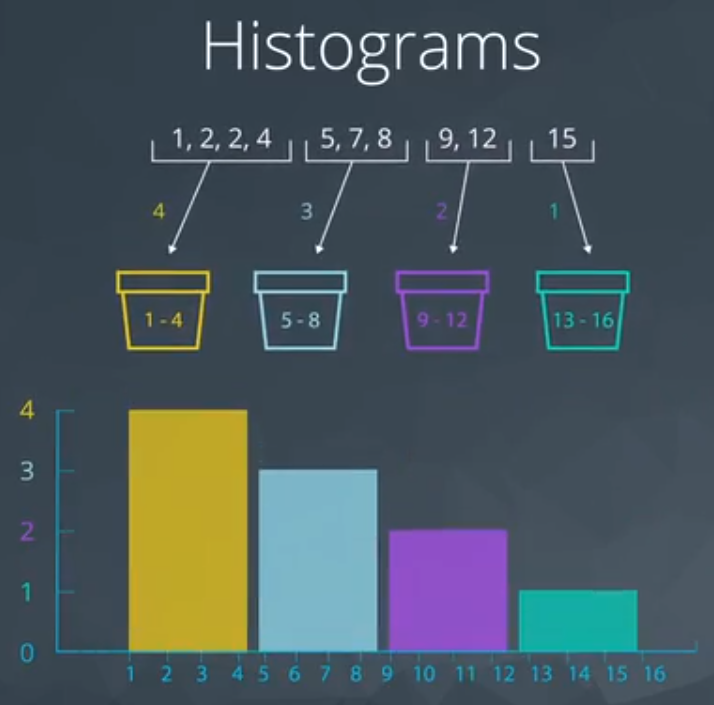
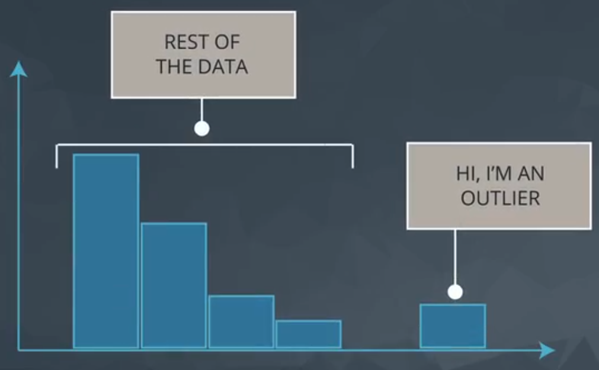

# Advanced Statistics

## Descriptive Statistics

This lesson is a kind of review.

### What is data?

Data could be whatever thing: Text, Spreadsheets, video, images, database, etc.

### Data types

* Quantitative Data: Allow us to perform mathematical operations with data (1, 2, 3, 4, etc.);
    * Continuous: Could be any real number (Age);
    * Discrete: Only integer number (Number of persons);
* Categorical Data: Used to label a group or a set of items (blue, yellow, red, etc.);
    * Ordinal: There are a way to put the categories in a scale (Very good, so-so, very poor);
    * Nominal: It is impossible to put the categories in order (blue, yellow, orange, etc.);

### Measures of Center

#### Categorical

The categorical data is analyzed doing a simple summary to count the total of each category has.

#### Quantitative

Four main aspects when analysing **quantitative** data:

* Measures of `Center`
    * Mean
    * Median: The median splits our data so that 50% of our values are lower and 50% are higher.
        * Even number of elements: single values.
        * Odd number of elements: average between two "center" values.
    * Mode: The mode is the most frequently observed value in our dataset.
        * No mode: If all observations in our dataset are observed with the same frequency, there is no mode.
        * Many modes: If two (or more) numbers share the maximum value, then there is more than one mode.
* Measures of `Spread`
* The `Shape` of the Data
* `Outliers`

## Quantitative Data

### Measures of Spread

>How far are points from one another.

Common values of spread:

* Range;
* Interquartile range (IQR);
* Standard Deviation, and;
* Variance.

#### Histogram

Figure 1 shows an example of histogram.

This is a way to visualize the quantitative data.

### Five Number Summary

These are the number:

* Maximum;
* Third quartile or Q3 (75%);
* Second quartile (it is the same of mean) or Q2 (or 50%);
* First quartile or Q1 (25%), and;
* Minimum.

First step to do is order the values, as you can see in Figure 2 (odd set of values).

As you can see, Q1 and Q3 are the median of the data on either sides of Q2.

The range is defined as:

$$ \text{Range} = maximum - minimum \tag{1}$$

The Interquartile is define as:

$$ \text{Interquartile} = Q3 - Q1 \tag{2}$$

For a even set of values I need to calculate the "average" of two values.

#### Boxplot

The boxplot graphic is a way to visualize the spread of the data.

It could be useful for quickly comparing the spread of two data sets.

Based on the Figure 4, the graphic on the right shows that in the weekends the number of dogs varies much more than on weekdays (looking to the range).

### Standard Deviation

>Meaning: On average, how much each point varies from the mean of the points.

First, I need to define the "distance" between mean and each observation. "Distance" could be interpreted as the difference of these two values. The issue observed in this difference are positive and negative values. For this reason, the square is used to turn everything positive (because later I can square root).

* Standard Deviation is frequently used to compare spread of different groups.
* Having higher standard deviation is associated with having higher risk.

$$ \text{Standard Deviation} = \frac{1}{n} \sum_{i = 1}^n (\bar x - x_i)^2 \tag{3}$$

### Shape

The shape is related to the histogram form, Figure 5 shows an example.

* Left Skewed
    * is pulled to the "begining"
    * median stays close to the mode
    * GPA, Age of death, Asset price changes
* Simmetric (example: Normal distribution or bell curve)
    * mean = median = mode;
    * Examples: heights, weights, scores, precipitation, etc.
* Right Skewed
    * mean is pulled to the tail
    * median stays close to the mode
    * Amount of drug left in your bloodstream over time, distribution of wealth, human athletic abilities.

>Side note: If you aren't sure if your data are normally distributed, there are plots called normal quantile plots and statistical methods like the Kolmogorov-Smirnov test that are aimed to help you understand whether or not your data are normally distributed. Implementing this test is beyond the scope of this class, but can be used as a fun fact.

### Outliers

>Data points thah fall very far from the rest of the values in our dataset.

The "very far" is quite generic and could be interpreted in many forms. One way to visualize it is plotting a histogram, as you can see in Figure 6.

1. Note they exist and the impact on summary Statistics
2. If typo, remove or fix it.
3. Understand why they exist, and the impact on questions we are trying to answer
4. Reporting the 5 number summary is better than mean and standard deviation when outliers are present
5. Be careful in reporting know how to ask the right questions

### Descriptive vs Inferential

Descriptive Statistics: Describing Collected Data
Inferential Statistics: Drawing conclusions about a population based on data collected from sample of individuals from that population.

## Admissions Case Study

### Simpson's Paradox

In this example lesson, you learned about Simpson's Paradox, and you had the opportunity to apply it to a small example with Sebastian, as well as work through similar example in Python.

In the lessons ahead, you will be learning a lot by following along with Sebastian, but it is really important to put these ideas to practice using data and computing, because that is how you will apply these skills in a day to day environment as a Data Analyst or Data Scientist.

It is so easy to get caught up in looking at full aggregates of your data. Hopefully, the examples here serve as a reminder to look at your data multiple ways.

### Case Study

## Probability

### Introduction to Probability

Do not confound Statistics and Probability.

* Probability: Make preditcions about the future events based on models, and;
    * Here I want to predict data!
* Statistics: Analyze data from past events to infer what those models or causes could be.
    * Here I use data to preditc!

Figure 1 shows the relation between these two subjects.

#### Fair Coin

The probability notation is based on the 0 to 1 scale, where 0 means zero percentage and 1 means 100 percentage. The example below is a 50%.

$$ P(HEADS) = 0.5 $$

To be a fair coin the tail probability it is the same of heads.

$$ P(TAILS) = 0.5 $$

#### Loaded Coin

Its occurs when the $P(HEADS)$ is different of $P(TAILS)$. Bear in mind, in the equation 1.

$$ P(HEADS) + P(TAILS) = 1 \tag{1}$$

**Example 1:** {HEADS, HEADS} = $P(H, H)$ for a fair coin.

$P(H) = P(T) = 0.5$

To ilustrate this solution, let's draw the Truth Table (Table 1)

<strong>Table 1 - Truth Table for a Fair Coin</strong>

|Flip 1|Flip 2|Probability|
|:-:|:-:|:-:|
|H|H|$ 0.5 * 0.5 = 0.25 $|
|H|T|$ 0.5 * 0.5 = 0.25 $|
|T|H|$ 0.5 * 0.5 = 0.25 $|
|T|T|$ 0.5 * 0.5 = 0.25 $|
|||$ SUM = 1.0 $|

The probability of P(H, H) is 0.25.

**Example 2:** {HEADS, HEADS} = $P(H, H)$ for a loaded coin.

$ P(H) = 0.6 $
$ P(T) = 0.4 $

To ilustrate this solution, let's draw the Truth Table (Table 2)

<strong>Table 2 - Truth Table for a Loaded Coin</strong>

|Flip 1|Flip 2|Probability|
|:-:|:-:|:-:|
|H|H|$ 0.6 * 0.6 = 0.36 $|
|H|T|$ 0.6 * 0.4 = 0.24 $|
|T|H|$ 0.4 * 0.6 = 0.24 $|
|T|T|$ 0.4 * 0.4 = 0.16 $|
|||$ SUM = 1.0 $|

The probability of P(H, H) is 0.36.

**Example 3:** Three coins flipped. What is the probability of only one heads in three coins flipped. Adopting a fair coin ($ P(H) = 0.5 $).

$P_1(Only one H)$

<strong>Table 3 - Truth Table for a Loaded Coin</strong>

|Flip 1|Flip 2|Flip 3|Probability|Has only one heads?|$P_1$|
|:-:|:-:|:-:|:-:|:-:|:-:|
|H|H|H|$ 0.5 * 0.5 * 0.5 = 0.125 $|No|0|
|H|H|T|$ 0.5 * 0.5 * 0.5 = 0.125 $|No|0|
|H|T|H|$ 0.5 * 0.5 * 0.5 = 0.125 $|No|0|
|H|T|T|$ 0.5 * 0.5 * 0.5 = 0.125 $|Yes|0.125|
|T|H|H|$ 0.5 * 0.5 * 0.5 = 0.125 $|No|0|
|T|H|T|$ 0.5 * 0.5 * 0.5 = 0.125 $|Yes|0.125|
|T|T|H|$ 0.5 * 0.5 * 0.5 = 0.125 $|Yes|0.125|
|T|T|T|$ 0.5 * 0.5 * 0.5 = 0.125 $|No|0|
||||$ SUM = 1.0 $|$ SUM = 3 \text{ cases} $|$ SUM = 0.375 $|

The $ P_1 $ is 0.375.

**Example 4:** Three coins flipped. What is the probability of only one heads in three coins flipped. Adopting a loaded coin ($ P(H) = 0.6 $).

$P_2(Only one H)$

<strong>Table 3 - Truth Table for a Loaded Coin</strong>

|Flip 1|Flip 2|Flip 3|Probability|Has only one heads?|$P_2$|
|:-:|:-:|:-:|:-:|:-:|:-:|
|H|H|H|$ 0.6 * 0.6 * 0.6 = 0.216 $|No|0|
|H|H|T|$ 0.6 * 0.6 * 0.4 = 0.144 $|No|0|
|H|T|H|$ 0.6 * 0.4 * 0.6 = 0.144 $|No|0|
|H|T|T|$ 0.6 * 0.4 * 0.4 = 0.096 $|Yes|0.096|
|T|H|H|$ 0.4 * 0.6 * 0.6 = 0.144 $|No|0|
|T|H|T|$ 0.4 * 0.6 * 0.4 = 0.096 $|Yes|0.096|
|T|T|H|$ 0.4 * 0.4 * 0.6 = 0.096 $|Yes|0.096|
|T|T|T|$ 0.4 * 0.4 * 0.4 = 0.064 $|No|0|
||||$ SUM = 1.0 $|$ SUM = 3 \text{ cases} $|$ SUM = 0.288 $|

The $ P_2 $ is 0.288.

### Bernoulli Distribution

Founded on this introduction, let's generalize this concept using the Bernoulli Distribution.

>In probability theory and statistics, the Bernoulli distribution, named after Swiss mathematician Jacob Bernoulli, is the discrete probability distribution of a random variable which takes the value 1 with probability ${\displaystyle p}$  and the value 0 with probability ${\displaystyle q=1-p,}$  that is, the probability distribution of any single experiment that asks a yes–no question; the question results in a boolean-valued outcome, a single bit of information whose value is success/yes/true/one with probability p and failure/no/false/zero with probability q. It can be used to represent a (possibly biased) coin toss where 1 and 0 would represent "heads" and "tails" (or vice versa), respectively, and p would be the probability of the coin landing on heads or tails, respectively. In particular, unfair coins would have ${\displaystyle p\neq 1/2.}$

>The Bernoulli distribution is a special case of the binomial distribution where a single trial is conducted (so n would be 1 for such a binomial distribution). It is also a special case of the two-point distribution, for which the possible outcomes need not be 0 and 1. -- <cite>[Wikipedia][source_bern_1]</cite>

Rede more in [wolfram][source_bern_2].

[source_bern_1]: https://en.wikipedia.org/wiki/Bernoulli_distribution
[source_bern_2]: http://mathworld.wolfram.com/BernoulliDistribution.html

#### Summary

>Here you learned some fundamental rules of probability. Using notation, we could say that the outcome of a coin flip could either be T or H for the event that the coin flips tails or heads, respectively.

>Then the following rules are true:

* Probability of a Event
> $$\bold{P(H)} = 0.5$$

* Probability of opposite event
> $$\bold{1 - P(H) = P(\text{not H})} = 0.5$$

>where $\bold{\text{not H}}$ is the event of anything other than heads. Since, there are only two possible outcomes, we have that $\bold{P(\text{not H}) = P(T)} = 0.5$. In later concepts, you will see this with the following notation: $\bold{\lnot H}$.

* Probability of composite event

$$ P * P * P * \dots * P $$

It is only true because the events are independent of one another, which means the outcome of one does not affect the outcome of another.

>* Across multiple coin flips, we have the probability of seeing n heads as $\bold{P(H)^n}$. This is because these events are independent.

>We can get two generic rules from this:

>1. The probability of any event must be between 0 and 1, inclusive.

>2. The probability of the compliment event is 1 minus the probability of an event. That is the probability of all other possible events is 1 minus the probability an event itself. Therefore, the sum of all possible events is equal to 1.

>3. If our events are independent, then the probability of the string of possible events is the product of those events. That is the probability of one event AND the next AND the next event, is the product of those events.

#### Looking Ahead

>You will be working with the Binomial Distribution, which creates a function for working with coin flip events like the first events in this lesson. These events are independent, and the above rules will hold. <cite>from Text: Recap + Next Steps</cite>

## Conditional Probability

Here the first event will affect the second one. Figure 1 shows an example of it.

![Figure 1][fig_1]

[fig_1]: 01-img/c4_l6_01.png

<em>Figure 1 - Example of conditional probability.</em>

The first event is to determine the bird type, and the second event the probability to run on the morning. Have in mind, these two birds has different probability to run on the morning.

* The early bird has 0.02;
* The night owl has 0.00.

### Medical Example

Supose a patient with a disease, the probability of this patient has cancer is 0.9 and to be free cancer is 0.1.

$$P(cancer) = 0.1 \\
  P(\neg \ cancer) = 0.9 \tag{1}$$

To be honest, we do not know if this patient has cancer, so it is necessary to apply a test. This test is not perfect, it means, there are a probability to indicates a false positive and a false negative.

For this reason, I introduce the conditional probability.

$$ P(Positive | cancer) = 0.9 \tag{2}$$

_What is the meaning of this notation?_

Given the patient has cancer, the probability of this test indicates positive is 0.9. Thus, given the patient has cancer and the test indicates negative is 0.1, as shown in equation (3).

$$ P(Negative | cancer) = 0.1 \tag{3}$$

Analogous to the case of the patient do not has cancer.

$$ P(Positive | \neg \ cancer) = 0.2 \\
   P(Negative | \neg \ cancer) = 0.8 \tag{2} $$

Table 1 shows a representation in a tabular way.

<strong>Table 1 - Truth Table for Medical Example</strong>

|Disease|Test|$P_{disease}$|$P_{test}$|P|Q1: Test Positive?|Q1: Answer|
|:-:|:-:|:-:|:-:|:-:|:-:|:-:|
|No|Negative|$P(\neg \ cancer) = 0.9$|$P(Negative\|\neg \ cancer) = 0.8$|0.72|No|0|
|No|Positive|$P(\neg \ cancer) = 0.9$|$P(Positive\|\neg \ cancer) = 0.2$|0.18|Yes|0.18|
|Yes|Negative|$P(cancer) = 0.1$|$P(Negative\| cancer) = 0.1$|0.01|No|0|
|Yes|Positive|$P(cancer) = 0.1$|$P(Positive\| cancer) = 0.9$|0.09|Yes|0.09|
|||||$SUM = 1$||$SUM = 0.27$|

>What is the probability the test is positive?

**Q1: 0.27**

#### Coin flip example

Two coins, one fair and other loaded.

* Coin 1: $P_1(HEADS) = P_1(TAILS) = 0.5$;
* Coin 2: $P_2(HEADS) = 0.9$ and $P_2(TAILS) = 0.1$.

![Figure 2][fig_2]

[fig_2]: 01-img/c4_l6_02.png

<em>Figure 2 - Coin Example of conditional probability.</em>

_What is the probability of this sequence HEADS and TAILS?_

|Coin|Flip 1|Flip 2|$P_{coin}$|$P_{Flip 1}$|$P_{Flip 2}$|P|Q2: HEADS then TAILS?|Q2: answer|
|:-:|:-:|:-:|:-:|:-:|:-:|:-:|:-:|:-:|
|1|H|H|0.5|0.9|0.9|0.405|No|0|
|1|H|T|0.5|0.9|0.1|0.045|Yes|0.045|
|1|T|H|0.5|0.1|0.9|0.045|No|0|
|1|T|T|0.5|0.1|0.1|0.005|No|0|
|2|H|H|0.5|0.5|0.5|0.125|No|0|
|2|H|T|0.5|0.5|0.5|0.125|Yes|0.125|
|2|T|H|0.5|0.5|0.5|0.125|No|0|
|2|T|T|0.5|0.5|0.5|0.125|No|0|
| | | |   |   |   |$SUM = 1$||$SUM = 0.170$

#### Summary

>In this lesson you learned about conditional probability. Often events are not independent like with coin flips and dice rolling. Instead, the outcome of one event depends on an earlier event.

>For example, the probability of obtaining a positive test result is dependent on whether or not you have a particular condition. If you have a condition, it is more likely that a test result is positive. We can formulate conditional probabilities for any two events in the following way:

>* $P(A|B) = \frac{P(A\text{ }\cap\text{ }B)}{P(B)}$
>* $P(A ∩ B)$

>In this case, we could have this as:

>$$P(positive|disease) = \frac{P(\text{positive }\cap\text{ disease})}{P(disease)}$$

>where ∣ represents "given" and $\cap$ represents "and". --- <cite>Class notes - Text: Summary
</cite>