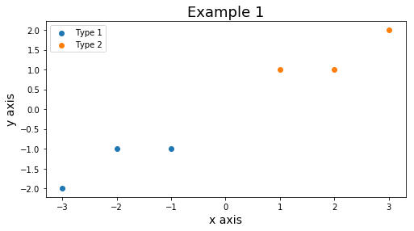
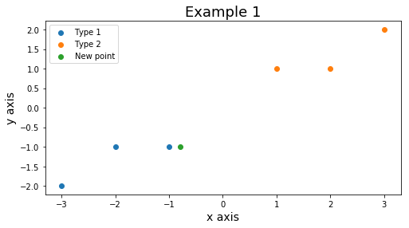
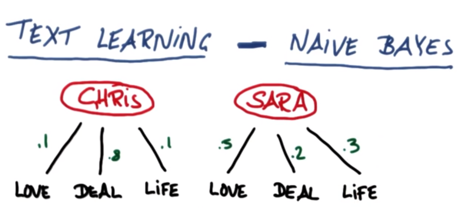
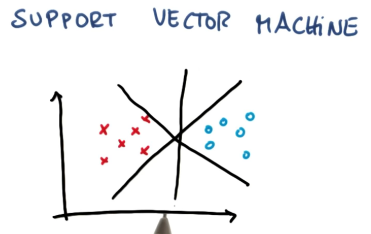
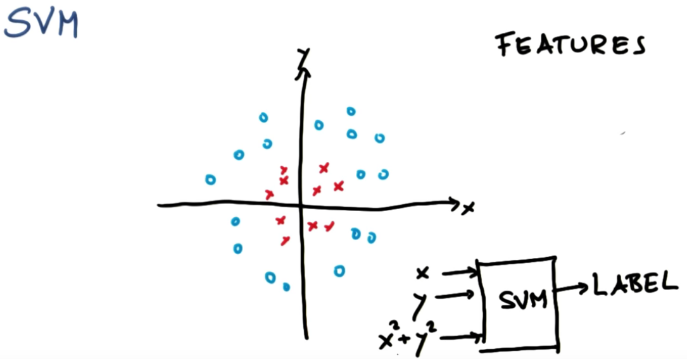
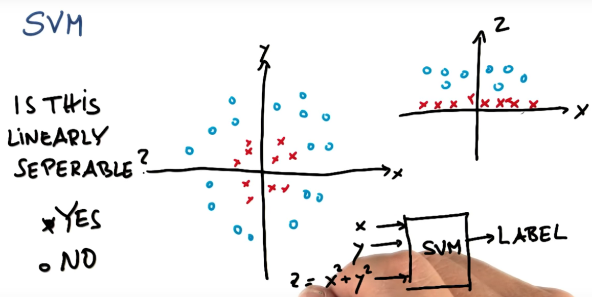
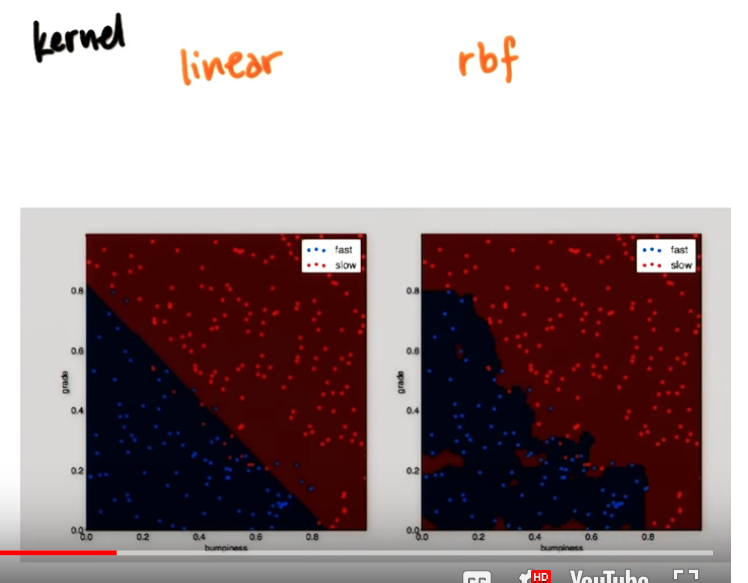

# Intro to Machine Learning


## Naïve Bayes


Before dive in Naive Bayes. Let's talk a little bit about the thwo main groups in Machine Learning.

#### Supervised Learning {-}

>**In supervised learning, we are given a data set and already know what our correct output should look like**, having the idea that there is a relationship between the input and the output.
>
>Supervised learning problems are categorized into "regression" and "classification" problems. In a regression problem, we are trying to predict results within a continuous output, meaning that we are trying to map input variables to some continuous function. In a classification problem, we are instead trying to predict results in a discrete output. In other words, we are trying to map input variables into discrete categories.
>
>Example 1:
>
>Given data about the size of houses on the real estate market, try to predict their price. Price as a function of size is a continuous output, so this is a regression problem.
>
>We could turn this example into a classification problem by instead making our output about whether the house "sells for more or less than the asking price." Here we are classifying the houses based on price into two discrete categories.
>
>Example 2:
>
>- Regression - Given a picture of a person, we have to predict their age on the basis of the given picture
>
>- Classification - Given a patient with a tumor, we have to predict whether the tumor is malignant or benign. --- <cite>[Coursera Machine Learning Notebook][coursera_ml]</cite>

#### Unsupervised Learning {-}

>Unsupervised learning allows us to approach problems with little or no idea what our results should look like. We can derive structure from data where we don't necessarily know the effect of the variables.
>
>We can derive this structure by clustering the data based on relationships among the variables in the data.
>
>With unsupervised learning there is no feedback based on the prediction results.
>
>Example:
>
>Clustering: Take a collection of 1,000,000 different genes, and find a way to automatically group these genes into groups that are somehow similar or related by different variables, such as lifespan, location, roles, and so on.
>
>Non-clustering: The "Cocktail Party Algorithm", allows you to find structure in a chaotic environment. (i.e. identifying individual voices and music from a mesh of sounds at a cocktail party). --- <cite>[Coursera Machine Learning Notebook][coursera_ml]</cite>

[coursera_ml]: https://www.coursera.org/learn/machine-learning


### Gaussian - Naive Bayes

>In machine learning, naive Bayes classifiers are a family of simple "probabilistic classifiers" based on applying Bayes' theorem with strong (naive) independence assumptions between the features. --- <cite>[Wikipedia][wiki_url_naive_bayes]</cite>

[wiki_url_naive_bayes]: https://en.wikipedia.org/wiki/Naive_Bayes_classifier

The [Naive Bayes][bookdown_4.7] was one of the topics covered in Advanced Statistics.

[bookdown_4.7]: https://andersonuyekita.github.io/ND111_data_science_foundations_02/bayes-rule-lesson-07.html

### Scikit Learn

In this lesson we are going to use the scikit learn package to perform the Gaussian Naive Bayes.

```py
# Importing the library.
from sklearn.naive_bayes import GaussianNB
```

#### `GaussianNB()` {-}

Creating the classifier.

```py
# Creating the Classifier.
clf = GaussianNB()
```

#### `.fit()` {-}

Bear in mind, the term _fitting_ or _training_ will be used interchangeably along the course.

The `.fit()` method will be used to fit/train the classifier based on two inputs:

* **X:** Coordinates/features of the variable to be classified;
* **Y:** Results of already classified outputs.

Recall, this is a supervised algorithm, which means we have already some results (that I do not care its origins) and what we are aiming is a generalization of this classification using a algorithm to calculate our own coefficients based on a training data.

An example of X and Y from Scikit Learning website:

```py
### Inputs.

# This is the coordinates of each point.
X = np.array([[-1, -1], [-2, -1], [-3, -2], [1, 1], [2, 1], [3, 2]])

# This is the outcome of each classification.
Y = np.array([1, 1, 1, 2, 2, 2])
```
Plotting the X dataframe using the Y vector as categorical variable to classify each point of X.

<center>

<em>Figure 1 - X and Y plotted.</em></center>

Now, I want to train my `clf` (classifier) based on X and Y to classify any point.

```py
# fit the classifier on the training features and labels
clf.fit(X, Y)
```
>What is the classification for (-0.8, -1)?

Let's take a look where is this point.

<center>

<em>Figure 2 - New point in green.</em></center>

Using the `.predict()` method it is possible to predict the classification of this point.

```py
clf.predict([[-0.8, -1]])
```
>**The result is Type 1, as we expected to be.**

Have in mind, generally we use two datasets:

* Training dataset: Used to train the model;
* Test dataset: Used to test.

Training and Test datasests are complete different and it is necessary to avoid overfitting. Recall, you will use the test dataset to calculate the accuracy of your model.

#### `accuracy_score()`

This method is used to calculate the model accuracy.

```py
accuracy_score(y_true, y_pred)
```
Where:

* `y_true:` True values;
* `y_pred:` Values predicted from the model, need to be check using the `y_true`.

### Text Learning

This is an application of the same package Scikit Learn, but this time the problem is a bit more complicated.

Figure 3 shows, very simplified, the probability of each word given the email writer.

<center>

<em>Figure 3 - Probability diagram of Chris and Sara.</em></center>

Suppose an email like this.

$$\text{Love life!} \tag{1}$$

_What is the person more likely to be written this email?_

Given the probability of Chris and Sara is equal to 50%.

* $P(Chris) = P(Sara) = 0.5$

This is the _a priori_ probabilities.

Based on the probabilities in Figure 3, let's calculate the _joint_ probabilities.

* $P_{chris,\text{Love life}} = 0.1 \cdot 0.1 \cdot 0.5 = 0.005$
* $P_{sara,\text{Love life}} = 0.5 \cdot 0.3 \cdot 0.5 = 0.075$

A new email like this:

$$\text{Life deal} \tag{2}$$

* $P_{chris,\text{Life deal}} = 0.1 \cdot 0.8 \cdot 0.5 = 0.004$
* $P_{sara,\text{Life deal}} = 0.3 \cdot 0.2 \cdot 0.5 = 0.003$

Founded on the _joint_ probabilities, we can calculate the _normalizator_ (:)) of probabilities.

* For $\text{Love life!}$;

$$P(\text{Love life}) = P(chris) \cdot P_{chris,\text{Love life}} + P(sara) \cdot P_{sara,\text{Love life}} = P(chris) \cdot 0.08$$

* For $\text{Life deal}$;

$$P(\text{Life deal}) = P(chris) \cdot P_{chris,\text{Life deal}} + P(sara) \cdot P_{sara,\text{Life deal}} = 0.007$$

Finally, using _normalizator_ and _joint_ probabilities we can calculate the _a posteriori_ probabilities.

* For $\text{Love life!}$;

Using the $P(\text{Love life})$ to normalize $P_{chris,\text{Love life}}$ and $P_{sara,\text{Love life}}$:

$$P(\text{Chris|"Love life"}) = P(chris) \cdot \frac{P_{chris,\text{Love life}}}{P(chris) \cdot P(\text{Love life})} = \frac{0.005}{0.080} = 0.0625$$

$$P(\text{Sara|"Love life"}) = P(sara) \cdot \frac{P_{sara,\text{Love life}}}{P(sara) \cdot P(\text{Love life})} = \frac{0.075}{0.080} = 0.9375$$

* For $\text{Life deal}$;

Using the $P(\text{Life deal})$ to normalize $P_{chris,\text{Life deal}}$ and $P_{sara,\text{Life deal}}$:

$$P(\text{Chris|"Life deal"}) = P(chris) \cdot \frac{P_{chris,\text{Life deal}}}{P(chris) \cdot P(\text{Life deal})} = \frac{0.004}{0.007} = 0.5714$$

$$P(\text{Sara|"Life deal"}) = P(sara) \cdot \frac{P_{sara,\text{Life deal}}}{P(sara) \cdot P(\text{Life deal})} = \frac{0.003}{0.007} = 0.4286$$

## Support Vector Machine (SVM)

The Support Vector Machine was an algorithm invented by [Hava Siegelmann and Vladimir Vapnik][wikipedia_svm]. The objective of this algorithm is to fit a line to divide a group of point/features in two or more classes.

[wikipedia_svm]: https://en.wikipedia.org/wiki/Support-vector_machine

Figure 1 show the possibilities the line to segregate the two types of points.

<center>

<em>Figure 1 - Possible lines to divide the points in two groups.</em></center>

All the three lines could be a solution, but the SMV algorithm aims to maximaze the distance to the nearest point, which is the so-called **margin**.

Have in mind, the first objective of SMV is to classify correctly, later maximize the **margin**.

#### Additional notebooks {-}

For a better understanding about SVM, read the [bookdown of Machine Learning][bookdown_machine_learning] offered by Stanford and taught by Andrew Ng.

[bookdown_machine_learning]: a

This course is focused in application and do not talk much about the theoretical aspects.

### Scikit Learn

The Scikit Learn also has methods to calculate the SVM.

#### `SVC()`

This function creates an object classifier.

```py
clf = SVC(kernel = 'linear')
```
Remember, the `kernel` used is linar, which means the SVM will plot a straight line, and also could be lon-linear.

#### Non linear SVM

The non-linear SVM occurs when you adopt a non-linear kernel, as you can see in Figure 2.

<center>

<em>Figure 2 - Example of Non-linear SVM.</em></center>

There are several non-linear kernels:

* Poly;
* rbf (gives the curvy answer);
* Sigmoid, etc.

The uses of a polynomial gives the output of Figure 3.

<center>

<em>Figure 3 - Interpretation of $z = x^2 + y^2$.</em></center>

#### Parameters

This is characteristics that you define when you creating the classifier, so before you fitting the data. There are three:

* Kernel;
* Gamma, and;
* C.

Figure 4 shows two examples of output with different kernel.

<center>

<em>Figure 4 - Comparison between linear (on the left side) and rbf (on the right side).</em></center>

For this reason, the kernel could change completely the boundary.

```py
clf = sm.SVC(C = 1, gamma = 1, kernel = "rbf")
```

#### C

Controls trafeoff between smooth decision boundary and classifying training points correctly.

>A low C makes the decision surface smooth, while a high C aims at classifying all training examples correctly.

#### Gamma

Defines how far the influence of a single training example reaches.

>gamma defines how much influence a single training example has. The larger gamma is, the closer other examples must be to be affected.

#### Overfitting

Avoide the overfitting, in SVM there are three parameters which could lead overfitting.

* Kernel;
* C
* gamma


#### `.fit()`

Similarly to the `.fit()` from GaussianNB.
```py
# Fitting a model.
clf.fit(X_train,Y_train)
```
Where:

* X_train: is the "coordinates" of the points to train the data;
* Y_train: the answer of each pair of coordinates.

#### `.pred()`

Based on the `clf` it is possible to predict the values of a test dataframe.

```py
# After fitting the clf you can use to predict.
clf.pred(X_test)
```


```{r echo=FALSE, results='asis'}
library(knitr)

# knit the first three lines of first.Rmd
cat(knit_child(text = readLines('05.2-intro_to_machine_learning.Rmd')[1:3]), sep = '\n')
```